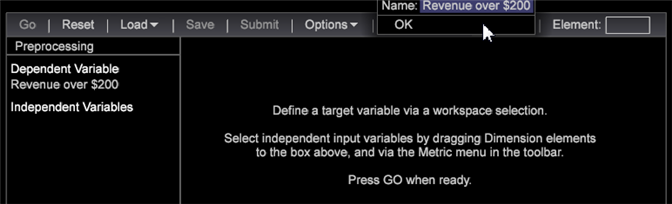

# Configurar a pontuação de propensão{#setting-up-propensity-scoring}

Siga estas etapas para usar a visualização de Pontuação de propensão .

1. Abra um novo espaço de trabalho e clique em **[!UICONTROL Add]** > **[!UICONTROL Visualization]** > **[!UICONTROL Predictive Analytics]** > **[!UICONTROL Scoring]** > **[!UICONTROL Propensity Score]**.

   

1. Defina o **[!UICONTROL Target]** (a variável dependente).

   Defina a variável dependente selecionando:

* **Elementos** Dimension: Clique com o botão direito do mouse no espaço de trabalho e selecione  **[!UICONTROL Table]**. Em seguida, selecione um Dimension elements como a variável dependente.

   OR

* **[!UICONTROL Filter Editor]**. Clique em **[!UICONTROL Add]** > **[!UICONTROL Visualization]** > **[!UICONTROL Filter Editor]** para abrir a visualização do Editor de filtros.

   

   Depois de selecionar um elemento Dimension ou Filtro como a variável dependente, clique em **[!UICONTROL Set Target]**, insira um nome para descrever a variável dependente. Em seguida, clique em **[!UICONTROL OK]** (e verifique se a caixa de filtro está realçada) para definir o Target.

   

   O nome que você dá ao público-alvo é a variável dependente que aparecerá no painel esquerdo.
1. Adicione variáveis independentes.

   Adicione as variáveis independentes usando Métricas ou Elementos de Dimension.

   

* **Métricas**. Na barra de ferramentas Pontuação de propensão , selecione uma métrica no menu **[!UICONTROL Metrics]** .

* **Elementos** Dimension: Clique com o botão direito do mouse no espaço de trabalho e selecione  **[!UICONTROL Table]**. Selecione um ou mais elementos de Dimension e arraste para a coluna da esquerda em **[!UICONTROL Independent Variables]** ou para a caixa **[!UICONTROL Element]** usando as teclas `<Ctrl>` + `<Alt>`.

1. Defina **[!UICONTROL Training Filter]**. Você pode definir o conjunto de visitantes que deseja pontuar clicando em **[!UICONTROL Options]** > **[!UICONTROL Set Training Filter]** na barra de ferramentas de Pontuação de propensão. Isso fornecerá um subconjunto de dados criado usando apenas os visitantes que você deseja pontuar. Por exemplo, quem visitou no último mês, visitantes que residem na Austrália ou visitantes que visualizaram produtos específicos.

   O filtro padrão é **[!UICONTROL Train on Everyone]**, mas você pode alterá-lo ativando **[!UICONTROL Dimension Elements]** em uma tabela ou criando um filtro usando **[!UICONTROL Filter Editor]**.

   Depois de selecionar um elemento Dimension ou criar um filtro e, enquanto estiver ativado, clique em **Options** > **Set Training Filter**, insira um nome para descrever o filtro e clique em **[!UICONTROL OK]**.
1. Depois de identificar todas as suas entradas, pressione **[!UICONTROL Go]**.

   

   O processo de pontuação começará passando os dados várias vezes. Em seguida, ele exibirá os resultados como gráficos de barras sobre uma linha de porcentagem.
1. Salve a pontuação de propensão.

   A partir da versão 6.1, agora há uma opção ao usar a opção Salvar pontuação de propensão:

* Dimensão
* Dimension e métrica

   Você pode acabar com dois arquivos salvos, uma dimensão e uma métrica definida.

   >[!NOTE]
   >
   >Se você enviar a Pontuação de propensão para processamento, receberá apenas uma dimensão.

   A métrica derivada é a métrica de pontuação média associada.
1. Verifique a precisão.

   O sistema exibirá **[!UICONTROL Model Complete]** e gerará um modelo de pontuação quando o processo estiver concluído.

   Clicar com o botão direito do mouse em **[!UICONTROL Model Complete]** identificará a precisão do modelo de pontuação, conforme definido pelo sistema. Valores que variam de 0% a 100% identificarão a probabilidade dos visitantes correspondentes à variável **[!UICONTROL Target]**.

   A Matriz de Confusão fornece quatro contagens pela combinação de Positivo Real (AP), Negativo Real (AN), Positivo Previsto (PP) e Negativo Previsto (PN). Esses números são obtidos pela aplicação do modelo de pontuação resultante aos dados de testes retidos de 20% dos quais sabemos a verdadeira resposta. Se a pontuação for maior que 50%, é previsto como um caso positivo (correspondendo ao evento definido).

   

<table id="table_154BDD6D294C4ED1B8C15EC33B74B199"> 
 <tbody> 
  <tr> 
   <td colname="col1"><b> Precisão</b> </td> 
   <td colname="col2"> Indica a precisão do modelo ao identificar as previsões corretas sobre todas as previsões. 
(TP + TN)/(TP + FP + TN + FN) 
 </td> 
  </tr> 
  <tr> 
   <td colname="col1"><b> Recall</b> </td> 
   <td colname="col2"> Identifica a capacidade de reidentificar o modelo de pontuação. 
<b>TP / (TP + FN)</b> 
 </td> 
  </tr> 
  <tr> 
   <td colname="col1"><b> Precisão</b> </td> 
   <td colname="col2">Identifica o nível de discrepância. 
TP / (TP + FP) 
 </td> 
  </tr> 
 </tbody> 
</table>

1. Abra um [Elevador ou Gráfico de Ganho](../../../../home/c-get-started/c-analysis-vis/c-visitor-propensity/c-propensity-gain-lift-chart.md#concept-0d049f6baf534f7fb97f271843ba6c4a), ou o [Visualizador de Modelo](../../../../home/c-get-started/c-analysis-vis/c-visitor-propensity/c-propensity-model-viewer.md#concept-9f2593a8218140b7bd132a4c74e159f9).

   Clique com o botão direito do mouse na visualização **Modelo completo** e selecione **[!UICONTROL Lift Chart]**, **[!UICONTROL Gain Chart]** ou **[!UICONTROL Model Viewer.]**
