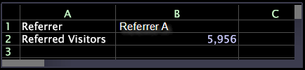

# Criar uma célula de entrada{#create-an-input-cell}

Como criar uma célula de entrada.

Quando a célula B1 é formatada como uma célula de entrada (clicando com o botão direito do mouse na célula e clicando em **[!UICONTROL Format]** > **[!UICONTROL Input Cell]**) e você bloqueia a visualização (clicando com o botão direito do mouse na borda superior e clicando em **[!UICONTROL Locked]**), você pode alterar o valor da célula de entrada para exibir os resultados &quot;imediatamente&quot;.

O exemplo a seguir mostra uma planilha que exibe a fórmula de uma célula de entrada.

Este exemplo mostra a mesma planilha que exibe o resultado da fórmula da célula de entrada.

Em ambos os exemplos, a Linha 1 mostra o referenciador que está sendo considerado no momento, Referenciador A, enquanto a Linha 2 mostra o número de visitantes que foram referenciados do Referenciador A.

Depois de formatar B1 e bloquear a visualização, é possível alterar o valor do Referenciador listado em B1 simplesmente digitando o novo valor:

