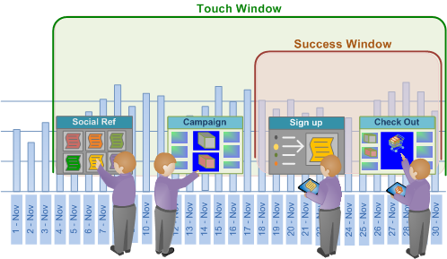
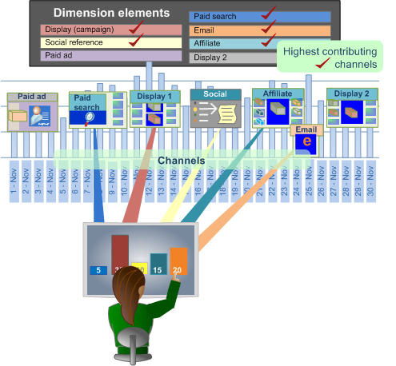

# Atribuição de melhor ajuste{#best-fit-attribution}

A Atribuição de melhor ajuste é uma abordagem de aprendizado automatizado para atribuir valores de atribuição nos diferentes canais de um evento de conversão bem-sucedido. A Análise de big data avalia automaticamente as contribuições para o sucesso em uma janela de tempo por canal e, em seguida, cria um modelo de atribuição com base nos padrões de interação reais de seus clientes.

**[!UICONTROL Best Fit Attribution]** permite que você compare as interações, ou toques, que contribuíram para uma venda bem-sucedida, uma inscrição por email ou outros indicadores de desempenho. A análise de atribuição atribui peso automaticamente aos toques mais importantes e fornece um modelo de atribuição por canal com base nos seus dados e responsivo ao seu mercado e protocolos internos.

Por exemplo, se um cliente visitar seu site por meio de uma pesquisa orgânica, se envolver com uma campanha e se inscrever para um email, a Atribuição [baseada em](/help/home/c-get-started/c-attribution-profiles/c-rules-attrib/c-rules-attrib.md) regras identificaria o primeiro toque ou último toque, ou distribuiria uniformemente a atribuição bem-sucedida em todos os pontos de contato usando modelos de atribuição predefinidos. Quando a atribuição baseada em regras é definida pelo usuário, os atributos de melhor ajuste definem valores por meio de um algoritmo calculando a probabilidade de uma conversão em função dos pontos de contato observados.

>[!NOTE]
>
>Para executar a Atribuição **de** melhor ajuste na Análise de big data, é necessário atualizar o certificado do servidor ( [!DNL .pem file]) para oferecer suporte ao Adobe Analytics Premium. Você também precisa adicionar o **Premium** ao seu cliente personalizado [!DNL Profile.cfg] para o cliente e receber novos certificados do Adobe ClientCare para Servidor e Servidor de relatórios.

## Configuração básica {#section-db597eaee462412ea7280d1426366c61}

Consulte [Criar uma atribuição](../../../../home/c-get-started/c-attribution-profiles/c-attrib-algorithmic/c-attrib-building.md#concept-fede6fc4f592475fa8b351b1765a522d) de melhor ajuste para obter instruções passo a passo.

**Definir a métrica** de sucessoDefina uma métrica que representa um evento de sucesso.

A Métrica de sucesso é frequentemente *Pedidos*, embora você possa aproveitar a Análise de big data para definir uma métrica de sucesso muito complicada juntamente com a Janela de sucesso.

**Definir a métrica** de toque (opcional)

Identifique as interações para rastrear o que levou a uma conversão bem-sucedida e, em seguida, defina a métrica de Toque sobre a qual a atribuição será calculada.

>[!NOTE]
>
>A configuração de uma métrica de toque só é necessária se você a estiver usando para derivar Métricas de canal do recurso arrastar e soltar elementos de Dimensão em vez de usar métricas de Canal existentes.

Se você não tiver uma métrica definida para campanhas ou canais, mas tiver dimensões representando canais, a Atribuição de melhor ajuste pode criá-los automaticamente com base na métrica Toque.

Por exemplo, com a Métrica de toque definida como *Ocorrências* e considerando uma dimensão chamada Tipo *de* mídia com elementos que incluem *Email*, *Press Release*, Anúncio ****[!DNL Hits where Media Type = Email] impresso e mídia social, a visualização gerará métricas de Canal do formulário quando você arrastar e soltar os elementos na visualização.

A métrica de toque determina a alocação das pontuações de atribuição para identificar interações de marketing consideradas influentes para o sucesso, permitindo qualificar os toques de marketing para a população identificada na janela de sucesso. Você pode definir métricas como Exibições *de* página ou *Ocorrências*, ou usar métricas de toque personalizadas específicas às suas necessidades.

Em muitos casos, a janela Touch deve incluir a janela Success (Sucesso) para avaliar um lead time longo no ciclo de vendas.

**Defina a métrica Receita.**

Você pode optar por identificar a receita entre pontos de contato definindo uma métrica de receita apropriada. Se especificado, o modelo exibirá a distribuição da receita pelos canais de entrada. 

É possível definir uma métrica de receita com tipos de dados de moeda para alocar sucesso em todos os pontos de contato principais definidos e analisados. Essa métrica divide a receita de vendas final e aloca com base na ponderação alocada pelo algoritmo.

**Configure as janelas bem-sucedidas e de toque.**

A janela Êxito define a população a ser examinada e o período para eventos bem-sucedidos, permitindo que você indique as janelas de tempo e amplitude da população a serem consideradas para a análise por meio de uma seleção de espaço de trabalho. A janela **Êxito** define o período e a população a serem analisados para eventos bem-sucedidos. A janela **Touch** especifica o período histórico de tempo para examinar as interações de canal que levam aos eventos bem-sucedidos.

>[!NOTE]
>
>A configuração de uma métrica de toque só é necessária se você estiver tentando criar métricas de sucesso automaticamente arrastando elementos de dimensão para a visualização.

Você pode definir um dia, mês, ano ou qualquer período disponível para restringir sua avaliação de eventos bem-sucedidos e de toque durante o ciclo de vendas ou para públicos-alvo específicos que entram no site. Criar janelas para limitar a atribuição permite que você concentre sua análise nos períodos relevantes para suas necessidades específicas.

Em muitos casos, você desejará que a janela de toque inclua a janela de sucesso para permitir que você estenda sua análise por um longo período de tempo com base na janela de vendas. Ou você pode rastrear e analisar toques separados do evento bem-sucedido.

**Selecione os Canais.**

Ao entrar em canais, você tem duas opções.

**Adicione a métrica de toque e adicione elementos de dimensão aos canais**

Em muitos casos, você desejará detalhar os pontos de toque principais por elementos de dimensão para definir canais específicos. Com base nos valores do elemento, a Atribuição de melhor ajuste selecionará automaticamente os melhores desempenhos e os classificará de acordo com a porcentagem e os exibirá em uma visualização de gráfico.

Um modelo de atribuição será construído com base nos visitantes que interagiram durante a janela de sucesso e examinaram os toques de canal durante a janela de toque que resultaram ou não em um evento bem-sucedido.

## Detalhamento por canais {#section-a30592b84bc84f57bd2b988824e852d4}

Ao entrar em canais, você tem duas opções:

* Adicione uma Métrica **de** toque e, em seguida, adicione Elementos **de** dimensão para os Canais.

   **ou**

* Crie métricas que filtram os elementos de canal que deseja avaliar.

**Opção 1: Adicione uma métrica de toque e elementos de dimensão para canais**.

Esta é a abordagem mais fácil. A Atribuição de melhor ajuste cria as métricas automaticamente para avaliar a atribuição. No exemplo abaixo, a métrica de toque é ***Ocorrências*** e os Canais são: Campanhas ***de exibição***, campanhas ***por*** email e campanhas ****** SEM.

Usando esse método, a Atribuição de melhor ajuste cria uma métrica em segundo plano para avaliar a atribuição entre os canais (mas você nunca vê a métrica gerada automaticamente e eles não são salvos). No exemplo abaixo, três métricas são criadas onde as Ocorrências são filtradas para cada um dos três canais (por exemplo, *Campanhas* de exibição, Campanhas *de* email e Campanhas ** SEM). Isso é o mais fácil porque você deixou a Atribuição de melhor ajuste criar as métricas para você.

**Opção 2: Criar uma métrica**.

Na segunda opção, você cria e salva as métricas dos canais que deseja avaliar filtrando um canal específico. Um exemplo dessa métrica é mostrado abaixo.

Em seguida, em vez de inserir uma Métrica de toque e elementos de dimensão para os Canais, você pode clicar na barra de menus na visualização e selecionar **Entradas** > **Adicionar canal** e, em seguida, selecionar as métricas que você criou.

Consulte o exemplo do segundo método abaixo. Você pode ver que os resultados de ambas as opções são idênticos.
