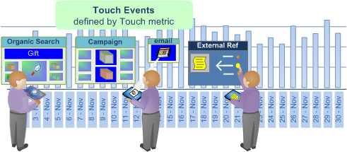

# Atribuição de melhor ajuste{#best-fit-attribution}

{{eol}}

A Atribuição de melhor ajuste é uma abordagem de aprendizado automatizado para atribuir valores de atribuição entre os diferentes canais de um evento de conversão bem-sucedido. O Data Workbench avalia automaticamente as contribuições para o sucesso em uma janela de tempo por canal e cria um modelo de atribuição com base nos padrões de interação reais dos clientes.

**[!UICONTROL Best Fit Attribution]** permite comparar as interações, ou toques, que contribuíram para uma venda bem-sucedida, a inscrição por email ou outros indicadores de desempenho. A análise de atribuição atribui peso automaticamente aos toques mais importantes e fornece um modelo de atribuição por canal com base nos dados e responsivo aos protocolos internos e de mercado.

Por exemplo, se um cliente visitar seu site por meio de uma pesquisa orgânica, participar de uma campanha e se inscrever para receber um email, [Atribuição baseada em regras](/help/home/c-get-started/c-attribution-profiles/c-rules-attrib/c-rules-attrib.md) identificaria o primeiro ou o último contato ou distribuiria uniformemente a atribuição de sucesso em todos os pontos de contato usando modelos de atribuição predefinidos. Quando a atribuição baseada em regras é definida pelo usuário, os atributos de Melhor Ajuste definem valores por meio de um algoritmo, calculando a probabilidade de uma conversão como função dos pontos de contato observados.

>[!NOTE]
>
>Para executar **Atribuição de melhor ajuste** no Data Workbench, é necessário atualizar o certificado do servidor ( [!DNL .pem file]) para oferecer suporte ao Adobe Analytics Premium. Você também precisa adicionar **Premium** ao seu [!DNL Profile.cfg] para o cliente e receba novos certificados do Adobe ClientCare for Server e Report Server.

## Configuração básica {#section-db597eaee462412ea7280d1426366c61}

Consulte [Criar uma atribuição de melhor ajuste](../../../../home/c-get-started/c-attribution-profiles/c-attrib-algorithmic/c-attrib-building.md#concept-fede6fc4f592475fa8b351b1765a522d) para obter instruções passo a passo.

**Definir a métrica de sucesso**
Defina uma métrica que represente um evento bem-sucedido.

A métrica de sucesso é frequentemente *Pedidos*, embora você possa aproveitar o Data Workbench para definir uma métrica de sucesso muito complicada juntamente com a Janela de sucesso.

**Definir a métrica de toque** (opcional)

Identifique as interações para rastrear o que levou a uma conversão bem-sucedida e, em seguida, defina a métrica de toque sobre a qual a atribuição será calculada.

>[!NOTE]
>
>A definição de uma métrica de toque só é necessária se estiver usando-a para derivar as Métricas de canal dos elementos de arrastar e soltar Dimension em vez de usar as métricas de canal existentes.

Se você não tiver uma métrica definida para campanhas ou canais, mas tiver dimensões que representem canais, a Atribuição de melhor ajuste poderá criá-las automaticamente com base na métrica de toque.

Por exemplo, com a métrica de toque definida como *Ocorrências* e considerando uma dimensão chamada *Tipo de mídia* com elementos que incluem *Email*, *Comunicado de imprensa*, *Imprimir anúncio* e *Redes sociais*, a visualização gerará métricas de Canal do formulário [!DNL Hits where Media Type = Email] ao arrastar e soltar os elementos na visualização.

A métrica de toque determina a alocação das pontuações de atribuição para identificar interações de marketing consideradas influentes para o sucesso, permitindo qualificar toques de marketing para a população identificada na janela de sucesso. É possível definir métricas como *Exibições de página* ou *Ocorrências* ou utilizar métricas de toque personalizadas específicas às suas necessidades.

Em muitos casos, a janela Toque deve incluir a janela Sucesso para avaliar um lead time longo no ciclo de vendas.

**Defina a métrica Receita .**

Você pode optar por identificar a receita em todos os pontos de contato, definindo uma métrica de receita apropriada. Se especificado, o modelo exibirá a distribuição de receita pelos canais de entrada. 

Você pode definir uma métrica de receita com tipos de dados de moeda para alocar sucesso em todos os pontos de contato principais definidos e analisados. Essa métrica divide a receita final de vendas e aloca com base na ponderação alocada pelo algoritmo.

**Defina as janelas Êxito e Toque.**

A janela Sucesso define a população a ser examinada e o período para eventos bem-sucedidos, permitindo indicar as janelas de tempo e a amplitude da população a serem consideradas para a análise por meio de uma seleção de espaço de trabalho. O **Sucesso** define o período e a população a serem examinados para eventos bem-sucedidos. O **Toque** especifica o período de tempo histórico a ser examinado quanto a interações de canal que antecedem os eventos bem-sucedidos.

>[!NOTE]
>
>Definir uma métrica de toque só será necessário se você estiver tentando criar métricas de sucesso automaticamente arrastando elementos de dimensão para a visualização.

Você pode definir um dia, mês, ano ou qualquer período disponível para restringir sua avaliação de eventos bem-sucedidos e de toque ao longo do ciclo de vendas ou para públicos-alvo específicos que entram em seu site. Criar janelas para limitar a atribuição permite que você concentre sua análise nos períodos de tempo relevantes para suas necessidades específicas.

Em muitos casos, você desejará que a janela de toque inclua a janela de sucesso para permitir estender sua análise por um longo período de lead com base na janela de vendas. Ou você pode rastrear e analisar toques separados do evento bem-sucedido.

**Selecione os Canais.**

Ao inserir canais, você tem duas opções.

**Adicionar a métrica de toque e adicionar elementos de Dimension aos canais**

Em muitos casos, é necessário detalhar os pontos de contato principais por elementos de dimensão para definir canais específicos. Com base nos valores do elemento, a Atribuição de melhor ajuste selecionará automaticamente os desempenhos principais e os classificará de acordo com a porcentagem e os exibirá em uma visualização de gráfico.

Um modelo de atribuição será criado com base nos visitantes que interagiram durante a janela de sucesso e examinaram os toques de canal durante a janela de toque que resultaram ou não em um evento bem-sucedido.

## Detalhamento por canais {#section-a30592b84bc84f57bd2b988824e852d4}

Ao inserir canais, você tem duas opções:

* Adicione um **Métrica de toque** e, em seguida, adicionar **Elementos de Dimension** para Canais.

   **ou**

* Crie métricas que filtram os elementos do canal que deseja avaliar.

**Opção 1: Adicionar uma métrica de toque e adicionar elementos de Dimension para canais**.

Esta é a abordagem mais fácil. A Atribuição de melhor ajuste cria as métricas automaticamente para avaliar a atribuição. No exemplo abaixo, a métrica de toque é ***Ocorrências*** e Canais são: ***Exibir campanhas***, ***Campanhas de email*** e ***Campanhas do SEM***.

Usando esse método, a Atribuição de melhor ajuste cria uma métrica em segundo plano para avaliar a atribuição entre os canais (mas você nunca vê a métrica gerada automaticamente e elas não são salvas). No exemplo abaixo, três métricas são criadas, onde as Ocorrências são filtradas para cada um dos três canais (por exemplo, *Exibir campanhas*, *Campanhas de email* e *Campanhas do SEM*). Essa é a função mais fácil, pois permite que a Atribuição de melhor ajuste crie as métricas para você.

**Opção 2: Criar uma métrica**.

Na segunda opção, você cria e salva as métricas para os canais que deseja avaliar filtrando um canal específico. Um exemplo dessa métrica é mostrado abaixo.

Em seguida, em vez de inserir uma Métrica de toque e Elementos de Dimension para os Canais, você pode clicar na barra de menu na visualização e selecionar **Entradas** > **Adicionar canal** e, em seguida, selecione as métricas que você criou.

Veja o exemplo do segundo método abaixo. Você pode ver que os resultados de ambas as opções são idênticos.
