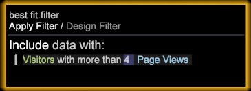

# Criar um modelo de atribuição de melhor ajuste{#build-a-best-fit-attribution-model}

Abra a Atribuição de melhor ajuste no menu Premium e siga estas etapas para criar um modelo de Atribuição de melhor ajuste.

Consulte uma visão geral de [Melhor atribuição de ajuste](../../../../home/c-get-started/c-attribution-profiles/c-attrib-algorithmic/c-attrib-algorithmic.md#concept-237feb6e9c4d49efaf75399297dcb9d1).

1. Abra **Atribuição de melhor ajuste**.

   Abra um espaço de trabalho e clique em **[!UICONTROL Premium]** > **[!UICONTROL Best Fit Attribution]**.

   

   >[!NOTE]
   >
   >A Atribuição de melhor ajuste é um recurso do Adobe Analytics Premium que requer a ativação do Premium no seu perfil. Ele requer que você atualize seu certificado e adicione o perfil Premium ao arquivo profile.cfg. Consulte [Atualização do servidor DWB: 6.2 a 6.3](/help/home/c-inst-svr/c-upgrd-uninst-sftwr/c-upgrd-sftwr/c-6-2-to-6-3-upgrade.md) para DWB 6.3.

1. Defina a métrica **[!UICONTROL Success]** .

   >[!NOTE]
   >
   >Você pode arrastar uma métrica de uma tabela **[!UICONTROL Finder]** para o painel esquerdo da visualização Atribuição ou selecionar no menu **Entradas**.

   Clique em **[!UICONTROL Inputs]** > **[!UICONTROL Set Success]**. O menu de métricas será aberto. 

   Selecione uma métrica que identifique uma conversão bem-sucedida.

1. (opcional) Defina a métrica **Receita** .

   Defina uma métrica para avaliar a receita durante o processo de conversão.

1. Defina a métrica **Touch**.

   >[!NOTE]
   >
   >Definir uma métrica de toque só será necessário se você estiver tentando criar métricas de sucesso automaticamente arrastando elementos de dimensão para a visualização.

   Clique no menu **[!UICONTROL Inputs]** e selecione **Definir toque** ou arraste uma métrica do Localizador. 

   Isso será usado para derivar métricas de canal quando elementos de dimensão forem usados como entradas.

1. Defina uma janela **Success**.

   Clique em [!DNL Inputs > Success Window]. Selecione um intervalo de datas em uma tabela e nomeie a janela Sucesso. Clique em **[!UICONTROL Workspace Selection]** e as datas selecionadas serão atribuídas como o intervalo de tempo da métrica Sucesso.

   

   >[!NOTE]
   >
   >Como a janela Sucesso é uma seleção de estação de trabalho, você pode incluir qualquer dimensão à janela Sucesso.

1. Defina um **[!UICONTROL Touch Window]**.

   Clique em [!DNL Inputs > Touch Window]. Selecione um intervalo de datas em uma tabela e nomeie a janela Toque. Clique em **[!UICONTROL Workspace Selection]** e as datas selecionadas serão atribuídas como o intervalo de tempo da métrica Sucesso.

   

   Por padrão, a janela **Touch** será definida com o mesmo período de tempo que a janela **[!UICONTROL Success]**.

1. (opcional) Definir um filtro de treinamento.

   Você também pode especificar um **Filtro de treinamento** no espaço de trabalho para filtrar os dados do visitante.

   >[!NOTE]
   >
   >Ao definir as janelas Sucesso e Toque, você pode aplicar o filtro Treinamento às seleções atuais do espaço de trabalho para limitar ainda mais seus dados.

   

   >[!NOTE]
   >
   >O conjunto de treinamento é sempre proveniente de visitantes que atendem à janela de sucesso. Ao filtrar por meio do Editor de filtros, é possível criar um subconjunto de visitantes relatados na janela Sucesso.

1. Especifique as métricas de canal que representam toques.

   Arraste as métricas para a visualização ou escolha-as no menu [!DNL Inputs] > [!DNL Add Channel]. Se você ainda não tiver métricas definidas para campanhas ou canais, mas tiver dimensões que representem canais, a visualização pode criá-las automaticamente com a especificação de uma métrica de toque.

   Por exemplo, com a métrica de toque definida como [!DNL Hits] e considerando um [!DNL dimension] chamado [!DNL Media Type] com elementos que incluem itens como [!DNL Email], [!DNL Press Release], [!DNL Print Ad] e [!DNL Social Media], a visualização gerará métricas de Canal do formulário [!DNL Hits where Media Type = Email] quando você arrastar e soltar os elementos na visualização.

1. Pressione **Ir**.

   O processo de Análise de melhor ajuste será executado e um gráfico exibirá as atribuições por canal com base nas entradas selecionadas.

   >[!NOTE]
   >
   >Clique com o botão direito do mouse **Modelo concluído** na análise concluída para ver as estatísticas do modelo de atribuição.

   

Quando concluído, um gráfico exibirá um modelo de atribuição calculado por canal e uma distribuição da métrica *Receita* (se definida). O modelo pode ser salvo internamente ou exportado para outros sistemas.

>[!NOTE]
>
>**[!UICONTROL Streaming]** Os  **[!UICONTROL Online]** modos ,  **[!UICONTROL Offline]** e produzem efeitos diferentes ao criar um modelo de atribuição com base na latência dos dados que estão sendo avaliados. No modo Streaming , a mensagem detalhada **[!UICONTROL Model Complete]** será exibida. Nos modos Online e Offline, os detalhes **[!UICONTROL Local Model Complete]** serão exibidos.

## Menu Opções {#section-22288867f6c8483a8a38410f4b948346}

O menu **Options** fornece recursos avançados para configurar e exibir a análise de Melhor Ajuste da Atribuição.

<table id="table_8F6F517B7DBF4259814BEC6D07A72EAC">
 <thead>
  <tr>
   <th colname="col1" class="entry"> Menu Opções </th>
   <th colname="col2" class="entry"> Descrição </th>
  </tr>
 </thead>
 <tbody>
  <tr>
   <td colname="col1"> Definir filtro de treinamento   </td>
   <td colname="col2"> O Filtro de treinamento é usado com a Janela de sucesso para filtrar a população ao criar o modelo de atribuição. Isso fornecerá um subconjunto de dados que inclui apenas os visitantes que você deseja analisar. 
Observação: Os usuários experientes também podem aproveitar a flexibilidade dos filtros para se concentrar além da linha de tempo das janelas Sucesso e Toque. Por exemplo, além de selecionar um intervalo de tempo, você pode selecionar um conjunto de <i>Domínios de referência</i> para examinar apenas a atribuição para usuários desses domínios. 
 </td>
  </tr>
  <tr>
   <td colname="col1"> Mostrar descrição de filtro complexo   </td>
   <td colname="col2"> Exibe o código de filtro para o Filtro de treinamento, a Janela de sucesso e a Janela de toque. </td>
  </tr>
  <tr>
   <td colname="col1"> Salvar modelo   </td>
   <td colname="col2"> Salva o modelo de atribuição atual para uso futuro. </td>
  </tr>
  <tr>
   <td colname="col1"> Modelo de carga   </td>
   <td colname="col2"> Abre um modelo de atribuição salvo anteriormente. </td>
  </tr>
  <tr>
   <td colname="col1"> Exibição da apresentação   </td>
   <td colname="col2"> Oculta a barra de menu superior para apresentação. </td>
  </tr>
  <tr>
   <td colname="col1"> 
<b>Opções &gt; </b> Avançado inclui recursos para definir o tamanho do conjunto de treinamento e especificar a abordagem a ser adotada em caso de desequilíbrio de classe. 
 </td>
   <td colname="col2"> </td>
  </tr>
  <tr>
   <td colname="col1"> Avançado &gt; Tamanho do conjunto de treinamento   </td>
   <td colname="col2"> 
Define o tamanho do conjunto de treinamento. 
 
Observação:  O tamanho de treinamento padrão é Grande para 250.000 visitantes. 

    <ul id="ul_5F17C60227C34A85A2C476A32F2B5DCD">
     <li id="li_A076FC2AD0214ADDBFCFD82AEA5F0880">Minúsculo = 50.000 </li>
     <li id="li_17E77E01D5374068BEBC80B3AD4CCD41">Pequeno = 75.000 </li>
     <li id="li_7F6B4834742A4BFCBC3DB214425B88C3">Normal = 100.000 </li>
     <li id="li_0BB7F791603745028CFC661EBC94D8B4">Grande = 250,00 </li>
     <li id="li_34B60233C84F48F1BCB8040C5195411A">Enorme = 500.000 </li>
    </ul> </td>
  </tr>
  <tr>
   <td colname="col1"><b>Avançado &gt; Saldo de classe  </b> </td>
   <td colname="col2"> 
Identifica e define o número de registros de entrada a serem gerados para um problema de desequilíbrio de classe com base no tamanho do conjunto de dados. 
 </td>
  </tr>
 </tbody>
</table>

| Opções Redefinir e Remover | Descrição |
|---|---|
| **[!UICONTROL Reset Model]** | No menu **[!UICONTROL Reset]**, selecione **[!UICONTROL Reset Model]** para limpar a visualização, mas manter as métricas de entrada. |
| **[!UICONTROL Reset All]** | No menu **[!UICONTROL Reset]**, selecione **[!UICONTROL Reset All]** para limpar a visualização e as métricas de entrada. |
| **[!UICONTROL Remove]** | Clique com o botão direito do mouse em qualquer entrada e selecione **[!UICONTROL Remove]** para limpar a métrica da entrada selecionada. |
| **[!UICONTROL Remove All]** | Clique com o botão direito do mouse em *Channels* e selecione **[!UICONTROL Remove All]** para limpar todas as métricas de entrada. |
