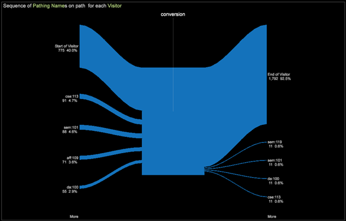

# Modelos de atribuição{#attribution-models}

Sete modelos de atribuição diferentes são fornecidos para uso com o perfil de Atribuição para ajudar a ilustrar e quantificar a jornada de marketing do cliente.

**Primeiro e último** **modelo**

Os primeiros modelos de atribuição são os tradicionais **Primeiro** e **Último** toques. Entender a primeira etapa para converter uma venda ou o último toque antes de sair e comprar um produto fornece uma compreensão dos tipos de campanha — para conscientização, primeiro toque e para chamada para ação, o Último toque.

**Mesmo** **modelo**

A visualização do envolvimento de marketing é ampliada com a introdução de **Par**. Toda interação de marketing qualificada recebe uma participação igual da ordem e da receita subsequentes geradas da conversão.

**Modelo inicial, reprodutor e mais próximo** ****

E, além de uma alocação igual, o modelo **Iniciador, Reprodutor e Fechador** fornece um esquema de ponderação baseado na posição com ponderação ajustável. Os pesos podem ser explorados durante a análise.

Considere este exemplo: O primeiro (ou o primeiro) recebe 30% da receita convertida, mais próximo (ou o último) recebe 30%, e todos os jogadores (aqueles intermediários) compartilham uma porção igual dos 40% restantes.

>[!NOTE]
>
>É bastante comum atribuir a alocação de volta às interações de marketing com base na receita ou na ocorrência do pedido. Esses dois modelos seguintes atribuem características diferentes às interações de marketing para expor outras dinâmicas de sucesso.

**Modelo de adaptação**

O modelo de Adjacência fornece visibilidade para a posição de marketing longe da conversão, respondendo à pergunta: O canal de marketing normalmente é a interação do canal de marketing 1`st` (mais próxima), 5`th`ou 10`th` longe do sucesso?

**Modelo de latência**

O modelo de **latência** ajuda a descrever o tempo de atraso entre a interação com o canal de marketing e a ocorrência de sucesso. Isso é útil para apresentar conscientização versus campanhas do tipo chamada para ação e saber quais alavancas a empresa pode aproveitar para obter uma resposta mais oportuna de um público-alvo. (Um valor de zero (0) dias significa que a interação de marketing ocorreu no mesmo dia que o sucesso.)

**Modelo de definição de caminho**

O modelo de definição de caminho fornece diferentes abordagens para explorar o envolvimento do cliente com o marketing e sua conversão bem-sucedida, estabelecendo as relações entre as interações de marketing na jornada do cliente. Explore os mapas de processo para entender os fluxos de alto nível entre os canais de marketing de suporte e o sucesso. Avalie as interações de marketing sequenciais diretas com o navegador de caminho.

Visualização do navegador de caminhos

**Visualização do mapa de processo 2D**

**Visualização do mapa de processos 3D**

