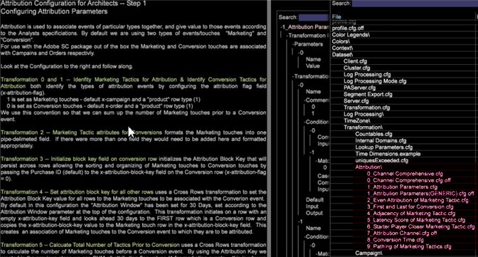

# Attribution Profile{#attribution-profile}

Usando o novo perfil de Atribuição baseado em regras no Análise de big data, você pode analisar rapidamente os eventos de atribuição e atribuir a responsabilidade que leva a uma conversão bem-sucedida definida por você. O perfil de Atribuição é concluído com as informações necessárias para que o seu arquiteto de dados configure e estenda seus recursos, e inclui espaços de trabalho pré-criados para que seu analista comece a analisar e a começar a trabalhar.

O perfil de Atribuição permite que você ganhe uma nova perspectiva sobre os relacionamentos entre seus esforços de marketing e uma geração de clientes potenciais bem-sucedidos ou conversão de vendas. O perfil de Atribuição ajuda você a qualificar interações que devem receber alocação de crédito para receita realizada ou participação a jusante na jornada do cliente. Ele ajuda a identificar o impacto de seus esforços e custos de marketing, permitindo que você analise rapidamente os eventos de atribuição e, em seguida, atribua responsabilidade pelos primeiros ou últimos toques ou outros eventos que levam a uma venda bem-sucedida.

<!--  -->

>[!IMPORTANT]
>
>O perfil de Atribuição é configurado para uso imediato por usuários que implementaram o perfil do Adobe SC que usa o feed de dados do Analytics (SC/Insight). Por padrão, os eventos de Marketing e Conversão são empregados como os tipos padrão de interações avaliadas nos modelos baseados em regras fornecidos.

Consulte [Implantação do perfil](../../../../home/c-get-started/c-attribution-profiles/c-rules-attrib/c-attrib-profile-deploy.md#concept-fbcb5800cd6a40cc901e61f3882988c0) de atribuição e modelos [de](../../../../home/c-get-started/c-attribution-profiles/c-rules-attrib/c-attrib-models.md#concept-e209c7e86a5c4008ad6d78fdf4ea032d) atribuição para obter mais informações.

## Espaços de trabalho de arquitetura e analistas {#section-27c6aff70ba147cca6e11451e127afb4}

No perfil de Atribuição, há espaços de trabalho do Arquiteto e do Analista definidos em guias separadas na bancada.

**Espaços de trabalho de arquitetura**

Na guia **Atribuição** , clique na **[!UICONTROL Architect Workspace]** guia para abrir espaços de trabalho especificamente projetados para configurar seus arquivos de configuração para modelagem básica de atribuição.

A guia Arquitetura inclui espaços de trabalho para percorrer cada um dos arquivos de configuração na pasta do conjunto de dados do perfil. Por exemplo, **[!UICONTROL Attribution Configuration - Step 1]** permite identificar os valores de Atribuição na seção Transformação do [!DNL profile.cfg] arquivo.

**Espaços de trabalho** do analista Clique na **[!UICONTROL Analyst]** **[!UICONTROL Workspaces]** guia para abrir a análise pré-construída de espaços de trabalho utilizando as dimensões e métricas fornecidas com o perfil de Atribuição.

Esses espaços de trabalho são organizados em quatro categorias:

1. **Relatórios** básicos expõem um único modelo em um espaço de trabalho.
1. **Relatórios** comparativos estenderam as análises ao apresentar vários modelos em uma única exibição.
1. **Relatórios** de investigação expandem os modelos de relatórios para apresentar os modelos de atribuição em diferentes formatos. Esta seção introduz e expõe igualmente as relações de ponderação baseadas na posição.
1. **Os Relatórios** de definição de caminho fornecem visibilidade sobre a jornada de marketing do cliente com várias visualizações de definição de caminho para explorar e expressar completamente os fluxos de processo e os caminhos de interação

A guia Analista inclui espaços de trabalho pré-configurados com relatórios. Por exemplo, **[!UICONTROL First Attribution]** permite selecionar na **[!UICONTROL Campaign]** tabela para ver a **[!UICONTROL Revenue]** atribuição com base em **[!UICONTROL Time]**.

