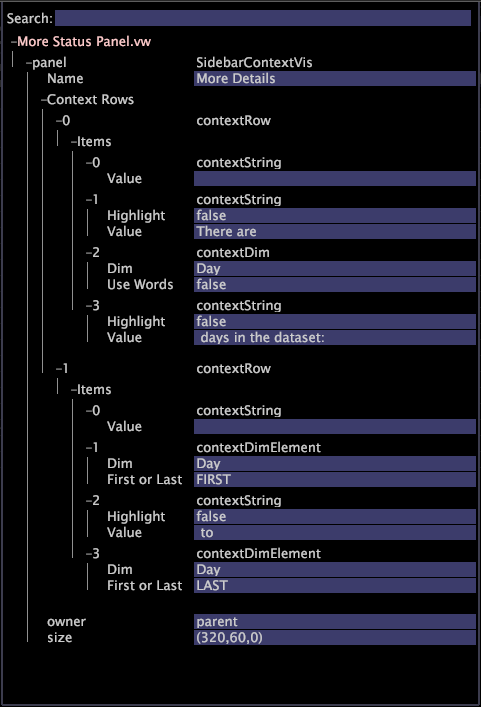

# Configurar a barra lateral{#configure-the-sidebar}

A barra lateral fornece acesso a funções usadas regularmente e preserva as visualizações conforme você se move entre os Espaços de trabalho.

Os administradores podem personalizar uma barra lateral para torná-la apropriada para grupos de usuários diferentes e, em seguida, implantar a barra lateral com um perfil.

A barra lateral é ideal para ajudá-lo a rastrear os filtros e as substituições locais. Se preferir não usar a barra lateral, oculte-a.

## Adicionar visualizações à barra lateral {#section-666f70a405db4f8d8eaffa567ffcac06}

1. Inicie a Análise de big data.
1. Na barra lateral, clique em **[!UICONTROL Add]** > *&lt;**[!UICONTROL item]**>*. For example, [!DNL Selections Panel], [!DNL Filters Panel], or [!DNL Table].

   Os seguintes painéis da barra lateral estão disponíveis na instalação padrão do Análise de big data. Mais itens podem estar disponíveis em seu perfil específico:

   * **Painel de seleções:** Permite que você entenda quais seleções estão ativas no espaço de trabalho atual. As [!DNL Selections Panel] atualizações são feitas sempre que você faz uma nova seleção. Você pode apagar as seleções clicando em **[!UICONTROL x]**. Consulte [Fazer seleções em visualizações](../../home/c-get-started/c-vis/c-sel-vis/c-sel-vis.md#concept-012870ec22c7476e9afbf3b8b2515746) para obter informações sobre como selecionar dados.
   * **Painel Filtros:** Facilita o carregamento e a aplicação de filtros salvos. Você pode carregar vários filtros e ativar ou desativar cada um deles independentemente clicando na caixa de seleção ao lado dele. Consulte Editores [de filtro](../../home/c-get-started/c-analysis-vis/c-filter-editors/c-filter-editors.md#concept-2f343ecbed8240f18b0c1f1eccef11e3).
   * **Painel Substituição Local:** Este painel exibe quais métricas, dimensões e filtros que estão presentes no perfil foram modificados na sua cópia pessoal do perfil. Isso ajuda a alertar sobre possíveis diferenças entre a forma como os dados são exibidos no cliente e os de outros usuários. Quando você salva alterações em uma métrica, dimensão ou filtro no servidor, a substituição é removida do [!DNL Local Overrides panel]. Se você clicar em uma substituição e clicar em **[!UICONTROL Revert to Server]**, a substituição local será removida e o item reverterá para a versão compartilhada.
   * **Legenda da métrica:** Adiciona uma legenda de métrica. [!DNL Metric legends] permite que você visualize as métricas de linha de base relacionadas ao seu perfil e às estatísticas relacionadas ao conjunto de dados (ou à seleção atual, caso uma tenha sido feita). Consulte Legendas [de métricas](../../home/c-get-started/c-analysis-vis/c-legends/c-metric-leg.md#concept-e7195bc8f7844ae295bda3a88b028d5b).
   * **Legenda de cor:** Adiciona uma legenda colorida. É possível visualizar códigos de cores por métricas, como Conversão e Retenção, e usá-las em quase todas [!DNL Workspace]. Vincular métricas de negócios a cores facilita detectar anomalias, exceções e tendências. Consulte Legendas coloridas.
   * **Anotação de texto:** Adiciona um painel de notas. [!DNL Text annotations] são janelas nas quais você pode inserir texto arbitrário para adicionar informações descritivas ou comentários a um [!DNL Workspace]. Consulte [Trabalhar com anotações](../../home/c-get-started/c-analysis-vis/c-annots/c-text-annots.md#concept-55b4aa3e0c58470b8e3c9d452e12a777)de texto.
   * **Tabela:** Adiciona uma tabela. Uma tabela pode exibir uma ou mais métricas em uma ou mais dimensões de dados. Consulte [Tabelas](../../home/c-get-started/c-analysis-vis/c-tables/c-tables.md#concept-c632cb8ad9724f90ac5c294d52ae667f).
   * **Abrir:** Abre um arquivo salvo.

## Abrir um painel da barra lateral {#section-cbc8e57491854274a577d47a48c306b8}

Você pode abrir um arquivo de visualização na barra lateral a partir de um local salvo ou da área de transferência.

1. Na barra lateral, clique em **[!UICONTROL Add]** > **[!UICONTROL Open]**.
1. Clique **[!UICONTROL File]** para localizar o [!DNL .vw] arquivo do painel que deseja adicionar ou clique em **[!UICONTROL Last Closed Window]**, o que puxa a visualização da área de transferência.

   Além disso, você pode clicar em **[!UICONTROL From Clipboard]** para colar uma visualização que foi copiada para a área de transferência. Consulte [Copiando um painel](../../home/c-get-started/c-config-sidebar.md#section-720ae057632a4b8dbb94412e06a370b1)da barra lateral.

## Copiando um painel da barra lateral {#section-720ae057632a4b8dbb94412e06a370b1}

1. Clique com o botão direito do mouse na borda superior do painel e clique em **[!UICONTROL Copy]** > **[!UICONTROL Window]**.
1. Para colar o painel, clique em **[!UICONTROL Add]** > **[!UICONTROL Open]** > **[!UICONTROL From Clipboard]**.

## Salvar um painel da barra lateral {#section-fb19936b12704fb0a4c592abb579db1d}

Em um painel da barra lateral, clique com o botão direito do mouse na barra de título e clique em **[!UICONTROL Save]**.

Da mesma forma, é possível abrir uma visualização da barra lateral salva. A Análise de big data salva a visualização como um [!DNL .vw] arquivo no local especificado.

## Reverter para a barra lateral padrão {#section-4d14b8771ad747bba799876267f24831}

Na barra lateral, clique em **[!UICONTROL Options]** > **[!UICONTROL Revert]**.

Quando você fecha o Análise de big data, o sistema salva a configuração atual da barra lateral no [!DNL sidebar.vw] arquivo no perfil do usuário. Quando você abre o Análise de big data, o sistema carrega o [!DNL sidebar.vw] arquivo do perfil do usuário, em vez de um perfil pai.

É possível reverter para uma barra lateral padrão ou salva anteriormente, o que exclui a barra lateral do perfil do usuário e recarrega a barra lateral do perfil pai. Os administradores podem substituir a barra lateral padrão (pai) por uma barra lateral local, fazendo upload dela a partir do [!DNL Profile Manager].

## Personalizar o arquivo do painel Mais status {#section-8d502f3b59cc4331966edec05e896ce1}

Os administradores do sistema podem criar fórmulas no [!DNL More Status Panel.vw]. Isso posiciona as palavras contextuais em torno dos valores de métrica e dimensão e exibe os resultados na barra lateral [!DNL More Status panel] .

Para exibir a barra lateral, clique nas setas mostradas [!DNL More Status panel] no exemplo a seguir.

O procedimento a seguir mostra um exemplo simples de como criar um status personalizado que informa quantos dias estão em um conjunto de dados:

1. Na barra lateral [!DNL Profile Manager], clique em **[!UICONTROL\]**.

1. Na [!DNL Base_5_3*] coluna, faça uma cópia local do [!DNL More Status Panel.vw] arquivo.

   Para fazer isso, clique com o botão direito do mouse na marca de seleção de arquivo e clique em **[!UICONTROL Make Local]**.

1. Abra o [!DNL More Status Panel.vw] arquivo no Bloco de notas [!DNL .vw] [!DNL Editor] ou no Bloco de notas.

   

1. Preencha os campos [!DNL Context] e [!DNL Items] no [!DNL Editor]. Consulte Sintaxe [de linguagem de](../../home/c-get-started/c-qry-lang-syntx/c-qry-lang-syntx.md#concept-15d1d3f5164a47d49468c5acb7299d9f) consulta para obter instruções sobre sintaxe.

1. Salve o arquivo.

   Os valores no exemplo anterior resultam em uma fórmula de status exibida da seguinte maneira:

   

