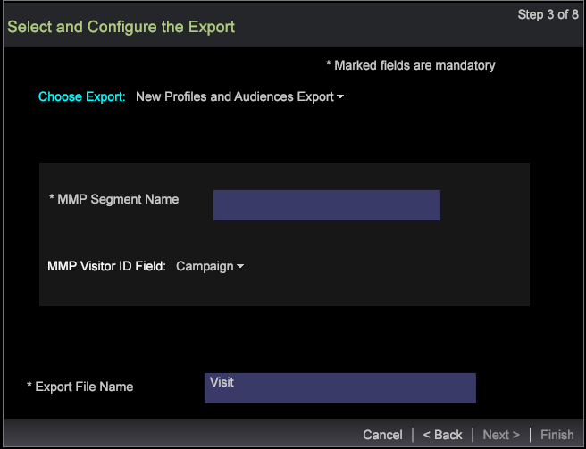
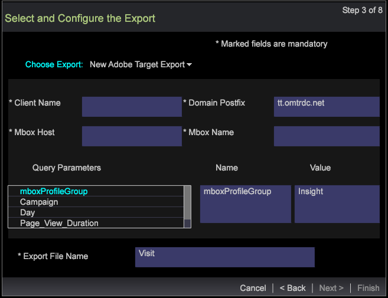

# Assistente de exportação de segmentos{#segment-export-wizard}

Exportar segmentos usando o assistente de exportação de segmentos

O assistente de exportação de segmentos fornece um processo passo a passo para configurar e exportar segmentos em vez de [exportar segmentos de uma tabela detalhada](https://experienceleague.adobe.com/docs/data-workbench/using/client/export-data/c-sgmt-expt.html).

## Exportar segmentos usando o assistente {#section-b30f2699dbc7490bad18512b91cb0cb3}

Para abrir o assistente, clique com o botão direito do mouse em um espaço de trabalho e selecione **Admin** > **Assistentes** > **Assistente de exportação de segmentos**.

>[!NOTE]
>
>Somente os segmentos aplicados antes da abertura do assistente serão capturados. Além disso, as exportações de segmento criadas no assistente não podem gerar comandos externos.

1. Selecione os vários níveis principais das dimensões e métricas a serem adicionadas à exportação.

   Os níveis exibidos dependem do perfil selecionado. Você pode selecionar vários níveis de dimensão com base no perfil.

   

1. Clique em **Avançar**.
1. Selecione o Dimension e as Métricas para os níveis selecionados.

   Por exemplo, depois de selecionar Exibição de página como o nível principal, você pode selecionar as dimensões e métricas secundárias disponíveis para serem exportadas.

1. Clique em **Avançar**.

   

   

1. Selecione o formato de exportação e insira um nome para o arquivo de exportação.

   

   Os tipos CSV, TSV, Exportação de segmentos e Exportação de segmentos com cabeçalho não precisam de configuração extra. No entanto, a exportação de perfis e públicos-alvo, o serviço de registro personalizado e a exportação do Adobe Target precisam ser configurados na etapa 3. Por exemplo, consulte os campos de configuração para Perfis e Exportação de público-alvo. Configure esses tipos de exportação e clique em **Next**.

   

   

   

1. Configure o tipo de exportação selecionado.

   Cabeçalho — Se o Cabeçalho for Verdadeiro, nomeie o campo **Arquivo de Saída**.

   Campo de escape — Definido como **True** ou **False**.

   Ordem dos Campos — Selecione um campo e mova para cima ou para baixo para definir a ordem no arquivo de exportação.

   

   Clique em **Avançar**.

1. Visualize o Nível e os filtros aplicados nesta caixa de diálogo. Clique em **Avançar**. 

1. Se **CSV**, **TSV**, **Exportação de segmento** ou **Exportação de segmento com cabeçalho** estiver selecionada, há três opções:

   Exportação Genérica - O arquivo de saída será gerado pelo servidor na pasta Servidor/Exportação.

   

   Exportação de FTP - O arquivo de saída será transferido para o servidor selecionado. (A lista do servidor será extraída do arquivo FTPServerInfo.cfg.)

   

   Exportação SFTP - O arquivo de saída será transferido com segurança para o servidor selecionado.

1. Clique em **Avançar**

   **Observação:** se o tipo de exportação selecionado for  **Perfis e exportação** de público-alvo, serviço de registro  **personalizado** e exportação do  **Adobe Target**, o texto será estático com base na exportação selecionada.

1. Configure os parâmetros de agendamento.

   **Um** Shotcan pode ser definido como Verdadeiro ou Falso.

   **O Advanced** Scheduling pode ser ativado ou desativado clicando no botão Advanced Scheduling Configuration.

   

   Como exportar a partir da Tabela de detalhes, um instantâneo desaparecerá se a Configuração avançada estiver ativada. Clique em **Avançar**.

1. Visualize o arquivo de exportação e clique em **Executar Exportação**.

   

   

Os seguintes tipos de exportações estão disponíveis usando o assistente:

**Tipos de exportação de segmento**

* Genérico
* FTP
* SFTP

**Exportar segmento com cabeçalho**

* Genérico
* FTP
* SFTP

**Exportação de CSV**

* Genérico
* FTP
* SFTP

**Exportação de TSV**

* Genérico
* FTP
* SFTP
