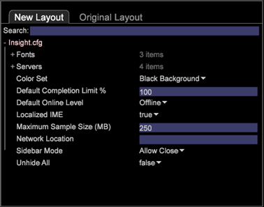

# Parâmetros de configuração{#configuration-parameters}

Defina os parâmetros no arquivo Insight.cfg para especificar a conexão de rede e as configurações do Data Workbench.

O exemplo a seguir contém apenas os parâmetros incluídos no arquivo [!DNL Insight.cfg] por padrão.

**Nova exibição de Layout**



**Exibição de layout original**


Alguns dos parâmetros disponíveis no novo arquivo [!DNL Insight.cfg] podem não estar disponíveis em sua versão do arquivo [!DNL Insight.cfg]. Se um desses parâmetros for necessário, você deverá adicioná-lo ao arquivo [!DNL Insight.cfg] usando [!DNL Add Custom Key], clicando com o botão direito do mouse em um parâmetro e especificando o nome e o tipo. Você também pode adicionar parâmetros abrindo o arquivo [!DNL .cfg] (localizado no diretório de instalação do Data Workbench) usando um editor de texto.

A seguir, um exemplo de todos os parâmetros disponíveis para o arquivo [!DNL Insight.cfg] que você pode usar como modelo para adicionar entradas de parâmetro:

```
Licensing = serverInfo:
  Proxy Address = string: 
  Proxy Port = int: 8080
  Proxy User Name = string: 
  Proxy Password = string: 
Servers = vector: 1 items
  0 = serverInfo: 
    Address = string: VS02
    Name = string: Insight Server
    Port = int: 443
    Proxy Address = string: 
    Proxy Password = string: 
    Proxy Port = int: 8080
    Proxy User Name = string: 
    SSL Client Certificate = string: Named User.pem
    SSL Server Common Name = string: VS02
    Use Address File = bool: false
    Use SSL = bool: true
Color Set = int: 0
Default to Online = bool: false
Fonts = vector: 0 items
Gamma = float: 1.6
Maximum Sample Size (MB) = double: 0
Network Location = string: 
Unhide All = bool: false
Unlock = bool: false
Update Software = bool: true
User Folder = string: User\\
Toolbar Icons = bool: false
```

A tabela a seguir fornece descrições dos parâmetros de arquivo [!DNL Insight.cfg] disponíveis em ordem alfabética.

<table id="table_4465713A08B649E280A3B4840E829518"> 
 <thead> 
  <tr> 
   <th colname="col1" class="entry"> Parâmetro </th> 
   <th colname="col2" class="entry"> Descrição </th> 
  </tr> 
 </thead>
 <tbody> 
  <tr> 
   <td colname="col1"> <p>Endereço </p> </td> 
   <td colname="col2"> <p>O nome do host ou endereço IP numérico do computador do servidor do Data Workbench. </p> <p>Exemplo: <span class="filepath"> vsServer.mycompany.com ou 192.168.1.90</span> </p> <p>Se <span class="wintitle"> Endereço</span> não for especificado, <span class="keyword"> o cliente</span> usará o nome comum especificado no parâmetro Nome Comum do Servidor SSL quando Usar Arquivo de Endereço for definido como falso. </p> <p> <p>Observação: Se o parâmetro Usar arquivo de endereço estiver definido como true, o texto inserido no parâmetro Endereço poderá ser removido depois que o primeiro perfil for aberto em <span class="keyword"> no cliente</span>. Em seguida, a configuração do Parâmetro de Local de Rede determina quais endereços do arquivo de Endereço do cluster são usados para se conectar ao servidor principal. </p> </p> </td> 
  </tr> 
  <tr> 
   <td colname="col1"> <p>Conjunto de cores </p> </td> 
   <td colname="col2"> <p>Especifica a cor de fundo de seu aplicativo cliente <span class="keyword"></span>. As opções são as seguintes: </p> <p>0 = preto </p> <p>1 = branco </p> <p>2 = monocromático </p> <p>O valor padrão é 0, preto. </p> </td> 
  </tr> 
  <tr> 
   <td colname="col1"> <p>Nível Online Padrão </p> </td> 
   <td colname="col2"> <p>Opcional. Permite que você faça sua instância do Data Workbench funcionar por padrão como streaming, offline ou online sempre que ela abrir. As opções são Streaming, Online ou Offline. A configuração padrão do Data Workbench é funcionar offline. </p> <p> <p>Observação: Antes de decidir trabalhar online por padrão, avalie os benefícios e as consequências descritas em <a href="../../home/c-get-started/c-off-on.md#concept-cef8758ede044b18b3558376c5eb9f54"> Trabalhar offline e online</a>. </p> </p> </td> 
  </tr> 
  <tr> 
   <td colname="col1"> <p>Fontes </p> </td> 
   <td colname="col2"> <p>Opcional. Vetor que lista as fontes que <span class="keyword"> o cliente</span> deve usar para renderizar caracteres especiais unicode baseados em UTF8. O número de fontes na lista é ilimitado. </p> <p>A primeira fonte deve ser sempre o Console do Lucida Sans. Se esse parâmetro não estiver incluído no arquivo <span class="filepath"> Insight.cfg</span>, o Data Workbench usará somente o console Lucida Sans para exibir o texto. </p> <p> O Data Workbench usa a primeira fonte da lista para renderizar todos os caracteres até encontrar um caractere que não pode ser renderizado. Ele usa a segunda fonte da lista para renderizar esse caractere. Se essa fonte não renderizar o caractere, o Data Workbench usará a terceira fonte da lista para renderizar esse caractere e assim por diante, até atingir o fim da lista de fontes. Se a fonte correta não estiver listada no vetor, a Data Workbench exibirá o valor hexadecimal do caractere. </p> <p> <p>Observação:  Não altere este parâmetro enquanto o Data Workbench estiver em execução. </p> </p> </td> 
  </tr> 
  <tr> 
   <td colname="col1"> <p>Gama </p> </td> 
   <td colname="col2"> Configuração de gama para a exibição da Data Workbench. O valor padrão é 1.6. O Adobe não recomenda alterar esse valor. </td> 
  </tr> 
  <tr> 
   <td colname="col1"> <p>Licenciamento </p> </td> 
   <td colname="col2"> <p>Opcional. Você precisa modificar os parâmetros no vetor de Licenciamento somente se estiver entrando em contato com o servidor de licenças do Adobe por meio de um servidor proxy. </p> <p>Identificador de seção para parâmetros que permitem que o <span class="keyword"> cliente</span> entre em contato com o Adobe License Server por meio de um servidor proxy. Expanda o nó Licenciamento e preencha os seguintes parâmetros. </p> </td> 
  </tr> 
  <tr> 
   <td colname="col1"> <p>Endereço Proxy </p> </td> 
   <td colname="col2"> <p>Opcional. O endereço do servidor proxy que <span class="keyword"> cliente</span> deve usar para acessar o Servidor de Licenças do Adobe. </p> </td> 
  </tr> 
  <tr> 
   <td colname="col1"> <p>Porta de Proxy </p> </td> 
   <td colname="col2"> <p>Opcional. A porta do servidor proxy. </p> </td> 
  </tr> 
  <tr> 
   <td colname="col1"> <p>Nome de usuário proxy </p> </td> 
   <td colname="col2"> <p>Opcional. O nome de usuário do servidor proxy. </p> </td> 
  </tr> 
  <tr> 
   <td colname="col1"> <p>Senha do Proxy </p> </td> 
   <td colname="col2"> <p>Opcional. A senha associada ao Nome de Usuário do Proxy. </p> </td> 
  </tr> 
  <tr> 
   <td colname="col1"> <p>Tamanho máximo da amostra (MB) </p> </td> 
   <td colname="col2"> <p>Especifica o tamanho máximo permitido no cache de dados usado por <span class="keyword"> o cliente</span> em execução em um único computador. </p> <p>Embora o parâmetro Bytes de amostra no arquivo <span class="filepath"> Server.cfg</span> especifique o tamanho do cache de dados para todos os <span class="keyword"> clientes</span> conectando-se a um servidor do Data Workbench (250e6 bytes por padrão), o parâmetro Tamanho de amostra máximo permite limitar ainda mais o tamanho do cache de dados para um computador específico. Isso é útil quando o cliente é instalado em um computador com capacidade de armazenamento ou computação limitada. </p> <p> <p>Observação: Esse parâmetro limita o tamanho de uma amostra de dados local consultada localmente pelo programa cliente. Por outro lado, o arquivo <span class="filepath"> cache.db</span> contém dados para cada perfil ao qual o cliente se conecta, além dos nomes dos elementos e suas dimensões. Esses nomes de elementos e dimensões nos arquivos <span class="filepath"> cache.db</span> são necessários para executar consultas locais. Consequentemente, não há como limitar seu tamanho a não ser reduzir o número de elementos no conjunto de dados. </p> </p> </td> 
  </tr> 
  <tr> 
   <td colname="col1"> <p>Nome </p> </td> 
   <td colname="col2">Opcional. O nome que <span class="keyword"> o cliente</span> usa para identificar o <span class="keyword"> servidor</span>. </td> 
  </tr> 
  <tr> 
   <td colname="col1"> <p>Local da rede </p> </td> 
   <td colname="col2"> <p>Opcional. O local de rede que o <span class="keyword"> cliente</span> usa para resolver o nome comum do servidor do Data Workbench para um endereço IP. Os locais de rede disponíveis são definidos no arquivo de endereço no servidor. Para obter mais informações, consulte o <i>Server Products Installation and Administration Guide</i>. </p> <p>Se você não especificar um local de rede, <span class="keyword"> cliente</span> resolverá nomes comuns usando o local de rede padrão, "Insight". </p> </td> 
  </tr> 
  <tr> 
   <td colname="col1"> <p>Porta </p> </td> 
   <td colname="col2"> <p>A porta para a qual <span class="keyword"> o cliente</span> envia solicitações. Esse número de porta deve corresponder à porta na qual o servidor do Data Workbench está escutando solicitações. Geralmente é 443 para conexões seguras. </p> </td> 
  </tr> 
  <tr> 
   <td colname="col1"> <p>Endereço Proxy </p> </td> 
   <td colname="col2"> <p>Se for necessário um servidor proxy para se conectar aos computadores do servidor do Data Workbench, você deve concluir pelo menos esse parâmetro e o parâmetro Porta Proxy. Opcionalmente, é possível preencher os parâmetros Proxy User Name e Proxy User Password . </p> <p>O endereço do servidor proxy que <span class="keyword"> o cliente</span> deve usar para acessar o servidor do Data Workbench. </p> </td> 
  </tr> 
  <tr> 
   <td colname="col1"> <p>Senha do Proxy </p> </td> 
   <td colname="col2"> <p>Opcional. A senha para o servidor proxy. </p> </td> 
  </tr> 
  <tr> 
   <td colname="col1"> <p>Porta de Proxy </p> </td> 
   <td colname="col2"> <p>A porta do servidor proxy. O valor padrão é 8080. </p> </td> 
  </tr> 
  <tr> 
   <td colname="col1"> <p>Nome de usuário proxy </p> </td> 
   <td colname="col2"> <p>Opcional. O nome de usuário do servidor proxy. </p> </td> 
  </tr> 
  <tr> 
   <td colname="col1"> <p>Pesquisar </p> </td> 
   <td colname="col2"> <p>No <span class="filepath"> Insight.cfg</span> (ou qualquer <span class="filepath"> arquivo .cfg</span>), você pode pesquisar por nome de chave, tipo de chave ou valor para localizar rapidamente uma entrada, para remover a necessidade de rolar por arquivos grandes e expandidos para obter informações aninhadas. Você pode localizar nomes de dimensões, nomes de servidores e assim por diante. </p> <p>Digite uma frase de pesquisa nesse campo para localizar os dados. Dependendo do sucesso de uma correspondência, a cor do campo muda. As correspondências são mostradas em destaque e as não correspondências são esmaecidas. Se não houver correspondências, o plano de fundo do campo de pesquisa ficará vermelho. Quando você pressiona Enter, a árvore de configuração expande cada lugar em que há uma correspondência e é reduzida em um local em que não há correspondência. </p> <p>Também é possível usar expressões regulares no campo <span class="wintitle"> Search</span>. Por exemplo, você pode usar re: <span class="filepath"> *zip.*</span> para qualquer entrada que contenha a palavra "zip". </p> <p>Para limpar uma pesquisa, pressione <span class="uicontrol"> Escape</span>. </p> </td> 
  </tr> 
  <tr> 
   <td colname="col1"> <p>Servidores </p> </td> 
   <td colname="col2"> <p>Cabeçalho de vetor para conexões <span class="keyword"> cliente</span> para <span class="keyword"> servidor</span>. </p> </td> 
  </tr> 
  <tr> 
   <td colname="col1"> <p>Certificado de cliente SSL </p> </td> 
   <td colname="col2"> <p>Opcional, a menos que você tenha mais de um certificado. O nome do arquivo que contém o certificado digital para esta cópia do Data Workbench. Este é o arquivo que você baixou ao baixar e instalar o certificado digital. </p> <p>Exemplo: <span class="filepath"> Samantha Smith.pem</span> </p> <p>Se você deixar esse parâmetro em branco, <span class="keyword"> o cliente</span> usará qualquer certificado presente. </p> </td> 
  </tr> 
  <tr> 
   <td colname="col1"> <p>Nome comum do servidor SSL </p> </td> 
   <td colname="col2"> <p>O nome comum do servidor do Data Workbench (conforme atribuído em seu certificado digital). </p> </td> 
  </tr> 
  <tr> 
   <td colname="col1"> <p>Ícones da barra de ferramentas </p> </td> 
   <td colname="col2"> <p>False desativa os ícones na interface do usuário da estação de trabalho e exibe o texto na barra de ferramentas. </p> </td> 
  </tr> 
  <tr> 
   <td colname="col1"> <p>Usar arquivo de endereço </p> </td> 
   <td colname="col2"> <p>Especifica se qualquer configuração no arquivo de endereço substitui a configuração do parâmetro Endereço . As opções são true ou false. Se definido como true, as configurações no arquivo de endereço, se presentes, substituirão a configuração do parâmetro Address . O valor padrão é true. </p> </td> 
  </tr> 
  <tr> 
   <td colname="col1"> <p>Usar SSL </p> </td> 
   <td colname="col2">Especifica se o SSL é usado para comunicação segura entre o servidor do Data Workbench e <span class="keyword"> o cliente</span>. As opções são true ou false. O valor padrão é true. </td> 
  </tr> 
  <tr> 
   <td colname="col1"> <p>Mostrar tudo </p> </td> 
   <td colname="col2"> <p>Opcional. Permite que você exiba temporariamente todas as métricas, dimensões e filtros que foram ocultos usando qualquer uma das seguintes funcionalidades: 
     <ul id="ul_B40E28D9FDC0418BBFA9B0A37F4F6913"> 
      <li id="li_E51BAC99AAE949E5886F19557366453A">[Exclusivo] na configuração <span class="filepath"> order.txt</span> arquivos </li> 
      <li id="li_E3D8222BC55D4CEB90BCCAE606711306">Ocultar opção em arquivos <span class="filepath"> order.txt</span> </li> 
      <li id="li_2ADE4EFC1F964D0A90B40CFB3D2766E8">Mostrar parâmetro em <span class="filepath"> .metric</span>, <span class="filepath"> .dim</span> e arquivos <span class="filepath"> .filter</span>. </li> 
      <li id="li_BBCD248A8F33440092B52E407E300FCC">Parâmetro oculto no arquivo <span class="filepath"> Transformation.cfg</span>. </li> 
     </ul> </p> <p>Para obter mais informações sobre esses métodos, consulte <a href="../../home/c-get-started/c-intf-anlys-ftrs/c-ctm-menus/t-cstm-menus-ordr-files.md#task-a391800a8dd444deb3e1516d5189f999"> Ocultar um item de menu</a>. </p> <p>As opções são true ou false. A configuração padrão é false. Altere este parâmetro para true para mostrar temporariamente as métricas, dimensões e filtros ocultos. </p> </td> 
  </tr> 
  <tr> 
   <td colname="col1"> <p>Desbloquear </p> </td> 
   <td colname="col2"> <p>Opcional. Especifica se você tem permissão para desbloquear espaços de trabalho bloqueados. As opções são true e false. True permite que você desbloqueie qualquer espaço de trabalho bloqueado, enquanto false não desbloqueia. O valor padrão é false. Para obter mais informações sobre espaços de trabalho bloqueados, consulte <a href="../../home/c-get-started/c-work-worksp/c-unlock-wksp.md#concept-18ada952aecf45c79a806b31b294023e"> Desbloquear um espaço de trabalho</a>. </p> </td> 
  </tr> 
  <tr> 
   <td colname="col1"> <p>Atualizar software </p> </td> 
   <td colname="col2"> <p>Opcional. Especifica se permite que <span class="keyword"> o </span>software cliente seja atualizado pelo servidor do Data Workbench. As opções são true ou false. O valor padrão é true. </p> </td> 
  </tr> 
  <tr> 
   <td colname="col1"> <p>Pasta do usuário </p> </td> 
   <td colname="col2"> <p>Opcional. Especifica o nome e o local da pasta que contém as cópias locais de espaços de trabalho, métricas, dimensões ou arquivos de configuração para cada perfil. A configuração padrão é Usuário\\, que especifica a pasta Usuário no diretório de instalação do Data Workbench. </p> <p>Alterar essa configuração é útil quando dois usuários estão compartilhando o mesmo computador. Para acomodar ambos os usuários, você pode especificar uma pasta compartilhada à qual ambos os usuários têm acesso. </p> </td> 
  </tr> 
 </tbody> 
</table>
