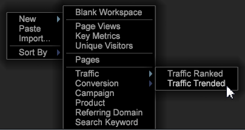

# Relatórios do Analytics{#analytics-reports}

Relatórios analíticos são fornecidos para usuários do perfil Adobe SC. Esses relatórios do Data Workbench—Exibições de página, Tráfego, Visitantes únicos, Domínio de referência e outros tipos significativos de relatórios—são relatórios padrão no Adobe Analytics.

Para os usuários do Adobe Analytics, esses modelos permitem que os usuários que usam o perfil Adobe SC (que usa o feed de dados SC/Insight) exibam relatórios gerados do Data Workbench usando modelos semelhantes ao recurso Adobe [Relatórios e análises de marketing](http://www.adobe.com/solutions/digital-analytics/marketing-reports-analytics.html?promoid=KAUCM). Os usuários podem acessar esses relatórios pré-configurados usando templates do Data Workbench.

>[!NOTE]
>
>Esse menu só será exibido para os usuários que implementaram o perfil do Adobe SC.

**Para Abrir Relatórios**

Na bancada, clique com o botão direito do mouse e selecione **[!UICONTROL New]** para exibir e abrir modelos de relatório.

Veja a seguir uma lista de relatórios do Analytics:

| Relatórios | Descrição |
|---|---|
| [Exibições de página](https://docs.adobe.com/content/help/pt-BR/analytics/components/variables/dimensions-reports/reports-page-views.html) | Um relatório de tendências que exibe o número de vezes em que as páginas do site foram visualizadas durante o intervalo selecionado (hora, dia, semana, mês, trimestre ou ano). Este relatório permite que você acompanhe as visualizações de páginas para cada página no site, bem como um agregado de exibições de página do site inteiro. |
| [Métricas principais](https://docs.adobe.com/help/en/analytics/components/variables/dimensions-reports/reports-key-metrics.html) | O Relatório de métricas principais é o novo relatório que permite que você compare as métricas para ver se elas têm tendência em conjunto. Por exemplo, à medida que suas exibições de página aumentam, o seu visitante conta no aumento? |
| [Visitantes únicos](https://docs.adobe.com/content/help/pt-BR/analytics/components/metrics/unique-visitors.html) | Mostra o número de visitantes únicos que acessaram site. Cada visitante é contado uma vez, independentemente de quantas vezes a pessoa visita site. |
| [Páginas](https://docs.adobe.com/content/help/en/analytics/components/variables/dimensions-reports/reports-pages.html) | Classifica as páginas do site com base nas páginas que recebem mais tráfego. Se sua pergunta comercial lida com dados quantitativos para as páginas, você pode usar este relatório para responder essa pergunta adicionando as métricas certas. |
| [Tráfego](https://docs.adobe.com/help/en/analytics/components/variables/dimensions-reports/reports-traffic.html) | Relatórios de tráfego fornecem um insight detalhado sobre como os visitantes interagem do site da Web. |
| [Conversão](https://docs.adobe.com/content/help/pt-BR/analytics/components/dimensions/evar.html) | Fornecem análises completas, precisas e detalhadas das atividades dos clientes. Métricas como gerenciamento de campanha, ciclo de vendas, desistências e conversão de cliente permitem medir as transações de comércio eletrônico, fontes de vendas, eficácia dos anúncios, fidelidade do cliente etc. |
| [Campanha](https://docs.adobe.com/content/help/en/analytics/components/variables/dimensions-reports/reports-campaigns.html) | Exibe informações sobre a eficácia de seus esforços de publicidade. Você pode ver que tipos de esforços publicitários proporcionam mais tráfego e qual entre seus funcionários é responsável por tais esforços. |
| [Produto](https://docs.adobe.com/content/help/pt-BR/analytics/components/variables/dimensions-reports/reports-products.html) | Identifica como os produtos individuais e grupos de produtos (categorias) contribuem para diversas métricas de conversão, tais como Receita ou Finalizações. |
| [Domínio de referência](https://docs.adobe.com/content/help/en/analytics/components/variables/dimensions-reports/reports-referring-domains.html) | Mostra os domínios que indicaram os clientes que mais tiveram impacto nas métricas de sucesso do site. Os referenciadores são divididos em duas categorias principais: Domínios e URLs. Domínios referem-se ao nome do domínio e aparecem como o domínio base, sem a sequência de consulta nem subdiretórios anexados. URLs incluem o nome de domínio base, bem como qualquer sequência de consulta ou subdiretórios. |
| [Palavra-chave de pesquisa](https://docs.adobe.com/content/help/en/analytics/components/variables/dimensions-reports/reports-search-keywords.html) | Relatórios que exibem um detalhamento de palavras-chave de pesquisa. |
