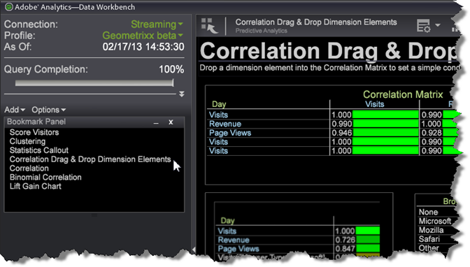

# Adicionar marcadores{#add-a-bookmarks}

Você pode marcar espaços de trabalho significativos para mover rapidamente entre visualizações e relatórios empregados no fluxo de trabalho.

1. Marque como favorito uma área de trabalho clicando no ícone Marcador  no canto superior direito da barra de ferramentas.

   Antes de marcar um espaço de trabalho, esse ícone aparece como apenas um livro. O ícone de marcador muda para um livro com uma página marcada depois que um espaço de trabalho é marcado.

1. Clique em **[!UICONTROL Add]** > **[!UICONTROL Bookmarks Panel]** no painel esquerdo para abrir uma lista de marcadores.

   

1. Para abrir um espaço de trabalho marcado, clique no nome de um espaço de trabalho no **[!UICONTROL Bookmark Panel]**.

   

   O espaço de trabalho selecionado será aberto. Ao clicar em outro espaço de trabalho marcado, o espaço de trabalho anterior será fechado e o espaço de trabalho selecionado recentemente será aberto, permitindo que você navegue rapidamente pelo seu fluxo de trabalho.

**Para excluir um marcador:**

* No Painel de marcadores, clique com o botão direito do mouse e selecione **Remover`<bookmark title>`** para excluir um marcador selecionado ou selecione **[!UICONTROL Clear All Bookmarks]** para excluir todos os marcadores.

* Você também pode clicar com o botão direito do mouse na área de trabalho na visualização em miniatura dentro da área de trabalho e selecionar **[!UICONTROL Clear Bookmark]**.

>[!IMPORTANT]
>
>* 25 marcadores podem ser salvos.
>* Se você adicionar um marcador e mover o local do espaço de trabalho, o marcador será inválido e deverá ser excluído do Painel de marcadores e redefinido.

