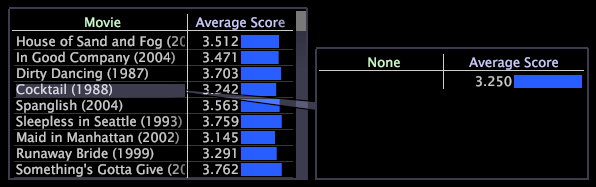

# Adicionar chamadas a um espaço de trabalho{#adding-callouts-to-a-workspace}

Chamadas são janelas que você adiciona a um espaço de trabalho para chamar a atenção para um elemento de dimensão específico criando uma nova visualização com uma seleção virtual desse elemento.

A Análise de big data é fornecida com um conjunto padrão de tipos de chamada. Como sua implementação pode ser totalmente personalizada, os tipos de chamada disponíveis que aparecem em sua implementação podem diferir do que está documentado neste guia.

Por padrão, o Análise de big data fornece os seguintes avisos:

* [Anotação](../../../home/c-get-started/c-vis/c-call-wkspc.md#section-7b6742160b3f4aed872a09c8c023f90d)
* [Gráfico de linhas em branco](../../../home/c-get-started/c-vis/c-call-wkspc.md#section-5dcc0504bdb64ed4976f880e2f7b277f)
* [Gráfico de dispersão em branco](../../../home/c-get-started/c-vis/c-call-wkspc.md#section-5dcc0504bdb64ed4976f880e2f7b277f)
* [Tabela em branco](../../../home/c-get-started/c-vis/c-call-wkspc.md#section-5dcc0504bdb64ed4976f880e2f7b277f)
* [Legenda de confiança](../../../home/c-get-started/c-vis/c-call-wkspc.md#section-386d1293ddc24a0c9cccb332e20db791)
* [Legenda da métrica](../../../home/c-get-started/c-vis/c-call-wkspc.md#section-daa6d372c22246d9827880a9d6e804d8)

>[!NOTE]
>
>Os convites não funcionam como seleções (ou seja, não afetam outras visualizações dentro do espaço de trabalho) a menos que você faça uma seleção dentro do texto explicativo.

Você pode adicionar ou editar definições de chamada configurando os arquivos de chamada armazenados na pasta de instalação *nome*\Context\Callout folder of the [!DNL Server] do perfil. Consulte [Configuração de Chamadas](../../../home/c-get-started/c-intf-anlys-ftrs/c-config-callouts.md#concept-f6e91e172f5e4c009245c9c549beb76a).

## Para adicionar um texto explicativo de anotação a uma visualização {#section-7b6742160b3f4aed872a09c8c023f90d}

1. Clique com o botão direito do mouse no elemento para o qual deseja criar um texto explicativo e clique em **[!UICONTROL Add Callout]** > **[!UICONTROL Annotation]** > **[!UICONTROL Image]** ou **[!UICONTROL Add Callout]** > **[!UICONTROL Annotation]** > **[!UICONTROL Text]**. Uma janela em branco é exibida com uma conexão visível a esse elemento.

   

   Para adicionar avisos às visualizações de gráfico, é necessário clicar com o botão direito do mouse na parte inferior da visualização (o eixo base) para abrir um menu.

   

1. Dependendo da sua seleção, conclua a etapa apropriada:

   * Para uma anotação de texto, digite ou cole o texto desejado no texto explicativo e, em seguida, formate o texto conforme apropriado. Consulte [Trabalhar com anotações](../../../home/c-get-started/c-analysis-vis/c-annots/c-text-annots.md#concept-55b4aa3e0c58470b8e3c9d452e12a777)de texto.
   * Para uma anotação de imagem, cole a imagem desejada no texto explicativo copiando a imagem e clicando com o botão direito do mouse no texto explicativo. Clique em **[!UICONTROL Paste image]**. Consulte [Trabalhar com anotações](../../../home/c-get-started/c-analysis-vis/c-annots/c-image-annots.md#concept-02081ed7d91c4fdcb8fc863f2a51c962)de imagem.

## Para adicionar uma tabela em branco, um gráfico de linhas ou um texto de dispersão ao texto de uma visualização {#section-5dcc0504bdb64ed4976f880e2f7b277f}

1. Clique com o botão direito do mouse no elemento para o qual deseja criar um texto explicativo e clique em **[!UICONTROL Add Callout]** > *&lt;**[!UICONTROL callout type]**>*.

   O exemplo a seguir mostra uma chamada de Tabela em branco.

   

1. Para selecionar uma dimensão, clique com o botão direito do mouse **[!UICONTROL None]** e clique em **[!UICONTROL Change Dimension]** > *&lt;**[!UICONTROL dimension name]**>*.

   >[!NOTE]
   >
   >Se você alterar a dimensão em uma visualização que tenha um texto explicativo, o texto explicativo mudará de estar conectado ao elemento da dimensão original para estar conectado à visualização inteira.

## Para adicionar uma chamada de legenda de confiança a uma visualização {#section-386d1293ddc24a0c9cccb332e20db791}

1. Clique com o botão direito do mouse no elemento para o qual deseja criar o texto explicativo e clique em **[!UICONTROL Add Callout]** > **[!UICONTROL Confidence Legend]**.

   

1. Se desejar, altere o [!DNL Metric or Formula] campo.

Para obter as regras de sintaxe de expressão, consulte Sintaxe [de linguagem de](../../../home/c-get-started/c-qry-lang-syntx/c-qry-lang-syntx.md#concept-15d1d3f5164a47d49468c5acb7299d9f)consulta. Consulte Legendas [de confiança](../../../home/c-get-started/c-analysis-vis/c-legends/c-conf-leg.md#concept-73db81c2c218427786c04068aa778efd).

## Para adicionar uma chamada de legenda de métrica a uma visualização {#section-daa6d372c22246d9827880a9d6e804d8}

1. Clique com o botão direito do mouse no elemento para o qual deseja criar o texto explicativo e clique em **[!UICONTROL Add Callout]** > **[!UICONTROL Metric Legend]**.

   

1. Se desejar, adicione ou remova métricas da legenda da métrica.

Consulte Legendas [de métricas](../../../home/c-get-started/c-analysis-vis/c-legends/c-metric-leg.md#concept-e7195bc8f7844ae295bda3a88b028d5b).
