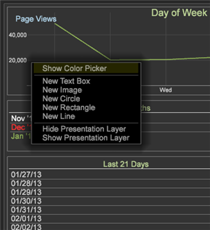

# Visualizações de anotação{#annotating-visualizations}

A Camada de apresentação permite marcar e anotar suas visualizações de espaço de trabalho e publicar com suas chamadas e comentários. Adicione descrições de texto, objetos gráficos, setas de texto explicativo, codificação de cores, imagens e outros recursos em uma sobreposição para adicionar anotações e esclarecer pontos de dados importantes e, em seguida, compartilhar com as partes interessadas.

**Adicione anotações às suas visualizações:**

1. Abra um espaço de trabalho.
1. Vá para **Arquivo** > Camada **de** apresentação.
1. Clique em **Permitir Camada** de Apresentação.

   Alterne o comando neste menu para permitir ou proibir a geração de uma camada de apresentação. Uma marca de seleção aparecerá quando a camada de apresentação for permitida.

   

   Quando você permite a camada de apresentação, um ícone clicável aparecerá no lado direito da barra de ferramentas.

    Esse ícone clicável mostra que você está no modo **Ocultar camada** de apresentação, mas não consegue ver anotações.

1. Clique no ícone para alternar para **Mostrar camada** de apresentação.

   Exibir anotações na camada de apresentação.

    Esse ícone clicável mostra que você está no modo **Mostrar camada** de apresentação, mas não pode editar.

   >[!NOTE]
   >
   >Você também pode clicar com o botão direito do mouse na área de trabalho para alterar modos usando comandos de menu.

   

1. **Edite e adicione recursos de chamada.**

   Clique no ícone novamente para capturar uma representação estática da visualização da área de trabalho e abrir uma sobreposição para adicionar ou editar anotações.

    Esse ícone clicável mostra que você está no modo **Editar camada** de apresentação para adicionar e editar anotações.

   Uma sobreposição cinza é exibida no modo de edição.

1. **Adicionar recursos** de chamada.

   Clique com o botão direito do mouse na visualização para adicionar uma nova caixa de texto. setas e outros recursos de chamada para realçar e anotar na apresentação.

   

1. **Defina os recursos** gráficos.

   Selecione um objeto gráfico e clique com o botão direito do mouse para definir opções. É possível definir cores para uma caixa ou outro objeto gráfico, ajustar configurações de texto em uma caixa de texto e adicionar setas ou definir camadas para linhas.

   

1. **Adicione imagens ao espaço de trabalho**.

   Clique com o botão direito do mouse para adicionar suas imagens .png e .jpg à sobreposição e redimensione.

1. **Atribuir cores a objetos** gráficos.

   É possível selecionar objetos na camada de apresentação e atribuir cores usando o seletor de cores. 

1. **Exportar e compartilhar a camada** de apresentação.

   Depois de anotar as visualizações do espaço de trabalho, você pode exportar a camada de apresentação com visualizações e compartilhar como um arquivo gráfico .png.

   Clique em **Exportar** > **Exportar PNG**.
