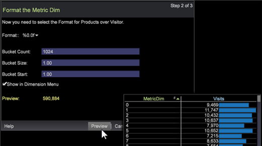

# Assistente de atenuação de métrica{#metric-dim-wizard}

Use o assistente de Esmaecimento de métrica para criar uma nova Dimensão de métrica.

Um Esmaecimento de métrica converte uma métrica em uma nova dimensão. Por exemplo, um Esmaecimento de métrica com base em uma métrica de Exibições de página e nível de Visitante exibirá elementos de dimensão com base no total de Exibições de página para cada Visitante. Ela permite estender uma métrica definida no momento com base em elementos de dimensão para criar e salvar como uma nova dimensão.

## Etapa 1: selecionar dimensão e métrica {#section-58b6ea7bbba5487ba1a3c264aa3dcb95}

1. **Abra o Assistente** de atenuação de métrica.

   Em um espaço de trabalho, clique com o botão direito do mouse e selecione **Ferramentas** > **Criar extremidade** de métrica.

1. **Nomeie o Esmaecimento** da métrica.

   Como padrão, o campo Nome será preenchido automaticamente com base nas seleções Nível e Métrica.

1. **Selecione um Nível de Dimensão.** O nível de dimensão é a dimensão pai que contém todos os valores de elementos constituintes para filtrar a entrada e definir um tipo de dimensão.

   Os níveis de dimensão incluem:

   * Clickthrough
   * Ocorrência
   * Product
   * Visita
   * Visitante

1. **Selecione uma métrica**.

   Selecione uma métrica pré-criada para estender e salvar como uma métrica reduzida.

   

1. (opcional) **Criar uma fórmula** de métrica.

   Clique na caixa para inserir uma fórmula de métrica personalizada. O valor de Visualização calculado aparecerá validando a expressão.

   

   Você pode adicionar sua própria expressão [de](https://docs.adobe.com/content/help/en/data-workbench/using/client/qry-lang-syntx/c-syntx-mtrc-exp.html) métrica ou recortar e colar de outro editor de métricas ou visualização. Erros de sintaxe, erros de fórmula, filtros indefinidos e outros erros são relatados no assistente.

1. Clique em **Próximo**.

## Etapa 2: formatar e definir grupos {#section-5bddf3cd306545d7806a501637f80f77}

Você pode selecionar o formato da métrica e definir os valores de grupo para uma expressão de dimensão.

1. Selecione um **Formato** para a nova métrica escurecer.

   

   O formato define como a métrica será apresentada quando aberta em uma visualização. Esses formatos são padrões [](http://www.cplusplus.com/reference/cstdio/printf/)printf selecionados, definidos abaixo:

   ```
   %[flags][width][.precision][length][specifier]
   %
   0.2lf = % _ [flags] 0 [width] .2 [.precision] l [length] f[ specifier]
   ```

   No campo **Visualização** , um valor será exibido com base na métrica e no formato selecionados.

1. Adicionar expressão Contagem **de** Período.

   É possível definir um tamanho de métrica com vários intervalos ou cestos. Isso retorna subconjuntos de elementos com base no tamanho, como [0-4], [5-10],...). Os elementos do Nível de dimensão estão relacionados aos elementos cujo intervalo contém o valor da métrica. Consulte a descrição da expressão bucket em [Sintaxe para Expressões](https://docs.adobe.com/content/help/en/data-workbench/using/client/qry-lang-syntx/c-syntx-dim-exp.html)de Dimensão.

1. Clique em **Visualizar** para abrir a tabela de valores de Esmaecimento de métrica antes de salvar.

   

   A tabela detalha os valores de métrica por tamanho de métrica.

1. Clique em **Mostrar no menu** Dimensão para adicionar a dimensão recém-criada à guia **Dimensão** no **Finder**.
1. Clique em **Próximo**.

## Etapa 3: concluir e salvar {#section-d9043235b18a425f9de0db668d4b1683}

1. Selecione para iniciar o Editor de borda de métrica, a visualização de gráfico ou a tabela depois de salvar.

   | Campo | Descrição |
   |---|---|
   | Iniciar o Editor de Esmaecimento de Métricas | Abra o Editor de atenuação de métrica. |
   | Gráfico de lançamento | Inicie um gráfico PNG da tabela. |
   | Iniciar tabela | Inicie uma tabela no espaço de trabalho com valores em colunas listando valores da nova métrica em comparação com os valores da métrica selecionada. |

1. Clique em **Concluir** e salve.

   Uma caixa de diálogo para salvar será aberta permitindo que você salve o arquivo. As opções selecionadas para exibir valores serão abertas no espaço de trabalho.

