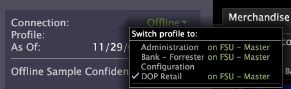

# Profiles{#profiles}

O Análise de big data baixa perfis para a máquina.

Se você estiver carregando um perfil pela primeira vez, precisará ter uma conexão de rede com o e estar trabalhando on-line para que o Análise de big data possa baixar os arquivos necessários do [!DNL Data Workbench server] [!DNL Data Workbench server].

O download do perfil pode levar vários minutos. Você não deve começar a trabalhar com o perfil até que o Cache de dados comece a ser preenchido, mas não precisa aguardar até que ele esteja cheio. É possível rastrear o progresso do cache de dados, o progresso da sincronização do perfil e a data e hora dos dados processados mais recentemente, observando as barras de status à medida que o perfil é carregado.

>[!NOTE]
>
>Não é possível visualizar os dados nas visualizações que você adiciona até que o cache de dados comece a preencher.

Na próxima vez que você carregar o perfil, as atualizações do perfil e de seus dados serão baixadas somente se você tiver uma conexão de rede com o perfil [!DNL Data Workbench server] e estiver trabalhando on-line. Se você estiver trabalhando offline, o perfil e seus dados serão carregados do cache do computador. Nesse caso, você está visualizando a versão do perfil e os dados que foram baixados na última vez que você trabalhou online com o perfil. Para obter mais informações sobre como trabalhar online versus offline, consulte [Trabalhar offline e online](../../home/c-get-started/c-off-on.md#concept-cef8758ede044b18b3558376c5eb9f54).

Quando precisar alterar seu perfil (usando o [!DNL Profile Manager] ou o [!DNL Server Files Manager]), você deve trabalhar online para garantir que tenha a versão mais atualizada do perfil. Para obter mais informações sobre o [!DNL Profile Manager] e o [!DNL Server Files Manager], consulte Interfaces [administrativas](../../home/c-get-started/c-admin-intrf/c-admin-intrf.md#concept-855c1a91e1a948969fab592adca15f74).

Se não conseguir acessar ou carregar um perfil, talvez seja necessário confirmar o seguinte:

* Você tem uma conexão de rede com a [!DNL Data Workbench server] máquina na qual o perfil reside.
* Você tem as permissões apropriadas para acessar o perfil.

Para obter ajuda, entre em contato com o administrador do sistema.

## Carregando ou alternando perfis {#section-c50499d7d8084d7cadfada52df33f5f4}

1. Inicie a Análise de big data.
1. Na barra lateral, clique no nome do perfil e clique em **[!UICONTROL Switch Profile]** > *&lt;**[!UICONTROL profile name]**>*, onde o nome *do* perfil é o perfil com o qual você deseja trabalhar.

   

Se esta for a primeira vez que você carrega o perfil selecionado, pode levar vários minutos para baixar dados suficientes para preencher uma visualização.

## Acessar um perfil em um cluster {#section-189a0ac04a8f46099c11c0f4f77b6dbb}

Usuários do Análise de big data que acessam um perfil em execução em um

o cluster de servidores da análise de big data identifica somente o Servidor da Análise de big data mestre no arquivo de configuração da Análise de big data ( [!DNL Insight.cfg]). Da perspectiva do usuário da Análise de big data, o perfil pode ser acessado em apenas um Servidor da Análise de big data (o Servidor mestre da Análise de big data). No entanto, as solicitações de consulta dos analistas podem ser direcionadas para qualquer um dos Servidores da Análise de big data no cluster.

Para obter mais informações sobre perfis em execução em um cluster do Data Workbench Server, consulte o Guia *de Instalação e Administração de Produtos para* Servidor.
