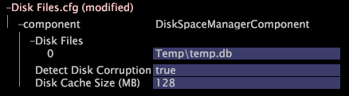

# Monitorar o espaço de dados do conjunto de dados{#monitoring-dataset-data-space}

Informações sobre o monitoramento do conjunto de dados e a adição de novos locais para o armazenamento de dados do conjunto de dados.

**Frequência recomendada:** a cada 5-10 minutos

Por padrão, [!DNL Insight Server] grava seu conjunto de dados no arquivo [!DNL temp.db] na mesma unidade dos arquivos de programa [!DNL Insight Server] na Unidade de processamento de dados. A quantidade de dados do conjunto de dados por máquina [!DNL Insight Server] é limitada ao seguinte, o que ocorrer primeiro:

* Quinhentos (500) milhões de registros de entrada de dados para esse conjunto de dados
* Quinhentos (500) GB de dados do conjunto de dados armazenados
* Um (1) MB de dados do conjunto de dados armazenados por qualquer dimensão de nível raiz (por exemplo, 5.000 registros por visitante em uma média de 200 bytes por registro)

Se quiser que [!DNL Insight Server] mantenha o conjunto de dados em uma unidade diferente ou se a quantidade de dados que espera coletar exigir o uso de várias unidades, atualize o arquivo de configuração Arquivos de Disco ( [!DNL Disk Files.cfg]) para especificar onde deseja que [!DNL Insight Server] grave o(s) arquivo(s) [!DNL temp.db]. O arquivo [!DNL Disk Files.cfg] lista os arquivos de disco (um vetor de sequências de caracteres) e especifica o local dos dados do conjunto de dados usados por [!DNL Insight Server] durante o reprocessamento e a operação. Geralmente há um arquivo por unidade física.

>[!NOTE]
>
>O conteúdo do arquivo [!DNL Disk Files.cfg] pode ter sido modificado ao instalar [!DNL Insight Server]. Para obter mais informações, consulte [Configuração da localização do conjunto de dados (temp.db)](../../../../home/c-inst-svr/c-install-ins-svr/t-install-proc-inst-svr-dpu/t-cfg-loc-dtst.md#task-f645eefecb154e679acbb480a07c1f0e).

**Para adicionar novos locais para armazenamento de dados do conjunto de dados**

1. Em [!DNL Insight], na guia [!DNL Admin] > [!DNL Dataset and Profile], clique na miniatura **[!UICONTROL Servers Manager]** para abrir o espaço de trabalho do Gerenciador de Servidores.
1. Clique com o botão direito do mouse no ícone do [!DNL Insight Server] que deseja configurar e clique em **[!UICONTROL Server Files]**.
1. No [!DNL Server Files Manager], clique em **[!UICONTROL Components]** para visualizar seu conteúdo. O arquivo [!DNL Disk Files.cfg] está localizado dentro desse diretório.
1. Clique com o botão direito do mouse na marca de seleção na coluna *server name* para [!DNL Disk Files.cfg] e clique em **[!UICONTROL Make Local]**. Uma marca de seleção aparece na coluna [!DNL Temp] para [!DNL Disk Files.cfg].
1. Clique com o botão direito do mouse na marca de seleção recém-criada na coluna [!DNL Temp] e clique em **[!UICONTROL Open]** > **[!UICONTROL in Insight]**.
1. Na janela [!DNL Disk Files.cfg], clique em **[!UICONTROL component]** para visualizar seu conteúdo.

   

   >[!NOTE]
   >
   >O parâmetro Detect Disk Corruption é definido como true por padrão. O parâmetro Tamanho do Cache de Disco (MB) controla a quantidade de memória que [!DNL Insight Server] usa para aumentar a velocidade de acesso ao disco e é definido como 128 por padrão. Entre em contato com o Adobe antes de alterar qualquer um desses parâmetros.

1. Para alterar os arquivos de disco na máquina [!DNL Insight Server], clique com o botão direito do mouse em **[!UICONTROL Disk Files]** e clique em **[!UICONTROL Add new]** > **[!UICONTROL Disk File]**.

   Para excluir um arquivo de disco, clique com o botão direito do mouse no número do arquivo de disco e clique em **[!UICONTROL Remove]**.

1. Para o novo arquivo de disco, insira o diretório e o nome do arquivo a ser usado por [!DNL Insight Server] durante o reprocessamento e a operação.

   

   >[!NOTE]
   >
   >O parâmetro Detect Disk Corruption é definido como true por padrão. O parâmetro Tamanho do Cache de Disco (MB) controla a quantidade de memória que [!DNL Insight Server] usa para aumentar a velocidade de acesso ao disco e é definido como 128 por padrão. Entre em contato com o Adobe antes de alterar qualquer um desses parâmetros.

1. Salve as alterações no servidor fazendo o seguinte:

   1. Clique com o botão direito do mouse **[!UICONTROL (modified)]** na parte superior da janela e clique em **[!UICONTROL Save]**.

   1. No [!DNL Server Files Manager], clique com o botão direito do mouse na marca de seleção do arquivo na coluna [!DNL Temp] e selecione **[!UICONTROL Save to]** > *&lt;**[!UICONTROL server name]***.
