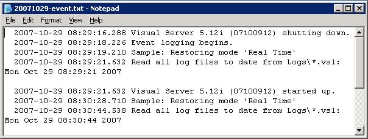

# Monitorar eventos administrativos{#monitoring-administrative-events}

Você deve monitorar regularmente seus arquivos de log de eventos para rastrear mensagens de evento do sistema do Insight Server, que são registradas no `<YYYYMMDD>-event.txt` arquivos localizados por padrão na pasta Eventos no diretório de instalação do Insight Server.

**Frequência recomendada:** A cada 5-10 minutos

Você pode monitorar esses eventos usando a variável [!DNL Server Files Manager] em [!DNL Insight], sua ferramenta de gerenciamento automatizado, o [!DNL *-event.txt] ou o Visualizador de Eventos do Windows.

>[!NOTE]
>
>Os Logs de evento administrativos são completamente separados do seu Registro de eventos do Windows, mas contêm alguns dos mesmos eventos. Os registros de eventos administrativos contêm informações somente sobre [!DNL Insight Server] eventos.

**Para exibir os arquivos events.txt por meio da[!DNL Server Files Manager]**

1. Em [!DNL Insight], no [!DNL Admin] > [!DNL Dataset and Profile] clique no botão **[!UICONTROL Servers Manager]** miniatura para abrir o espaço de trabalho do Gerenciador de Servidores.
1. Clique com o botão direito do mouse no ícone de um [!DNL Insight Server] e clique em **[!UICONTROL Server Files]**.
1. No [!DNL Server Files Manager], clique em **[!UICONTROL Events]** para visualizar seu conteúdo.
1. Clique com o botão direito do mouse na marca de seleção no *nome do servidor* ao lado do arquivo desejado e clique em **[!UICONTROL Make Local]**. Uma marca de seleção é exibida ao lado do nome do arquivo na [!DNL Temp] coluna.
1. Clique com o botão direito do mouse na marca de seleção no [!DNL Temp] e clique em **[!UICONTROL Open]** > **[!UICONTROL in Notepad]**. O arquivo de evento é exibido em uma nova janela Microsoft Windows Notepad .

   

   O [!DNL Server.log] no [!DNL Trace] na pasta [!DNL Insight Server] o diretório de instalação contém informações de registro mais detalhadas.

**Para visualizar eventos através do Visualizador de eventos do Windows**

* Clique em **[!UICONTROL Start]** > **[!UICONTROL Control Panel]** > **[!UICONTROL Administrative Tools]** > **[!UICONTROL Event Viewer]**.

**Para alterar o diretório Log de Eventos Administrativos**

O arquivo de configuração Logs de evento administrativo, [!DNL Administrative Events Log.cfg], especifica o diretório para o qual o registro de eventos é emitido.

1. Em [!DNL Insight], no [!DNL Admin] > [!DNL Dataset and Profile] clique no botão **[!UICONTROL Servers Manager]** miniatura para abrir o espaço de trabalho do Gerenciador de Servidores.

1. Clique com o botão direito do mouse no ícone do [!DNL Insight Server] você deseja configurar e clicar em **[!UICONTROL Server Files]**.

1. No [!DNL Server Files Manager], clique em **[!UICONTROL Components]** para visualizar seu conteúdo. O [!DNL Administrative Event Logs.cfg] O arquivo está localizado dentro desse diretório.

1. Clique com o botão direito do mouse na marca de seleção no *nome do servidor* coluna para [!DNL Administrative Event Logs.cfg] e clique em **[!UICONTROL Make Local]**. Uma marca de seleção aparece no [!DNL Temp] coluna para [!DNL Administrative Event Logs.cfg].

1. Clique com o botão direito do mouse na marca de seleção recém-criada na [!DNL Temp] e clique em **[!UICONTROL Open]** > **[!UICONTROL in Insight]**.

1. No [!DNL Administrative Event Logs.cfg] , clique em **[!UICONTROL component]** para visualizar seu conteúdo. O caminho padrão é o [!DNL Events] na pasta [!DNL Insight Server] diretório de instalação.

   

1. No parâmetro Path , digite o nome do diretório no qual deseja exibir os dados de registro do evento.
1. Salve as alterações no servidor fazendo o seguinte:

   1. Clique com o botão direito do mouse **[!UICONTROL (modified)]** na parte superior da janela e clique em **[!UICONTROL Save]**.
   1. No [!DNL Server Files Manager], clique com o botão direito do mouse na marca de seleção do arquivo no [!DNL Temp] e selecione **[!UICONTROL Save to]** > **[!UICONTROL server name]**.
