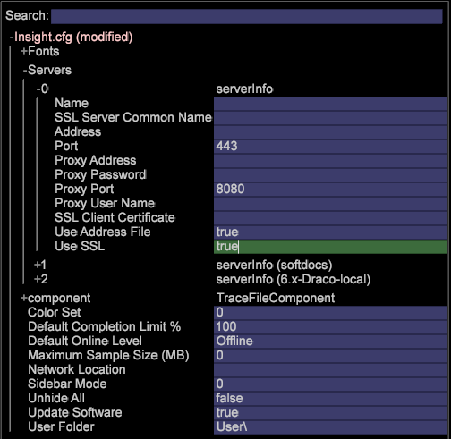

# Configuração da conexão com o servidor Insight{#configuring-the-connection-to-insight-server}

Depois de instalar o software Insight e o certificado digital, você deve iniciar o Insight e configurar sua conexão com o Insight Server.

>[!NOTE]
>
>Em alguns casos, a conexão com o Insight Server pode ter sido pré-configurada pelos Serviços de consultoria da Adobe ou pelo administrador do sistema. Em caso afirmativo, não é necessário concluir essa tarefa.

Quando você inicia o Insight pela primeira vez, ele se conecta automaticamente ao Adobe License Server para registrar seu certificado digital. Para concluir o processo de registro com êxito, o computador deve estar conectado à Internet quando você executar as etapas a seguir.

>[!NOTE]
>
>Se você já solicitou, baixou e instalou um certificado pré-bloqueado conforme descrito em [Download e instalação do certificado](../../../home/c-install-insight/install-setup/c-dgtl-crtf.md#topic-fed3b44e472c4e4ca6dd5852af14cdb9)digital, o Insight não tentará se conectar ao License Server e você não receberá um erro.

**Para configurar a conexão com o Insight Server**

Ao trabalhar em um ambiente clusterizado, o Insight deve ser configurado para acessar o Servidor Insight mestre para evitar problemas de sincronização. No Insight, você pode exibir informações sobre o processamento [!DNL Insight Servers] no cluster usando o item de [!DNL Related Servers] menu no Gerenciador de servidores.

1. Inicie o Insight.
1. No [!DNL Worktop], clique em **[!UICONTROL Admin]**, em seguida **[!UICONTROL First Steps]**.

1. Clique na **[!UICONTROL Configure Connection to Servers]** miniatura.

   O [!DNL Servers Manager]arquivo, o [!DNL Insight.cfg] arquivo e as instruções para configurar seu [!DNL Insight.cfg]arquivo são exibidos.

1. Na [!DNL Insight.cfg] janela, clique com o botão direito do mouse **[!UICONTROL Servers]** e clique em **[!UICONTROL Add new child]** > **[!UICONTROL Server]**.

   

1. Conclua ou modifique os parâmetros do servidor para fornecer ao Insight acesso ao seu Servidor Insight mestre. Para obter descrições detalhadas dos parâmetros no arquivo Insight.cfg, consulte Parâmetros de configuração.

   

1. Repita a Etapa 4 e a Etapa 5 para cada Servidor Insight ao qual você deseja configurar uma conexão.
1. Para salvar as alterações de configuração, clique com o botão direito do mouse **[!UICONTROL Insight.cfg (modified)]** na parte superior da janela e clique em **[!UICONTROL Save as Insight.cfg]**.

   O Insight tenta se conectar ao [!DNL Insight Server(s)] usando as configurações especificadas. Se uma conexão for estabelecida, um nó verde será exibido na página [!DNL Servers Manager] como mostrado na página a seguir.

   

   * **Verde:** Indica que a conexão com o Insight Server está ativa.
   * **Vermelho claro:** Indica um possível problema com o servidor, como uma fuga no processamento do servidor, alta utilização de memória ou pouco espaço em disco.
   * **Vermelho:** Indica que a conexão com o Insight Server não está ativa.
   Se o Insight não conseguir se conectar usando as configurações especificadas, um nó vermelho aparecerá no [!DNL Servers Manager]. Se isso acontecer, consulte Solução de problemas de [conexão](../../../home/c-install-insight/install-setup/t-conn-trbsh.md#task-034e588c5ce04c4a8f6d0097364d3b2b).

<!--
c_dir_crt_setup.xml
-->

Quando você seleciona um perfil para usar, as informações do perfil (incluindo dados relacionados e quaisquer espaços de trabalho ou visualizações específicos definidos para o perfil) são baixadas para o computador. À medida que você baixa cada perfil, o Insight cria uma pasta dentro do diretório de instalação usando o nome do perfil.

Por exemplo, se você selecionar um perfil chamado Vendas, uma pasta chamada Vendas será exibida no diretório Insight. Essa pasta contém as métricas, dimensões, espaços de trabalho e visualizações definidas no perfil de vendas. Após o carregamento inicial do perfil, o perfil pode ser usado ao trabalhar offline. Consulte [Trabalhar offline e online](https://docs.adobe.com/content/help/en/data-workbench/using/client/c-off-on.html).

Além disso, quando você se conecta ao Insight Server pela primeira vez a partir do Insight, o Insight Server cria os seguintes diretórios no diretório de instalação do Insight.

* **[!DNL Trace]diretório:**No[!DNL Trace]diretório está o arquivo de log do Insight ([!DNL insight.log]). Quando o tamanho do[!DNL Insight.log]arquivo atingir 100 MB, o nome do arquivo será renomeado para[!DNL insight-1.log]. Se um arquivo do nome[!DNL insight-1.log]já existir, então[!DNL insight-1.log]será renomeado para[!DNL insight-2.log], e assim por diante, com um máximo de[!DNL insight-9.log]. O arquivo[!DNL insight.log]sempre contém as informações de log mais recentes e[!DNL insight-max.log]as mais antigas.

* **[!DNL User]diretório:**Dentro do[!DNL User]diretório estão as pastas que correspondem a cada perfil usado até o momento, e dentro de cada pasta de perfil estão as pastas nomeadas[!DNL Work]e[!DNL Workspaces]. O diretório`User\*profile name*\Workspaces`é o local padrão no qual os arquivos do Insight Workspace são salvos.`User\*profile name*\Work`é o local padrão no qual as visualizações do Insight e outros trabalhos personalizados executados pelo usuário do Insight são salvos.

A tabela a seguir lista os locais padrão dos componentes acessados com frequência.

<table id="table_0254A8C25AF5400F89F87A242746D07E"> 
 <thead> 
  <tr> 
   <th colname="col1" class="entry"> Componente </th> 
   <th colname="col2" class="entry"> Local do diretório </th> 
  </tr>
 </thead>
 <tbody> 
  <tr> 
   <td colname="col1"> 
Visualizações salvas 
 </td> 
   <td colname="col2"> 
<i>Insight</i>\User\<i>nome</i>do perfil\Work\ 
 </td> 
  </tr> 
  <tr> 
   <td colname="col1"> 
Espaços  de trabalho salvos 
 </td> 
   <td colname="col2"> 
<i>Insight</i>\User\<i>nome</i>\Workspaces\<i>nome</i>da guia\ 
 </td> 
  </tr> 
  <tr> 
   <td colname="col1"> 
Arquivos .png salvos . 
 </td> 
   <td colname="col2"> 
<i>Insight</i>\User\<i>nome</i>do perfil\Work\ 
 </td> 
  </tr> 
  <tr> 
   <td colname="col1"> 
Cache de dados 
 </td> 
   <td colname="col2"> 
<i>Insight</i>\User\Cache.db 
 </td> 
  </tr> 
  <tr> 
   <td colname="col1"> 
 Arquivo Insight.log 
 </td> 
   <td colname="col2"> 
<i>Insight</i>\Trace\ 
 </td> 
  </tr> 
 </tbody> 
</table>

<!--
c_config_file_ent.xml
-->

Você pode pesquisar por nome de chave, tipo de chave ou valor para localizar rapidamente uma entrada, a fim de remover a necessidade de percorrer arquivos grandes e expandidos para obter informações aninhadas. Você pode localizar nomes de dimensão, nomes de servidor e assim por diante. O exemplo a seguir mostra correspondências para uma pesquisa no mapa de frases.

Digite uma frase de pesquisa nesse campo para localizar os dados. Dependendo do sucesso de uma correspondência, a cor do campo muda. As correspondências são mostradas realçadas e as não correspondências ficam esmaecidas. Se não houver correspondências, o plano de fundo do campo de pesquisa ficará vermelho. Quando você pressiona Enter, a árvore de configuração expande cada lugar onde há uma correspondência e fecha onde não há correspondência.

Também é possível usar expressões regulares no [!DNL Search] campo. Por exemplo, você pode usar re: [!DNL *CEP.*]para qualquer entrada que contenha a palavra &quot;CEP&quot;.

Para apagar uma pesquisa, pressione **[!UICONTROL Escape]**.
