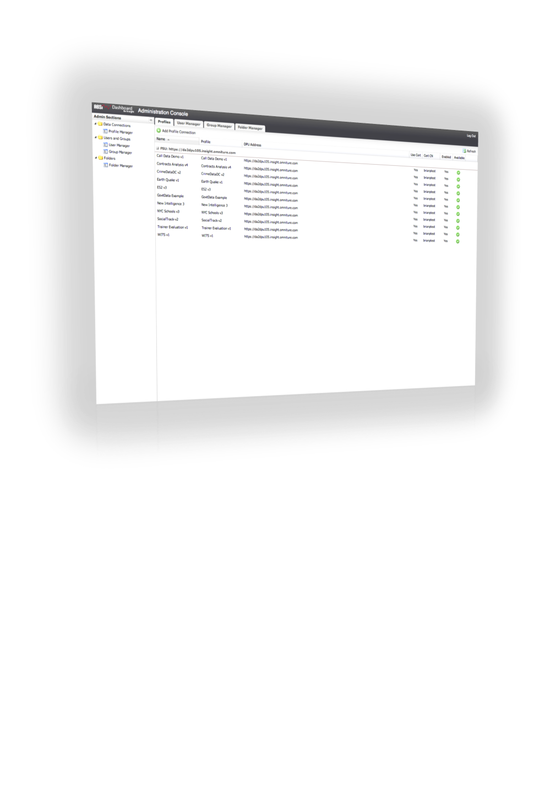

# Gerenciar do Console de administração{#managing-from-the-administration-console}

{{eol}}

As funções administrativas do aplicativo de painel são executadas usando o **[!UICONTROL Administration Console.]** Com esse console, você pode gerenciar conexões de perfil, usuários, grupos de usuários, hierarquias de pastas e as definições de esquema usadas no painel.

Para acessar o Console de administração, primeiro você deve estar conectado ao painel como administrador. Depois de fazer logon na interface do painel, clique em **[!UICONTROL User]** > **[!UICONTROL Admin]** para navegar até o Console de administração.

