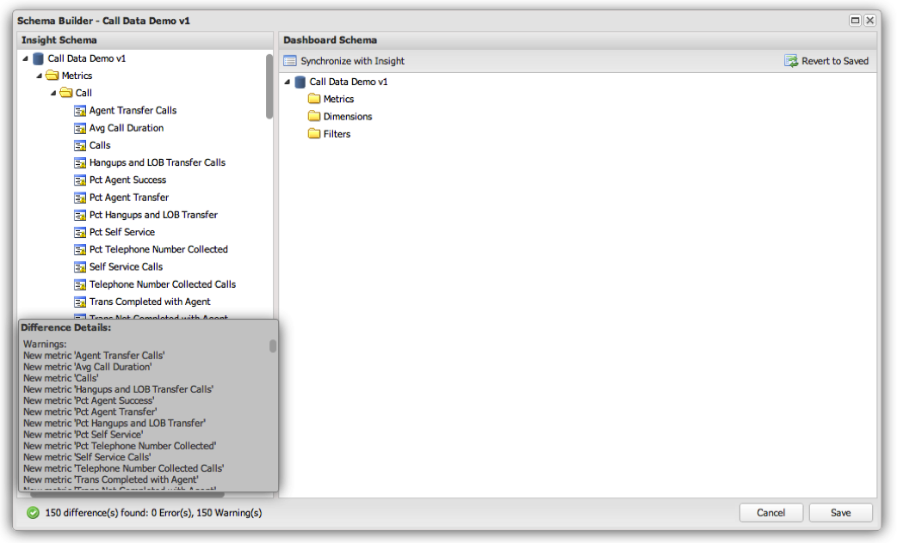

# Inicializando e Atualizando a Definição de Esquema de um Perfil{#initializing-and-updating-a-profile-s-schema-definition}

1. Abra o **[!UICONTROL Schema Builder]** para o perfil que deseja configurar.
1. Uma **[!UICONTROL Loading]** mensagem será exibida enquanto o esquema estiver sendo recuperado do perfil do Insight. O tempo de carregamento do esquema depende da complexidade do perfil que está sendo carregado.
1. Ao concluir, você verá um resumo das diferenças entre o painel **[!UICONTROL Insight Schema]** à esquerda e o painel **[!UICONTROL Dashboard Schema]** à direita. Este resumo aparecerá na parte inferior esquerda da **[!UICONTROL Schema Builder]** janela.

   >[!NOTE]
   >
   >Ao configurar o esquema pela primeira vez, cada métrica, dimensão e filtro serão listados de forma diferente do esquema do painel. Isso ocorre porque os objetos de esquema do painel não existem no momento.

   

1. Clique no **[!UICONTROL Synchronize with Schema]** botão para sincronizar todas as métricas, dimensões e filtros da exibição Esquema do Insight com a exibição Esquema do painel.
1. Ao concluir, você deverá ver uma mensagem indicando que não há diferenças encontradas:

   

1. Se houver erros com o Esquema do painel, como métricas e dimensões duplicadas, você deverá corrigi-los manualmente antes de salvar.

   >[!NOTE]
   >
   >É possível remover seletivamente quaisquer métricas, dimensões ou filtros do painel **[!UICONTROL Dashboard Schema]** que você não deseja que apareçam para os usuários finais do painel. Você receberá um aviso de que os itens não estão presentes no Esquema do painel, mas isso não impedirá que você seja salvo.

1. Quando estiver pronto, clique em **[!UICONTROL Save]** para salvar as alterações no esquema do painel.
1. O sistema de painel usará essa definição de esquema para preencher as dimensões, métricas e filtros disponíveis para os usuários finais da interface do painel.
