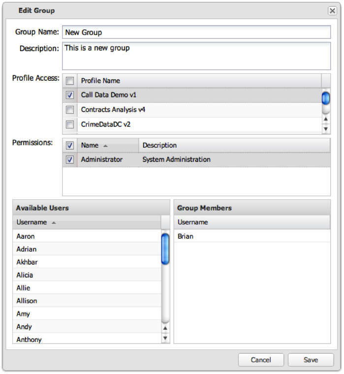

# Editar um grupo de usuários{#editing-a-user-group}

{{eol}}

1. Clique no ícone de engrenagem no final da linha para editar o grupo.

   

1. Edite as configurações do grupo e clique em **[!UICONTROL Save]** para salvar as alterações.

   Se a operação foi bem-sucedida, você verá uma mensagem indicando que o grupo de usuários foi salvo com sucesso.
