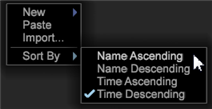

# Atualização do Data Workbench 6.21{#data-workbench-update}

A Data Workbench 6.2.1 fornece novos recursos e correções de erros.

## Novos recursos {#section-1aacfe9a6a964c91b1d24fc1b181db34}

A Data Workbench 6.2.1 inclui estes novos recursos:

<table id="table_E28A6D31E7D941F7A0C2048F0F0F7838"> 
 <thead> 
  <tr> 
   <th colname="col1" class="entry"> Recursos </th> 
   <th colname="col2" class="entry"> Descrição </th> 
  </tr> 
 </thead>
 <tbody> 
  <tr> 
   <td colname="col1"> Barras de rolagem verticais nos recursos de Texto e Quebra automática de texto. </td> 
   <td colname="col2"> As caixas de texto agora têm barras de rolagem verticais e texto de quebra automática. 
  
 </td> 
  </tr> 
  <tr> 
   <td colname="col1"> Classificação de miniaturas na mesa de trabalho </td> 
   <td colname="col2"> Os nomes classificados na bancada agora são insensíveis ao caso do caractere, classificando alfabeticamente AaBbCcDd em vez de ABCDabcd . 
  
 </td> 
  </tr> 
  <tr> 
   <td colname="col1"> Pesquisando dimensões com base na dimensão pai. </td> 
   <td colname="col2"> 
No painel Localizadores, você pode clicar com o botão direito do mouse na guia Dimensões e selecionar Tipo de dimensão &gt; Por pai. Uma lista com as principais dimensões contáveis é exibida. Quando selecionar uma dessas dimensões principais, uma lista com as dimensões subordinadas será exibida nos resultados de busca. 
  </td> 
  </tr> 
  <tr> 
   <td colname="col1"> Caixa de diálogo solicitando a inicialização de um aplicativo externo. </td> 
   <td colname="col2"> 
Agora você verá uma caixa de diálogo na primeira vez que tentar abrir um aplicativo externo no Data Workbench. 
 
Por exemplo, se você abrir um arquivo de texto no Bloco de notas, aparecerá a seguinte mensagem. 
  
Essa ação também criará um arquivo local de nome InsightSES.dat, dentro da pasta de instalação do cliente. 
 </td> 
  </tr> 
  <tr> 
   <td colname="col1"> Da Barra de ferramentas para Botões </td> 
   <td colname="col2"> Você pode optar por não utilizar os novos ícones da barra de ferramentas presentes na versão 6.2 do Análise de big data. Para isso, basta alterar o argumento Ícones da Barra de ferramentas no arquivo insight.cfg para falso . <code> Toolbar&amp;nbsp;Icons&amp;nbsp;=&amp;nbsp;bool:&amp;nbsp;false&amp;nbsp;&amp;nbsp;&amp;nbsp;&amp;nbsp;&amp;nbsp;&amp;nbsp; </code> 
Será necessário reiniciar o cliente para que a alteração seja executada. 
 </td> 
  </tr> 
  <tr> 
   <td colname="col1"> Opções de redefinição na Pontuação de propensão e Árvores de decisão atualizadas </td> 
   <td colname="col2"> Nas visualizações de <a href="https://experienceleague.adobe.com/docs/data-workbench/using/client/analysis-visualizations/visitor-propensity/c-visitor-propensity.html" format="http" scope="external"> Pontuação de propensão </a> (  Ferramentas &gt; Análise preditiva &gt; Pontuação de propensão ) e <a href="https://experienceleague.adobe.com/docs/data-workbench/using/client/analysis-visualizations/decision-trees/c-decision-trees.html" format="http" scope="external"> Árvore de decisão </a> (  Visualizações &gt; Análises preditivas &gt; Classificações &gt; Construtor da árvore de decisão ), agora você tem duas opções de redefinição: 
<b>Redefinir modelos</b>: limpa o modelo mas mantém as configurações e entradas. Torna o botão <b>Ir</b> selecionável. 
 
<b>Redefinir tudo</b> — Redefine todas as configurações (como no design anterior). 
 </td> 
  </tr> 
 </tbody> 
</table>

## Correções de erros {#section-8704a9ac358246cd81233dd0982d534f}

* Os arquivos de pesquisa **[!UICONTROL Browsers]** e **[!UICONTROL Operating Systems]** não serão atualizados dentro do perfil herdado **[!UICONTROL Traffic]** (por exemplo, [!DNL Lookups\Traffic\Browsers.txt)]. Em vez disso, a configuração do perfil **[!UICONTROL Traffic]** utilizará o pacote DeviceAtlas ( [!DNL Lookups\DeviceAtlas\DeviceAtlas.bundle]) para fornecer essas informações de configuração.
* O Análise de big data 6.2.1 será a última versão a oferecer o download de um aplicativo de 32 bits. Todos os futuros downloads de aplicativos do cliente deverão ter 64 bits, e será necessário o Windows 7 ou versão mais recente. Limitações de memória do aplicativo de 32 bits são endereçadas com a introdução do aplicativo de 64 bits, a começar pela versão 6.1.

   >[!NOTE]
   >
   >A versão de 32 bits do aplicativo cliente Data Workbench pode apresentar possíveis problemas relacionados às limitações de memória ao executar modelos preditivos usando os recursos de cluster e pontuação.
