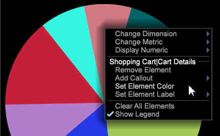

# Pie Chart Update{#pie-chart-update}

As atualizações da exibição do gráfico de pizza permitem utilizar as cores padrão identificadas em uma legenda, ou um conjunto de cores baseado na tabela de cores.

Quando você abre um gráfico de pizza, as cores dos conjuntos de dados são definidas por padrão com cada um identificado na legenda.

A legenda pode ser ativada ou desativada ao clicar com o botão direito do mouse no gráfico e selecionar **Mostrar legenda**. O resultado é um gráfico de pizza sem códigos de cores e elementos identificados nos avisos de cada seção.

**Personalização do Gráfico de Pizza**

Clique com o botão direito do mouse no gráfico de pizza para abrir um menu e modificar seu gráfico de pizza. 

O menu permite alterar elementos de dimensão, métricas e exibição numérica, bem como personalizar cores e rótulos do gráfico.
