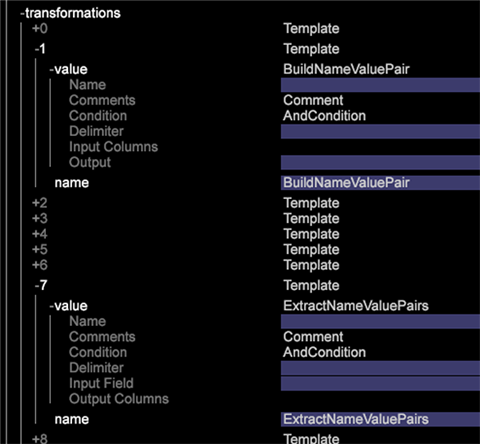

# Notas de versão do Data Workbench 6.3{#data-workbench-release-notes}

As notas de versão da Data Workbench 6.3 incluem novos recursos, requisitos de atualização, bugs corrigidos e problemas conhecidos.

## Novos recursos {#section-1225066ea8f44cf68e42e019d0bca816}

A Data Workbench 6.3 inclui estes novos recursos:

<table id="table_E28A6D31E7D941F7A0C2048F0F0F7838"> 
 <thead> 
  <tr> 
   <th colname="col1" class="entry"> Recursos </th> 
   <th colname="col2" class="entry"> Descrição </th> 
  </tr> 
 </thead>
 <tbody> 
  <tr> 
   <td colname="col1"> <a href="../../../home/c-get-started/c-attribution-profiles/c-attrib-algorithmic/c-attrib-algorithmic.md"> Atribuição de melhor ajuste </a> </td> 
   <td colname="col2"> A Atribuição de melhor ajuste fornece uma abordagem de aprendizado de máquina para determinar os níveis variados de influência que as interações do cliente contribuem para um evento de conversão bem-sucedido e, em seguida, atribui o nível de atribuição apropriado a cada evento. A Atribuição de melhor ajuste permite avaliar os toques em uma janela de tempo antes do evento de conversão bem-sucedido ocorrer e, em seguida, emprega o algoritmo de Data Workbench para criar um modelo de atribuição com base nos seus dados com resultados específicos às suas campanhas de marketing e fluxo de trabalho interno. </td> 
  </tr> 
  <tr> 
   <td colname="col1"> <a href="../../../home/c-get-started/c-exp-data-seg-exp/c-mmp-integration.md"> Integração com o Master Marketing Profile </a> </td> 
   <td colname="col2"> Compartilhe segmentos ricos de clientes criados em Data Workbench com a Adobe Experience Cloud. Integrating with Profiles and Audiences enables the <a href="https://www.adobe.com/solutions/digital-marketing.html?promoid=KLXLZ" format="https" scope="external"> Adobe Experience Cloud </a> and other Adobe Analytic capabilities the opportunity to leverage rich audience segments created in Data Workbench. Isso requer que você tenha o Experience Cloud configurado e em execução. <p>A integração com o Experience Cloud Principal permite que você execute recursos preditivos como agrupamento ou pontuação de propensão e, em seguida, envie segmentos para o Adobe Experience Cloud ou outros produtos maiores, como Adobe Target e Adobe Experience Manager. </p> </td> 
  </tr> 
  <tr> 
   <td colname="col1"> <a href="../../../home/c-get-started/c-exp-data-seg-exp/c-segment-export.md#concept-ac18fdb34edc4b9592130ab98fabd05e"> Opções de formato para exportação de arquivo </a> </td> 
   <td colname="col2"> Added industry-standard format options for segments for direct integration with other capabilities, such as <b>R</b>, without additional file manipulation. Isso oferece um fluxo de trabalho contínuo e uma análise mais rápida. </td> 
  </tr> 
  <tr> 
   <td colname="col1"> <a href="../../../home/c-get-started/c-analysis-vis/c-visitor-cluster/c-clustering-2.md"> Geração de cluster 2.0 </a> </td> 
   <td colname="col2"> Includes a new <span class="filepath"> KMeans++ </span> algorithm ( <span class="filepath"> KMeans </span> is currently supported) that uses a faster approach to finding centers for an expedited cluster-generation process. </td> 
  </tr> 
  <tr> 
   <td colname="col1"> <a href="../../../home/c-get-started/c-analysis-vis/c-graphs/c-trend-lines.md#concept-2898b2ef97dc4762bda7df292713e9a2"> Linhas de tendência </a> </td> 
   <td colname="col2"> Apresentam uma representação dos dados mais visual e fácil de interpretar. </td> 
  </tr> 
  <tr> 
   <td colname="col1"> <a href="../../../home/c-get-started/c-analysis-vis/c-graphs/c-regression-analysis.md#concept-58ec981ab50549488585a88295fa14b7"> Gráfico de análise da regressão </a> </td> 
   <td colname="col2"> Oferece a habilidade de comparar o impacto de um fator a outro dentro do fluxo de trabalho da análise. </td> 
  </tr> 
  <tr> 
   <td colname="col1"> <a href="../../../home/c-get-started/c-analysis-vis/c-chord-visualization.md#concept-ca600beb11674f3bb2696edf41f1dda9"> Exibição de corda </a> </td> 
   <td colname="col2"> The Chord Visualization provides another view of the <a href="https://docs.adobe.com/content/help/en/data-workbench/using/client/analysis-visualizations/correlation-analysis/c-correlation-analysis.html" format="http" scope="external"> Correlation Matrix </a>. </td> 
  </tr> 
  <tr> 
   <td colname="col1"> <a href="../../../home/c-get-started/c-admin-intrf/c-query-que/c-query-string-grouping.md"> Agrupamento de sequência de consulta </a> </td> 
   <td colname="col2"> Se você tiver muitos campos com evars, props e variáveis personalizadas, durante o processamento de log você pode criar um par de valores de nome para combinar campos em um relatório. </td> 
  </tr> 
  <tr> 
   <td colname="col1"> <a href="../../../home/c-get-started/c-analysis-vis/c-latency.md#concept-a18c23d45af0460ba531f94da0cdfe6a"> Análise de latência </a> </td> 
   <td colname="col2"> A visualização Latência permite analisar o comportamento latente do cliente em um número definido de dias antes ou depois que um evento ocorreu após uma campanha ou outro tipo de evento. </td> 
  </tr> 
  <tr> 
   <td colname="col1"> <b>Dimensão de tempo</b> </td> 
   <td colname="col2"> In the Finders panel, you can now right-click on the <span class="uicontrol"> Dimensions </span> tab and select <span class="uicontrol"> Dimension Type &gt; Time </span>. Uma lista de dimensões de tempo será exibida nos resultados da pesquisa. <p>  </p> </td> 
  </tr> 
  <tr> 
   <td colname="col1"> <b>Bloquear</b> recurso </td> 
   <td colname="col2"> O novo recurso <b>Bloquear</b> exibe um ícone na barra de ferramentas quando um espaço de trabalho está bloqueado. Você pode desbloquear o espaço de trabalho clicando no menu <b>Adicionar</b> e, em seguida, clicando em Desbloquear <b></b>temporariamente. </td> 
  </tr> 
  <tr> 
   <td colname="col1"> Operadores lógicos e novos recursos de métrica no painel <b>Filtro </b> </td> 
   <td colname="col2"> Os operadores lógicos E/OU foram adicionados ao Painel <b></b>de Filtro, permitindo que você participe ou adicione métricas ao filtrar dados. À medida que você altera as métricas, a porcentagem de filtro se ajusta e é exibida de acordo. </td> 
  </tr> 
  <tr> 
   <td colname="col1"> Atalhos de teclado </td> 
   <td colname="col2"> Os novos atalhos de teclado na Data Workbench permitem navegar pela área de trabalho principal e por áreas de trabalho individuais usando as teclas de seta. Além disso, a barra de ferramentas do espaço de trabalho agora é exibida na janela de trabalho superior. </td> 
  </tr> 
  <tr> 
   <td colname="col1"> Suporte ao Windows 8.1 </td> 
   <td colname="col2"> O Microsoft Windows 8.1 de 64 bits <a href="https://docs.adobe.com/content/help/pt-BR/data-workbench/using/install/c-data-workbench-client-install.html" format="https" scope="external"> agora é compatível </a> com a instalação do cliente. </td> 
  </tr> 
 </tbody> 
</table>

## Requisitos de atualização e Recommendations {#section-8704a9ac358246cd81233dd0982d534f}

Os novos perfis para Data Workbench estão localizados no perfil **Software e Documentos** em

```
Profiles - Current\DataWorkBench\ 
  English Translated\DataWorkBench_6.31-en-us\
```


**Servidor de atualização:**

>[!NOTE]
>
>Se você personalizou perfis que têm precedência sobre os arquivos padrão fornecidos no [!DNL Base] pacote, será necessário atualizar esses arquivos personalizados:

* **Atualize o arquivo** Meta.cfg ( [!DNL E:\..\Profiles\<your custom profile>\Context\meta.cfg)]para definir a criptografia de senha atualizada para a Unidade de Sistema de Arquivos (servidor FSU) e adicione entradas para as transformações do campo Nomear Valor para aproveitar o Agrupamento [de Sequências de Caracteres de](../../../home/c-get-started/c-admin-intrf/c-query-que/c-query-string-grouping.md)Query.

   1. Abra o [!DNL meta.cfg] arquivo no FSU.
   1. Altere o tipo de dados para **[!UICONTROL Proxy Password]** de &quot; [!DNL string"] para &quot; [!DNL EncryptedString]&quot; na seção Configuração *da* estação de trabalho.

      ```
      Proxy User Name = string: 
      Proxy Password = EncryptedString:   (from Proxy Password = String) 
      Use Address File = bool: true
      ```

   1. Adicione novas entradas para ativar as novas transformações do campo Nomear valor: *BuildNameValuePair* e *ExtractNameValuePairs*.

      Abra um espaço de trabalho e clique com o botão direito do mouse em **Admin** > Gerenciador **de** Perfis.

      Em **Contexto**, clique no arquivo **meta.cfg** na coluna **Base** e clique em **Tornar local**. Na coluna Tabela do usuário, clique com o botão direito do mouse e selecione **Abrir** > **na estação de trabalho**.

      

      * Na nova janela, clique em **metadados** e adicione modelos filhos aceitáveis.

      

      * Abra a **transformação** e adicione novos modelos.

      


* **Atualização para melhorias** da Fast Merge. Adicione parâmetros ou altere valores aos seguintes arquivos de configuração para aproveitar as melhorias de velocidade na Data Workbench durante uma transformação.

   * **Communications.cfg** ([!DNL E:\Server\Components\Communications.cfg])

      ```
      18 = SourceListServer:  
          URI = string: /SourceListServer/ 
          Listing Interval = int: 10 (new)
      ```

   * **Disk Files.cfg** (em [!DNL E:\Server\Components] e [!DNL E:\Server\Components for Processing Servers])

      ```
      Disk Cache Size (MB) = double: 1024 (from double: 256) 
      Disk Cache Read Limit (MB) = double: 768 (new)
      ```

   * **Log Processing Mode.cfg** ( [!DNL E:\Server\Profiles\<your profile>\Dataset\Log Processing Mode.cfg])

      ```
      <i>(changed)</i> 
      Batch Bytes = int: 268435456 
      Cloud Bytes = int: 268435456 
      Real Time FIFO Bytes = int: 268435456
      ```

      ```
      (new) 
      Cache Bytes = int: 32000000 
      Fast Input Decision Ratio = double: 200 
      Fast Input FIFO Bytes = int: 268435456 
      FIFO Hash Mask = int: 16383 
      Fast Merge Buffer Bytes = int: 536870912 
      Slow Merge Buffer Bytes = int: 268435456 
      Fast Merge Fan In = int: 64 
      Key Cache Size Logarithm = int: 21 
      Max Seeks = int: 512 
      Output Old Buffer Bytes = int: 536870912 
      Overflow FIFO Bytes = int: 67108864 
      Paused = bool: false
      ```

      >[!NOTE]
      >
      >* Para aproveitar os aprimoramentos de Fast Merge, verifique se você tem pelo menos 8 GB de RAM por DPU.
      >* O Intervalo de salvamento, a duração entre o conjunto de dados salva, pode precisar ser reduzido se os novos parâmetros do Modo de processamento de log forem aplicados. Como a Transformação será concluída mais rapidamente, o arquivo de estado do conjunto de dados conterá mais dados entre Salvar intervalos em comparação com as versões anteriores.

      >
      >  **É recomendável reduzir a configuração Salvar intervalo para 1800 segundos (30 minutos)**— o intervalo de salvamento padrão é de 3600 segundos (1 hora). (Se essa linha precisar ser adicionada ao [!DNL Log Processing Mode.cfg], observe que há dois (2) espaços à esquerda).
      >
      >  
      ```
      >      Save Interval (sec) = int: 1800
      >  ```
      >
      >  * É recomendável que os novos parâmetros do Modo de Processamento de Log não sejam aplicados a um conjunto de dados configurado com uma **CrossRows** usando a operação **All** . Com essas configurações, o uso de memória para esta operação pode se tornar muito grande para o ambiente.


* **Atualização** de integração do Adobe Target com DWB. Um novo arquivo de exportação [!DNL ExportIntegration.exe]substitui o [!DNL TnTSend.exe] arquivo existente no Insight Server ( [!DNL E:\Server\Scripts\TnTSend.exe]). Este novo arquivo de exportação suporta integração e coordenação da Adobe Target com o novo Perfil de Marketing Principal (MMP) e Adobe Audience Manager.

   Você precisará atualizar os seguintes comandos para exportações do Adobe Target.

   `Command = string: TnTSend.exe`

   para

   ```
   <filepath>
   Command = string: ExportIntegration.exe 
   </filepath>
   ```

   >[!NOTE]
   >
   >Isso só afetará as exportações criadas antes da versão 6.3.
   >
   >
   >Você também pode tentar o seguinte para utilizar o processo de exportação antigo:
   >    
   >* Crie um novo teste e exportação de Público alvo na estação de trabalho.
   >* Modifique a antiga exportação de teste e Público alvo encontrada em Server/Perfis/`<your profile>`/Export.


* **Atualize o perfil Adobe SC.** As alterações no [!DNL Exclude Hit.cfg] arquivo exigem que um campo seja declarado no [!DNL Decoding Instructions.cfg] arquivo associado.

   >[!NOTE]
   >
   >Se o perfil Adobe SC incluir um arquivo personalizado, será necessário incluir um [!DNL Decoding Instructions.cfg] [!DNL DelimitedDecoder] parâmetro ao arquivo personalizado.

   ```
   0 = DelimitedDecoder: 
      Delimiter = string: \t 
      Fields = vector: x items 
      …  
         5 = string: 
   Changed to: 
   
   5 = string: x-hit_source
   ```

   Adicionar o [!DNL DelimitedDecoder] campo permite aproveitar as atualizações de recursos e evitar possíveis problemas de processamento de log resultantes dessas atualizações.

**Cliente de Atualização:**

* **Atualize seu cliente do servidor**.

   Depois que o servidor for atualizado, o cliente poderá atualizar automaticamente se o [!DNL Insight.cfg] arquivo estiver configurado corretamente:

   1. Edit the [!DNL Insight.cfg] file.

      ```
      Update Software = bool: true
      ```

      Então **[!UICONTROL Save]**.

   1. Saia e inicie o cliente.
   1. Conecte-se ao perfil.

      O cliente atualizará automaticamente para a Data Workbench 6.3.

   1. Saia do cliente.
   1. Editar [!DNL Insight.cfg]

      * Alteração [!DNL Proxy Password = string:]

         para [!DNL Proxy Password = EncryptedString:]

         Remova o valor do Endereço proxy e da Senha do proxy anteriores.

      * **[!UICONTROL Save]**.
   1. Inicie o cliente.
   1. Editar [!DNL Insight.cfg].

      * Insira a senha do proxy para todos os servidores e Salvar.
      * Insira o endereço proxy para todos os servidores e Salvar.

         >[!IMPORTANT]
         >
         >O Endereço proxy e a Senha do proxy devem ser inseridos e salvos no cliente.
   1. Conecte-se ao perfil.
   >[!NOTE]
   >
   >
   >    
   >    
   >    * Siga a sequência exata de atualização para evitar um bloqueio de conta. Se a conta estiver bloqueada, execute todas as alterações necessárias na sequência exata listada, salve o trabalho e saia do cliente. Aguarde o bloqueio ser lançado (cerca de 45 minutos) e inicie o cliente novamente.
   >    * A modificação de senha deve ser executada no cliente somente devido ao fato de as senhas serem salvas no Cofre de Credenciais do Windows.


* **Recomendação**: **Novos Temas Aero do Windows. ** Atualize a aparência do seu aplicativo cliente usando os Temas Aero do Windows.

* **Recomendação: Fontes para versões** em chinês e japonês:

   Chinês:

   * Arial
   * SimSun

   Japonês:

   * MS Gothic
   * Meiryo
   * MS Mincho
   * Arial
   * SimSun

   >[!NOTE]
   >
   >*SimSun* pode ser usado para chinês e japonês. Se estiver tentando gravar caracteres de meio byte em japonês, também é necessário incluir o *MS Mincho*. Para ativar essas fontes no, [!DNL Insight.cfg]é possível adicionar esses parâmetros.

   ```
   0 = string: Arial 
   1 = string: SimSun 
   2 = string: MS Mincho
   ```

   Essas fontes devem ser listadas no arquivo de configuração da estação de trabalho: [!DNL Insight.cfg.]

**Atualizar para Adobe Analytics Premium**

Para executar a Atribuição **de** melhor ajuste na Data Workbench, você precisa receber novos certificados do Adobe ClientCare para seu Cliente, Servidor e Servidor de relatórios (arquivos .pem) para suportar o Adobe Analytics Premium. Cada um dos novos certificados terá este parâmetro:

```
Product = Premium
```

O pacote Premium está disponível para download **[!UICONTROL Software and Docs]** na guia **[!UICONTROL Getting Started]** na área de trabalho de arquivos de pesquisa e **Perfis** . Navigate to `Profiles - Current\DataWorkBench\<language>\Data WorkBench_6.30-en-us\Premium_6.30_en-us.zip`.  Depois que o perfil **Premium** for carregado no servidor, será necessário adicionar um parâmetro *Premium* ao seu [!DNL Profile.cfg] arquivo personalizado. Isso permite que seu perfil personalizado inclua menus, visualizações e espaços de trabalho como parte do Adobe Analytics Premium.

## Erros corrigidos {#section-e1e3df3da3594987a325344cd5e8b855}

* Corrigido o problema no qual a visualização do Mapa de **densidade** não possuía os elementos maiores.
* Corrigido o problema no **Mapa** de densidade onde a área de elementos não retratava a proporção do valor da métrica.
* Corrigido o problema no qual arrastar a métrica do **[!UICONTROL Finders]** painel para a legenda da métrica fora da coluna da métrica excluía a legenda do espaço de trabalho.
* Foi corrigido um problema em que **[!UICONTROL Print Workspace]** o uso **[!UICONTROL Sidebar]** e **[!UICONTROL Both]** as opções não incluíam as informações de direitos autorais na página impressa.

## Problemas conhecidos {#section-751e8698e9f14b75a85f63253782be41}

* Os usuários das placas gráficas **** AMD Radeon™ devem atualizar para os drivers gráficos mais recentes. Algumas versões anteriores do driver alegam que são compatíveis com o openGL 3.2, mas são inconsistentes.
* A saída gerada pela configuração de Exportação **de** segmento sem uma declaração de cabeçalho pode resultar em um cabeçalho bogus exibido no início do arquivo que está em conflito com o primeiro conjunto de linhas.
* **Adicionar Dimension** mostra apenas os Dimension ** estendidos. A solução alternativa é usar a ferramenta **Localizadores** para arrastar dimensões para tabelas.

* Quando a Visualização de gráfico de dispersão 3D inclui avisos, o zoom pode exibir os gráficos fora da borda da visualização. Para contornar esse problema, faça zoom no Gráfico de dispersão 3D primeiro e, em seguida, adicione avisos à sua visualização.
* O uso da estação de trabalho na sessão Área de trabalho remota travará ao renomear espaços de trabalho.
* Listar item
* **Os arquivos de exportação do segmento herdado são enviados com aspas** de duplo mesmo se o arquivo de exportação não contiver aspas no campo Formato de saída.

   *Solução*: Adicione essas três linhas ao arquivo .export. A definição desses valores não acionará uma integração MMP (como outros campos de configuração são obrigatórios), mas ignorará as fugas automáticas indesejadas.

   ```
     MMP Configuration = MMPConfiguration: 
       MMP Segment Name = string: UNESCAPE DUMMY 
       MMP Visitor ID Field = string: [Specify a Dimension from the output of 
                                       the current export]
   ```

   (A primeira linha tem dois (2) espaços à esquerda e as linhas seguintes quatro (4). O Dimension da saída da exportação atual precisa ser referenciado no [!DNL MMP Visitor ID Field].)
