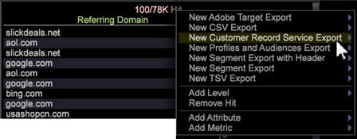

# Exportação para os principais serviços do Analytics{#exporting-to-analytics-core-services}

O recurso de exportação CRS (Customer Record Service) permite exportar dados da Análise de big data para os principais serviços do Adobe Analytics para integrar-se aos recursos de outros serviços do Analytics, incluindo Relatórios e análises.

>[!NOTE]
>
>Para que o recurso de exportação do CRS funcione, a ID do Analytics de um visitante deve ter por base o Serviço da Experience Cloud ID (ECID). Embora o ECID possa ser preenchido na Análise de big data para um visitante, se o cliente estiver no período de carência ou o cookie do visitante não tiver sido substituído pelo ECID, a exportação do CRS não funcionará para esse visitante. Para obter mais informações, consulte [Identificação de visitantes](https://docs.adobe.com/content/help/en/analytics/export/analytics-data-feed/data-feed-contents/datafeeds-visid.html) e período [de carência do serviço de](https://docs.adobe.com/content/help/en/id-service/using/reference/analytics-reference/grace-period.html)ID.

Em uma Tabela **de** detalhes (clique com o botão direito do mouse **[!UICONTROL Tools]** > **[!UICONTROL Detail Table]** em uma área de trabalho), é possível definir valores de atributos e as variáveis necessárias para integrar-se aos Relatórios e análises do Analytics (usando os Adobe Pipeline Services).

1. **Clique com o botão direito do mouse no cabeçalho da tabela e clique em Novo Serviço de Registro de Cliente.**

   

1. **Nomeie o arquivo de exportação e salve.**

   A janela de edição do arquivo de exportação será aberta.

1. **Abra** **Consulta > Configuração** CRS.
1. **Clique com o botão direito do mouse em Atributos CRS > Adicionar novo.**
1. **Informe** Atributos ****** CRS **parâmetros**.

   Abra a nova entrada e digite ou verifique os valores na seção Atributos *do* CRS do arquivo de exportação:

   

   <table id="table_8156A2C66C0E41D381C31F1082CCA479"> 
    <tbody> 
      <tr> 
      <td colname="col1"> 
<b>Nome do atributo</b> 
 </td> 
      <td colname="col2">Nome da variável Atributos <i>do</i> cliente exibida em <i>Relatórios e análises</i>. </td> 
      </tr> 
      <tr> 
      <td colname="col1"><b>Tipo de atributo</b> </td> 
      <td colname="col2"> 
Esse parâmetro aceita valores de (<i>int</i>, <i>string</i>). 
 
Observação: Se um atributo <b>não</b> estiver inscrito no Analytics: 
 
      <ul id="ul_B77BF6FDA3FB4F1BBF9380C2FD938270"> 
       <li id="li_3D099456AF6B4103B227D841C81AB936">O atributo será criado com qualquer tipo de atributo válido suportado pelo Analytics (para esta versão, está limitado somente à <i>string</i> e <i>int</i>). </li> 
       <li id="li_EA1DBDB2E6BE49278C6CD6A5503EDC8A">Se um tipo de atributo inválido for inserido, você receberá um erro informando uma falha ao assinar o Analytics. </li> 
      </ul> 
 
Se um atributo <b>já</b> estiver inscrito no Analytics: 
 
 
      <ul id="ul_16415B639F1C49A5AE9932C128184171"> 
       <li id="li_83C90D44FE5C4D979DEA786660C7F3EC">Certifique-se de inserir o tipo de atributo correto para o atributo já inscrito. </li> 
       <li id="li_02C5024E335C4C59B4F7B0084232CC24">Se você inserir o tipo errado para o atributo, seu comportamento dependerá da manipulação dos tipos de atributos pelo Analytics. </li> 
      </ul> 
 
 </td> 
      </tr> 
      <tr> 
      <td colname="col1"> 
<b>Nome do campo</b> 
 </td> 
      <td colname="col2">Nome da dimensão ou métrica da qual os valores de atributo são selecionados. 
Observação: O Nome <i><b>do</b></i> campo em Atributos <i></i> CRS deve ser o mesmo que Campos <b><i>de</i> saída &gt; Nome <i>do</i></b> campo (preenchido automaticamente com base no atributo selecionado). Se o Nome <i>do</i> campo for inválido, a exportação não será executada. 
 </td> 
      </tr> 
    </tbody> 
   </table>

1. Clique com o botão direito do mouse em **[!UICONTROL Report Suite]** > **[!UICONTROL Add New]**.
1. Insira as informações **[!UICONTROL Report Suite ID]**.

   Abra a nova entrada e digite ou verifique os valores na seção Conjunto de *relatórios* do arquivo de exportação:

   <table id="table_A3279CADB74C441DA2E062E2123CE9D4"> 
    <tbody> 
      <tr> 
      <td colname="col1"><b>Conjunto de relatórios</b> </td> 
      <td colname="col2">ID do conjunto de relatórios em <i>Relatórios e análises</i> que identifica as variáveis de Atributo <i>do</i> cliente que estão sendo exportadas. 
 
Observação: Embora o <i>Relatórios e análises</i> permita adicionar vários conjuntos de relatórios, o Análise de big data 6.4 exportará apenas um único conjunto de relatórios identificado no <i>índice 0</i>. 
O valor do conjunto de relatórios inserido nesse campo é a ID do conjunto de relatórios (e não o nome do conjunto de relatórios). 
 
 
 </td> 
      </tr> 
    </tbody> 
   </table>

1. Digite o parâmetro Campo ECID.

   **Campo** ECID: Nome da dimensão em seu perfil que representa a Adobe Experience Cloud ID. Este é um campo obrigatório e qualquer valor de dimensão inválido inserido não será exportado.

1. (opcional) Complete o parâmetro Campo de ID do visitante.

   **Campo** de ID do visitante: Se o usuário deseja enviar qualquer outra ID personalizada para um visitante em seus dados, é aqui que ele insere o nome da dimensão que representa a ID de visitante personalizada. Este é um campo opcional e pode ser deixado em branco.
