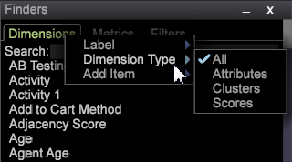
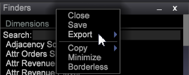

# Localizadores{#finders}

Use os painéis do Localizador no Data Workbench para selecionar métricas, dimensões e filtros. Esses painéis fornecem suporte de pesquisa, opções de classificação e recursos de arrastar e soltar.

Um painel Localizador pode ser aberto na barra lateral esquerda ou em um espaço de trabalho.

<table id="table_3E43DBA0646842898F14F31374F9E39C"> 
 <thead> 
  <tr> 
   <th colname="col1" class="entry"> Localizador de Dimension </th> 
   <th colname="col2" class="entry"> Localizador de métricas </th> 
   <th colname="col3" class="entry"> Localizador de filtros </th> 
  </tr>
 </thead>
 <tbody> 
  <tr> 
   <td colname="col1"> 
Uma lista de todas as dimensões no modelo de query. 
 </td> 
   <td colname="col2"> 
Uma lista de todas as métricas no modelo de consulta. 
 </td> 
   <td colname="col3"> 
Uma lista de todos os filtros criados para sua organização. 
 </td> 
  </tr> 
 </tbody> 
</table>

**Para abrir um Localizador:**

* Clique com o botão direito do mouse em um espaço de trabalho e selecione **[!UICONTROL Tools]** > **[!UICONTROL Finder]**.

   O painel Localizador com guias para Métricas, Dimension e Filtros será aberto no espaço de trabalho.

* Clique com o botão direito do mouse na barra lateral esquerda e selecione **[!UICONTROL Add]** > **[!UICONTROL Finder]**.

   O painel Localizador será aberto no painel esquerdo.

O **Localizador** inclui os seguintes recursos:

<table id="table_072047E919204577AE85789BAE0F4EE8"> 
 <thead> 
  <tr> 
   <th colname="col1" class="entry"> Recursos do Localizador </th> 
   <th colname="col2" class="entry"> Detalhes </th> 
  </tr>
 </thead>
 <tbody> 
  <tr> 
   <td colname="col1"><b>Arrastar e soltar</b> </td> 
   <td colname="col2"> 
 Você pode arrastar e soltar dimensões ou métricas do painel para uma visualização no espaço de trabalho para alterar a dimensão ou adicionar novas métricas. 
 
    <ol id="ol_612DC76EC04C4FCE938B20B388C43CE8"> 
     <li id="li_7F73B781141E4B8CAE9800F580F62E44">Mantenha pressionadas as teclas  &lt;Ctrl&gt; e  &lt;Alt&gt; e selecione a dimensão ou métrica no painel Localizador. </li> 
     <li id="li_631D57976F71415AA61F33EBBFDD128A">Arraste uma nova dimensão do painel e solte-a na visualização para alterar ou adicionar dimensões. </li> 
     <li id="li_5329FB82225F46EBBE3A996A641058DE">Para adicionar métricas, arraste uma nova métrica do painel e solte-a no cabeçalho da métrica da visualização selecionada. </li> 
    </ol> 
Isso funcionará para todas as visualizações relevantes, incluindo tabelas, cluster de visitantes, matriz de correlação, gráficos de dispersão e o gráfico de barras 2D (dependendo do eixo). 
 </td> 
  </tr> 
  <tr> 
   <td colname="col1"><b>Pesquisar</b> </td> 
   <td colname="col2">Uma caixa  Pesquisar nos painéis do Localizador permite filtrar nomes para Dimension, Métricas e Filtros. 
    <ul id="ul_0F6F377E9906472E99008EBE7483F689"> 
     <li id="li_75857895EDB045C8B2960393854B257D"> 
Correspondência de padrão (pesquisa glob simples). Comece a digitar o nome de uma dimensão, métrica ou entidade de filtro necessária no campo Pesquisar e somente as strings correspondentes contidas em qualquer lugar do nome serão filtradas e exibidas no painel Localizadores . 
 
Por exemplo, digite: 
 <code><b>Search:</b>click</code> 
Você pode obter os seguintes resultados no Localizador do Dimension: 
 
 
 
A correspondência padrão permite usar caracteres curingas, como . (ponto), "?" e "*" (estrela). 
 </li> 
     <li id="li_044F9EC1399B44CD81E1852F85137704"> 
Expressões regulares. Expressões regulares mais complexas também são compatíveis com recursos de pesquisa adicionados. Adicione o prefixo "re:" antes do termo de pesquisa (sem espaços) para interpretar como uma expressão regular. 
 
Por exemplo, digite: 
 <code><b>Search:</b>re.*ip</code> 
Você pode obter os seguintes resultados no Localizador do Dimension: 
 
 
 </li> 
    </ul> 
Para obter informações de pesquisa aprofundadas, consulte <a href="https://docs.adobe.com/content/help/en/data-workbench/using/dataset/c-reg-exp.html" format="http" scope="external"> expressões regulares</a>. 
 </td> 
  </tr> 
  <tr> 
   <td colname="col1"><b>Tipo de Dimension</b> </td> 
   <td colname="col2">Na guia Dimension , é possível clicar com o botão direito do mouse no cabeçalho da guia para classificar pelo tipo de dimensão. 
 
     <ul id="ul_D36B8474730F4859BC7AA015CC1B8EF0"> 
      <li id="li_4AE1D5699D0E45AF880A134F886B8B19">Atributos — Dimension criadas com base nas características do visitante, produtos, geografia, tempo, vídeo e outros atributos. </li> 
      <li id="li_0B2A08F8CBE94356AC506F95DC268C47">Clusters — Dimension no construtor de cluster. </li> 
      <li id="li_4BC3396A680B49A4B6BDAAD066826864">Pontuações — Dimension criadas dentro da pontuação de propensão. </li> 
     </ul> 
 </td> 
  </tr> 
  <tr> 
   <td colname="col1"><b>Rótulo</b> </td> 
   <td colname="col2">Em cada guia, clique com o botão direito do mouse e selecione  Label para renomear o painel Localizador. 
 
 
Os rótulos Dimension, Métricas e Filtros padrão podem ser alterados para um nome de guia que atenda às convenções de sua organização. 
 </td> 
  </tr> 
  <tr> 
   <td colname="col1"><b>Adicionar Item</b> </td> 
   <td colname="col2">Em cada guia, é possível clicar com o botão direito do mouse e selecionar  Adicionar item para abrir uma tabela e adicionar manualmente Dimension, métricas e filtros. </td> 
  </tr> 
  <tr> 
   <td colname="col1"><b>Barra de localizadores</b> </td> 
   <td colname="col2">Clique com o botão direito do mouse na barra  Localizadores na barra lateral esquerda para abrir um menu para obter recursos adicionais. 
 
 </td> 
  </tr> 
  <tr> 
   <td colname="col1"><b>Close</b> </td> 
   <td colname="col2">Clique com o botão direito do mouse na barra  Localizadores e selecione  Fechar para fechar um painel Localizadores. </td> 
  </tr> 
  <tr> 
   <td colname="col1"><b>Salvar</b> </td> 
   <td colname="col2">Salve a lista localmente clicando com o botão direito do mouse na barra de cabeçalho e selecionando a opção  Salvar. </td> 
  </tr> 
  <tr> 
   <td colname="col1"><b>Exportar</b> </td> 
   <td colname="col2">Você pode exportar uma lista de dimensões, métricas ou filtros selecionados do painel Localizador clicando com o botão direito do mouse na barra Localizadores e selecionando  Exportar no menu. 
 Adicione um nome e exporte para o Microsoft Excel. 
 </td> 
  </tr> 
  <tr> 
   <td colname="col1"><b>Copiar</b> </td> 
   <td colname="col2"> Copie uma lista de Dimension, métricas ou filtros. Você pode copiar como arquivo ou gráfico em Fundo escuro, Plano de fundo claro ou Monocromático. </td> 
  </tr> 
  <tr> 
   <td colname="col1"><b>Minimizar</b> </td> 
   <td colname="col2"> Minimize o painel Localizador. Somente a barra Localizadores será exibida. </td> 
  </tr> 
  <tr> 
   <td colname="col1"><b>Borderless</b> </td> 
   <td colname="col2"> Exibe um painel sem linhas de borda para Localizadores no espaço de trabalho (mas não na barra lateral esquerda). </td> 
  </tr> 
 </tbody> 
</table>

