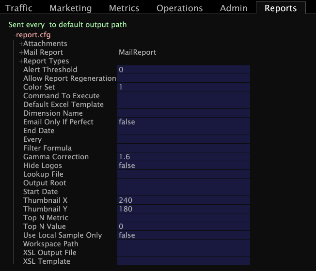

# Configurar o conjunto de relatórios{#configure-the-report-set}

Depois de criar e salvar os espaços de trabalho na pasta do conjunto de relatórios, você deve criar um novo arquivo Report.cfg .

Você deve especificar no arquivo [!DNL Report.cfg] para o conjunto de relatórios quando e como os relatórios devem ser gerados e distribuídos.

**Para criar um novo Report.cfg**

1. No Data Workbench, abra o [!DNL Profile Manager] clicando com o botão direito do mouse em um espaço de trabalho e clicando em **[!UICONTROL Admin]** > **[!UICONTROL Profile]** > **[!UICONTROL Profile Manager]**.
1. Clique em **[!UICONTROL Reports]** para abrir a pasta [!DNL Reports].
1. Clique na pasta do seu conjunto de relatórios.
1. Na coluna [!DNL User] da pasta do conjunto de relatórios, clique com o botão direito do mouse e selecione **[!UICONTROL Create]** > **[!UICONTROL Report]**. Um novo arquivo [!DNL Report.cfg] aparece na coluna [!DNL File].
1. Na coluna [!DNL User] do novo arquivo [!DNL Report.cfg], clique com o botão direito do mouse na marca de seleção do arquivo [!DNL Report.cfg] e depois clique em **[!UICONTROL Open]** > **[!UICONTROL from the workbench]**.

   

1. Edite os parâmetros de configuração conforme desejado. Para obter informações sobre esses parâmetros, consulte [Parâmetros Report.cfg](../../../../../home/c-rpt-oview/c-rpt-param-ref/c-rpt-param.md#concept-838e59d72d3f4cb29ee15f5c7eb0ceff).

   >[!NOTE]
   >
   >A amostra [!DNL Report.cfg] mostrada neste exemplo contém apenas os parâmetros incluídos no arquivo [!DNL Report.cfg] por padrão. Se precisar adicionar mais parâmetros a um arquivo [!DNL Report.cfg], faça isso usando um editor de texto. Para obter etapas para fazer isso, consulte [Editar arquivos Report.cfg existentes](../../../../../home/c-rpt-oview/c-work-rpt-sets/c-edit-ex-rpt-files/c-edit-ex-rpt-files.md#concept-96fd57159f454defa09bd18655a12887).

1. Salve o arquivo clicando com o botão direito do mouse em **[!UICONTROL Report.cfg (modified)]** na parte superior do arquivo e clicando em **[!UICONTROL Save as Reports\]***&lt; **[!UICONTROL ReportSetName]*****[!UICONTROL \Report.cfg]**.
1. Feche o arquivo .
1. No [!DNL Profile Manager], clique com o botão direito do mouse na marca de seleção na coluna [!DNL User] do novo arquivo [!DNL Report.cfg] e selecione **[!UICONTROL Save to]***&lt; **[!UICONTROL profile name]***.
