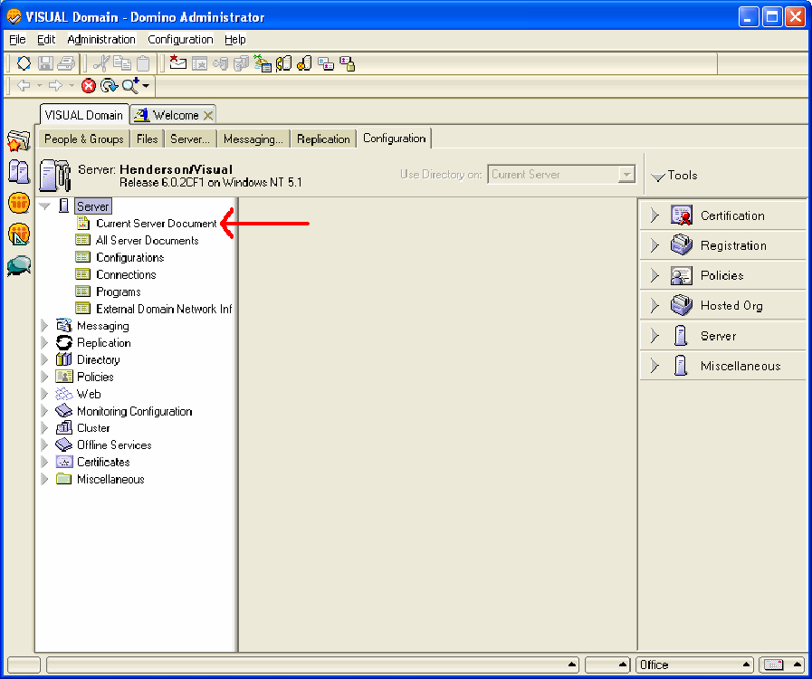

# Lotus Domino Server no Windows Server 2000 ou posterior{#lotus-domino-server-on-windows-server-or-later}

{{eol}}

Instruções sobre como instalar e configurar o Sensor para o Lotus Domino Server 6 para Windows 3.1 ou posterior em execução no Microsoft Windows Server 2000 ou posterior.

Os arquivos de programa do Sensor são empacotados em um arquivo de instalação obtido do site de download do Adobe. Se você ainda não tiver o arquivo de instalação do Sensor para seu servidor da Web específico, baixe-o (ou obtenha-o do representante do Adobe) antes de começar os seguintes procedimentos.

Para instalar e configurar o Sensor, execute as seguintes etapas:

## Instalar os arquivos do programa {#section-2f3e85083b4f4aa989a85997330e86ae}

1. Na máquina do Lotus Domino, crie um diretório para instalar os arquivos de programa do Sensor. Lembre-se de que sua fila de discos também reside nesse diretório, portanto, verifique se o dispositivo escolhido tem espaço suficiente para manter uma fila do tamanho necessário.

   ```
   C:\VisualSensor
   ```

1. Extraia o conteúdo do arquivo de instalação para o diretório Lotus Domino. Durante essa etapa, o Sensor instala os seguintes arquivos:

<table id="table_ABFF5F92271B4F3CB0AC68DAB6A5709F"> 
 <thead> 
  <tr> 
   <th colname="col1" class="entry"> Arquivo </th> 
   <th colname="col2" class="entry"> Descrição </th> 
  </tr> 
 </thead>
 <tbody> 
  <tr> 
   <td colname="col1"> EventMessages.dll </td> 
   <td colname="col2"> Mensagens do Visualizador de Eventos </td> 
  </tr> 
  <tr> 
   <td colname="col1"> stchatlog.dll </td> 
   <td colname="col2"> O módulo coletor </td> 
  </tr> 
  <tr> 
   <td colname="col1"> <p>TestExperiment.xls </p> </td> 
   <td colname="col2"> <p>Um arquivo de planilha do Excel que os arquitetos podem usar para configurar um experimento controlado </p> <p>O sensor não usa esse arquivo. </p> </td> 
  </tr> 
  <tr> 
   <td colname="col1"> trust_ca_cert.pem </td> 
   <td colname="col2"> O certificado usado para validar o certificado digital que o Insight Server apresenta durante o processo de conexão </td> 
  </tr> 
  <tr> 
   <td colname="col1"> TXLog.exe </td> 
   <td colname="col2"> O programa transmissor </td> 
  </tr> 
  <tr> 
   <td colname="col1"> <p>txlogd.conf </p> </td> 
   <td colname="col2"> O arquivo de configuração do sensor </td> 
  </tr> 
 </tbody> 
</table>

>[!NOTE]
>
>O pacote de instalação contém um arquivo de planilha chamado TestExperiment.xls. Esta planilha é uma ferramenta que os arquitetos usam para configurar um experimento controlado. O próprio sensor não usa esse arquivo, portanto, não é necessário instalar o arquivo na máquina em que o Sensor está sendo executado (embora você possa optar por fazê-lo). Em vez disso, você pode querer copiar o arquivo para um local onde seus arquitetos possam acessá-lo ou simplesmente extrair o arquivo do pacote de instalação, conforme necessário. Para obter mais informações sobre experimentação controlada, consulte o Guia de experimentos controlados do Insight.

## Configurar o servidor Lotus Domino {#section-2e2f1875a5304cdfa2cbcd0680683cfd}

Etapas para configurar o Lotus Domino Server.

1. Faça logon no Administrador do Lotus Domino e clique em **[!UICONTROL Domain]**.

   

1. No Administrador do Lotus Domino, clique em **[!UICONTROL Configuration]**.

   

1. Expanda o nó Servidor e clique em **[!UICONTROL Current Server Document]**.

   

1. Clique em **[!UICONTROL Current Server Document]** e depois em **[!UICONTROL Internet Protocols]**.

   

1. Na guia HTTP , na seção DSAPI , clique duas vezes depois da palavra [!DNL ndolextn].

   

1. Press **[!UICONTROL Enter]** e digite o caminho para a variável [!DNL dominosensor.dll] arquivo.

   

1. Clique em **[!UICONTROL Save & Close]**.

   

## Editar o arquivo de configuração do sensor {#section-de0eb4a646394b61abb6cd5a2b706de0}

O arquivo txlogd.conf contém os parâmetros de configuração do Sensor.

É necessário editar esse arquivo para especificar, entre outras coisas, o tamanho e o local do arquivo da fila de discos, o endereço do servidor Insight e a ID que será anexada aos dados do evento produzidos por esse sensor.

O arquivo de configuração contém parâmetros obrigatórios e parâmetros opcionais.

* **Parâmetros obrigatórios** são configurações que você deve especificar ao instalar o Sensor. Sem essas configurações, o Sensor não é executado com êxito.
* **Parâmetros opcionais** são configurações que assumem o padrão de valores predefinidos (que podem ser modificados) ou ativam recursos opcionais.

**Para editar o arquivo de configuração do Sensor**

* Abra o `<Sensor directory>/txlogd.conf` em um editor de texto e defina os parâmetros obrigatórios, bem como quaisquer parâmetros opcionais desejados.
* Salve e feche o arquivo.

## Inicie o transmissor e crie a fila de discos {#section-55630de65f264274aefd771da2002852}

Após configurar o arquivo txlogd.conf, você pode iniciar o programa transmissor, registrá-lo como um serviço do Windows e criar a fila de disco.

1. No menu Iniciar do Windows, selecione **Acessórios** > **Prompt de comando**.

1. Na janela da tela de comandos, navegue até o diretório em que o Sensor foi instalado e execute o seguinte comando:

   ```
   txlog /regserver
   ```

   Esse comando inicia o transmissor, cria a fila de disco e registra o Sensor como um serviço do Windows.

1. Para confirmar que o transmissor está sendo executado corretamente, clique em **Iniciar > Painel de controle > Ferramentas administrativas > Serviços**.

   >[!NOTE]
   >
   >Essa sequência de comando pode variar dependendo da versão do Windows que você estiver usando.

   1. Na lista de serviços, localize a entrada do Sensor e confirme se seu status é Iniciado e se seu tipo de inicialização é Automático.
   1. Feche o painel de controle Serviços .

1. Para verificar se o transmissor apresentou algum erro durante a inicialização, clique em Iniciar > Painel de controle > Ferramentas administrativas > Visualizador de eventos para abrir o Visualizador de eventos.

   >[!NOTE]
   >
   >Essa sequência de comando pode variar dependendo da versão do Windows que você estiver usando.

   1. No painel esquerdo da janela Visualizador de Eventos, selecione o log de Aplicativos.
   1. No painel direito, procure por eventos com &quot;Adobe&quot; na coluna Origem.
   1. Se você encontrar um erro de &quot;Adobe&quot;, clique duas vezes no erro para exibir a janela Propriedades do evento. Esta janela fornece informações detalhadas sobre o erro.

1. Quando terminar de examinar o log de Aplicativos, feche o Visualizador de Eventos.
1. Verifique se o transmissor criou a fila de discos ( [!DNL Diskq2000.log]) no diretório em que você instalou os arquivos de programa do Sensor e que é o tamanho especificado no [!DNL QueueSize] no [!DNL txlogd.conf] arquivo.

   Se a fila não tiver sido criada corretamente:

   1. Examine o arquivo txtlogd.conf e verifique se o parâmetro QueueSize está definido corretamente.
   1. Verifique se o dispositivo no qual você instalou o Sensor tem espaço suficiente disponível para armazenar um arquivo do tamanho especificado no parâmetro QueueSize .
   1. Usando o painel de controle Serviços no Windows, pare o transmissor.
   1. Exclua o arquivo da fila.
   1. Registre novamente o Sensor como um serviço do Windows: no menu Iniciar do Windows, selecione Acessórios > Prompt de comando. Na janela da tela de comandos, navegue até o diretório em que o Sensor foi instalado e execute o seguinte comando:

      ```
      txlog /regserver
      ```

      O transmissor foi projetado para funcionar continuamente. Se você reiniciar a máquina, o transmissor será reiniciado automaticamente. Se precisar iniciar e parar o transmissor manualmente, faça isso usando o Painel de controle dos Serviços no Windows.
