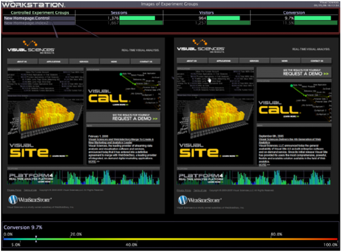

# Avaliação do experimento{#evaluating-the-experiment}

Depois de executar o experimento até que o número mínimo de visitantes necessários tenham participado do experimento, você pode ter a certeza estatística suficiente para avaliar os resultados do experimento.

Usando [!DNL Insight], compare as métricas ou os principais indicadores de desempenho definidos como parte da hipótese para determinar se o experimento foi um sucesso (ou seja, a hipótese foi validada com a confiança especificada).

No nosso experimento de exemplo, nossa hipótese está correta se a Conversão de visitante aumentar em pelo menos 1,5%, que é o critério de sucesso definido anteriormente.

O exemplo de espaço de trabalho a seguir mostra que a Conversão para o grupo de teste index2 era, na verdade, 1,8% maior do que para o grupo de controle, provando nossa hipótese.

* [Resumo dos resultados do experimento](../../../home/c-undst-ctrld-exp/c-vw-rslts/c-ev-exp.md#section-24a496c080a04e929764094acb00bab7)
* [Tomar medidas com base nos resultados](../../../home/c-undst-ctrld-exp/c-vw-rslts/c-ev-exp.md#section-1623e26ced524fd9beab48ac1f9165d9)
* [Monitoramento de suas ações](../../../home/c-undst-ctrld-exp/c-vw-rslts/c-ev-exp.md#section-1954311950c34637800cbd7c0711983f)

## Resumo dos resultados do experimento {#section-24a496c080a04e929764094acb00bab7}

Usando [!DNL Insight], você pode criar relatórios detalhados para resumir e ilustrar os resultados de seu experimento.

Você pode usar seus relatórios, como mostrado no exemplo a seguir, para fazer recomendações com base nos resultados, que são copiados nas informações visuais fornecidas nos relatórios:

## Tomar medidas com base nos resultados {#section-1623e26ced524fd9beab48ac1f9165d9}

Depois que os resultados estiverem claros, você estará pronto para agir sobre esses resultados fazendo alterações no nível de produção nas páginas testadas, aplicando essas mesmas alterações em outras áreas do seu site, e certificando-se de documentar completamente o teste, seus resultados e as alterações que você fez.

## Monitoramento de suas ações {#section-1954311950c34637800cbd7c0711983f}

Depois que o experimento controlado for concluído e você tiver implementado as alterações apropriadas, continue monitorando as alterações feitas, por exemplo, exibindo métricas de validação, criando gráficos de controle e fornecendo métricas de painel.

Esteja sempre preparado para testar novamente a sua hipótese se achar que as alterações que testou e efetuou não estão a produzir os resultados originais.
