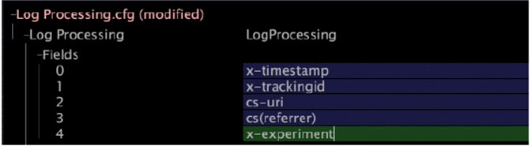

# Modificar o Log Processing.cfg{#modifying-log-processing-cfg}

Você deve adicionar o campo x-experience ao arquivo Log Processing.cfg, que é usado para criar uma dimensão estendida.

Consulte [Modificando Transformation.cfg](../../../home/c-undst-ctrld-exp/c-vw-rslts/t-mod-trfmtn.md#task-d61b02853a82492c9a76e3c5fe8a3fb6).

**Para modificar o Log Processing.cfg**

1. Em [!DNL Insight], abra o arquivo [!DNL Profile Manager] clicando com o botão direito do mouse em um espaço de trabalho e clicando em **[!UICONTROL Admin]** > **[!UICONTROL Profile Manager]**, ou abrindo o espaço de trabalho Gerenciamento de Perfis na [!DNL Admin] guia.
1. No [!DNL Profile Manager], clique em **[!UICONTROL Dataset]** para mostrar seu conteúdo.
1. Clique com o botão direito do mouse na marca de seleção ao lado de [!DNL Log Processing.cfg] e clique em **[!UICONTROL Make Local]**. Uma marca de seleção para este arquivo é exibida na [!DNL User] coluna.
1. Clique com o botão direito do mouse na marca de seleção recém-criada e clique em **[!UICONTROL Open]** > **[!UICONTROL in Insight]**. A [!DNL Log Processing.cfg] janela é exibida.
1. Clique em **[!UICONTROL Fields]** para mostrar seu conteúdo.
1. Clique com o botão direito do mouse no último campo da lista atual e clique em **[!UICONTROL Add new]** > **[!UICONTROL Field]**.
1. Digite x-experience no campo recém-criado, como mostrado no exemplo a seguir:

   

1. Clique com o botão direito do mouse **[!UICONTROL (modified)]** na parte superior da janela e clique em **[!UICONTROL Save]**.
1. Na [!DNL Profile Manager], clique com o botão direito do mouse na marca de seleção para [!DNL Log Processing.cfg] na [!DNL User] coluna, em seguida, clique em **[!UICONTROL Save to]** > *&lt;**[!UICONTROL profile name]**>* para salvar as alterações feitas localmente no perfil que está funcionando.

   >[!NOTE]
   >
   >O conjunto de dados inicia o reprocessamento imediatamente.

   Para obter mais informações sobre Processamento de log e Campos, consulte o Guia *de Configuração de* Conjunto de Dados.

