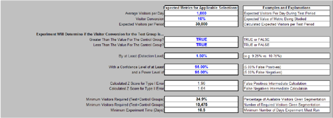

# Planilha de design de experimento{#experiment-design-spreadsheet}

Esse arquivo funciona não apenas como uma planilha, mas também como um registro de suas decisões sobre o experimento.

Se precisar de ajuda para criar seu experimento, você pode usar a planilha de design de experimento (chamada de Design de Experimento Controlado VS.xls por padrão) fornecida pela Adobe.

A planilha do projeto do experimento pode fornecer inferências estatísticas úteis somente quando a métrica em questão é definida como uma porcentagem de visitantes que atendem a alguns critérios. Ou seja, é útil somente ao testar uma hipótese de métrica baseada em visitantes.

**Para projetar seu experimento usando o arquivo de projeto do experimento**

1. Se você tiver acesso de administrador à Web ou aos servidores de aplicativos, navegue até a pasta de [!DNL Sensor] instalação em qualquer [!DNL Sensor] computador no cluster da Web. Se você não tiver acesso de administrador, entre em contato com seu gerente de conta do Adobe para solicitar o arquivo.
1. Abra o arquivo VS Controlled Experiment Design.xls. (Se desejar, você pode renomear esse arquivo.)

   A planilha na página a seguir é um exemplo de como você completaria a planilha ao se preparar para testar a hipótese de exemplo usada em todo este guia.

   

   

   

1. Digite o texto ou os valores de todos os campos em azul neste arquivo, que estão descritos na tabela a seguir. Os campos calculados são definidos na segunda tabela.

<table id="table_C343F7A4BF3D4E0E9A5E9739EC7C2E10"> 
 <thead> 
  <tr> 
   <th colname="col1" class="entry"> Neste campo... </th> 
   <th colname="col2" class="entry"> Especificar </th> 
  </tr> 
 </thead>
 <tbody> 
  <tr> 
   <td colname="col1"> Título do experimento </td> 
   <td colname="col2"> Um nome descritivo para o seu experimento. </td> 
  </tr> 
  <tr> 
   <td colname="col1"> Descrição do Experimento </td> 
   <td colname="col2"> Uma descrição textual do experimento. </td> 
  </tr> 
  <tr> 
   <td colname="col1"> Métrica sendo estudada </td> 
   <td colname="col2"> 
O nome da métrica na qual o experimento se baseia. 
 
Exemplo: Conversão de visitantes 
 </td> 
  </tr> 
  <tr> 
   <td colname="col1"> Definição de métrica </td> 
   <td colname="col2"> 
A definição da métrica na qual o experimento se baseia. 
 
Formato: Visitantes[X]/Visitantes 
 
Exemplo:  Visitantes[URI='conversionpage.asp']/Visitantes
 </td> 
  </tr> 
  <tr> 
   <td colname="col1"> Tempo de Start pretendido </td> 
   <td colname="col2"> A data e a hora em que você deseja que o experimento comece. </td> 
  </tr> 
  <tr> 
   <td colname="col1"> Hora de término pretendida </td> 
   <td colname="col2"> A data e a hora em que você deseja que o experimento termine. </td> 
  </tr> 
  <tr> 
   <td colname="col1"> Seleções aplicáveis </td> 
   <td colname="col2"> (Opcional) O nome da dimensão e o conjunto de elementos ou intervalo pelo qual você deseja segmentar ainda mais o conjunto de dados. </td> 
  </tr> 
  <tr> 
   <td colname="col1"> URIs de teste </td> 
   <td colname="col2"> Os URIs envolvidos na sua hipótese. Você define os URIs atuais para o grupo de controle e os URIs alternativos que você criou ou criará para os grupos de teste. </td> 
  </tr> 
  <tr> 
   <td colname="col1"> Métricas esperadas para seleções de aplicativos </td> 
   <td colname="col2"> Cabeçalho para os valores de métrica que você espera para seu site. </td> 
  </tr> 
  <tr> 
   <td colname="col1"> Média de Visitantes por dia </td> 
   <td colname="col2"> O número médio de visitantes do site por dia. </td> 
  </tr> 
  <tr> 
   <td colname="col1"> Conversão de visitantes </td> 
   <td colname="col2"> A taxa de conversão média de visitantes para o seu site. </td> 
  </tr> 
  <tr> 
   <td colname="col1"> O teste determinará se o nome da métrica para os grupos de teste é ... </td> 
   <td colname="col2"> Cabeçalho para como os valores da métrica devem ser comparados. </td> 
  </tr> 
  <tr> 
   <td colname="col1"> Maior que o valor do Grupo de controle? </td> 
   <td colname="col2"> Defina esse campo como Verdadeiro se desejar concluir que a métrica do grupo de teste aumentou durante o experimento. Defina esse campo como Falso para reduzir o número de visitantes necessários para tirar conclusões. A Adobe recomenda que você a defina como Verdadeiro. </td> 
  </tr> 
  <tr> 
   <td colname="col1"> Menor que o valor do Grupo de controle? </td> 
   <td colname="col2"> Defina esse campo como Verdadeiro se desejar concluir que a métrica do grupo de teste diminuiu durante o experimento. A Adobe recomenda que você a defina como Verdadeiro. </td> 
  </tr> 
  <tr> 
   <td colname="col1"> Pelo menos (nível de detecção) </td> 
   <td colname="col2"> A porcentagem pela qual você deseja que a métrica do grupo de teste seja maior ou menor que a do grupo de controle. </td> 
  </tr> 
  <tr> 
   <td colname="col1"> Com um nível de confiança de pelo menos </td> 
   <td colname="col2"> O nível de confiança desejado para os valores do grupo de teste. O nível de confiança determina o número de falsos positivos para medir a probabilidade de que a expectativa declarada seja verdadeira. </td> 
  </tr> 
  <tr> 
   <td colname="col1"> e um nível de potência de </td> 
   <td colname="col2"> O nível de energia desejado para os valores do grupo de teste. O nível de energia determina o número de falsos negativos. </td> 
  </tr> 
  <tr> 
   <td colname="col1"> % de Visitantes </td> 
   <td colname="col2"> Cabeçalho para a porcentagem de valores de visitantes. </td> 
  </tr> 
  <tr> 
   <td colname="col1"> Grupo de teste </td> 
   <td colname="col2"> Porcentagem de visitantes que você deseja incluir no grupo de teste. É possível reproduzir com esse número até que o valor no campo Total (normalmente 100%) na seção Visitantes seja igual ou maior que o valor no campo Visitantes mínimos exigidos (Grupos de controle de teste), ambos descritos na tabela a seguir. </td> 
  </tr> 
  <tr> 
   <td colname="col1"> grupo de controle </td> 
   <td colname="col2"> Porcentagem de visitantes que você deseja incluir no grupo de controle. </td> 
  </tr> 
  <tr> 
   <td colname="col1"> Outras notas de design </td> 
   <td colname="col2"> Quaisquer observações que você deseja salvar para referência futura. </td> 
  </tr> 
 </tbody> 
</table>

Os campos restantes são calculados com base nos valores inseridos e descritos na tabela a seguir.

| Campo | Descrição |
|---|---|
| Métricas esperadas para seleções de aplicativos | Cabeçalho para os valores de métrica que você espera para seu site. |
| Visitantes esperados por Período | Normalmente, esse campo é calculado automaticamente pela planilha. Baseia-se no pressuposto de que, na maioria dos dias, o website recebe muito mais visitantes novos do que visitantes de retorno. Se esse não for o caso, o cálculo dessa célula deve ser substituído pelo número real de visitantes esperados durante o experimento. |
| Pontuação Z calculada para o erro Tipo I | A pontuação Z para um resultado falso positivo. Trata - se de um cálculo estatístico intermédio. |
| Pontuação Z calculada para erro de tipo II | A pontuação Z para um resultado negativo falso. Trata - se de um cálculo estatístico intermédio. |
| Mínimo de Visitantes necessários (Testar+Grupos de controle) | Número mínimo de visitantes necessários no seu experimento para atender ao nível de confiança, nível de energia e pontuação Z especificados, expresso como uma porcentagem do valor no campo Visitantes esperados por período. |
| Mínimo de Visitantes necessários (Testar+Grupos de controle) | Número mínimo de visitantes necessários no seu experimento para atender ao nível de confiança, nível de energia e pontuação Z especificados. Esse valor deve ser menor ou igual ao valor no campo Total (normalmente 100%) na seção Visitantes. |
| Tempo Mínimo de Experiência (Dias) | Número mínimo de dias necessários para executar o experimento para atender ao nível de confiança, nível de energia e pontuação Z especificados. Esse número calculado está sujeito aos mesmos problemas discutidos no campo Visitantes esperados por período. No caso de um site com muitos visitantes recorrentes, o campo Tempo Mínimo de Experiência (Dias) é o número esperado de dias para que um número de visitantes únicos seja igual ao valor no campo Visitantes Mínimos Necessários. |
| Visitantes | Cabeçalho para os valores dos visitantes. |
| Grupo de teste | Número de visitantes necessários no grupo de teste. |
| grupo de controle | Número de visitantes necessários no grupo de controle. |
| Total (Normalmente 100%) | O número total de visitantes necessários para o experimento. Esse valor deve ser igual ou superior ao valor no campo Visitantes mínimos obrigatórios (Testar+Grupos de controle). |
| Precisão do grupo de teste (no nível de confiança do Público alvo) | A porcentagem que indica que há uma chance igual ao nível de confiança especificado de que o valor medido da métrica calculada para o grupo de teste estará dentro dessa porcentagem do seu valor real. |
| Precisão do grupo de controle (no nível de confiança do Público alvo) | A porcentagem que indica que há uma chance igual ao nível de confiança especificado de que o valor medido da métrica calculada para o grupo de controle estará dentro dessa porcentagem do seu valor real. |
| Pontuação Z (na precisão do Público alvo) | Número de desvios padrão que um dado valor representa em relação à média do teste. |
| Nível de confiança real (no intervalo do Público alvo) | O nível de confiança obtido para o experimento. O nível de confiança mede a probabilidade da expectativa declarada ser verdadeira. |
| Intervalo Real (no Nível de Confiança do Público alvo) | O intervalo de confiança obtido para o experimento, que fornece um intervalo estimado de valores que provavelmente incluirá um parâmetro de população desconhecido. Esse intervalo é calculado a partir de um determinado conjunto de dados de amostra. |

É necessário observar o valor no campo Visitantes mínimos obrigatórios (Testar+Grupos de controle). . .

e compare-o com o valor no campo Total na [!DNL Visitors] coluna.

Para que seu experimento seja estatisticamente válido, o valor no campo Total (normalmente 100%) deve ser igual ou maior que o valor no campo Visitantes mínimos exigidos (Testar+Grupos de controle).

Considerando as entradas fornecidas, o que a planilha de exemplo mostra é que 10.475 visitantes precisam participar deste experimento para atingir a taxa de confiança de 95% informada (que é a confiança mínima sugerida para qualquer experimento controlado, embora você possa aumentar esse número). O experimento, como foi projetado atualmente, inclui 30 mil visitantes, que superam bem o número mínimo de visitantes necessários.

Se você mantiver o número de dias igual, poderá aumentar o nível de confiança, contanto que o número total de visitantes continue com o atendimento ou exceda o mínimo necessário.

1. Salve o arquivo para seus registros e use as informações do arquivo para configurar o experimento usando a planilha de configuração do experimento. Para obter mais informações sobre essa planilha, consulte [Configuração e implantação do Experimento](../../home/c-undst-ctrld-exp/t-crt-ctrld-exp/c-cnfg-dply-exp.md#concept-50f1de0242904698937bb72b3ea1b429).
