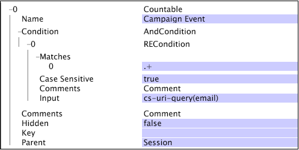

# Estruturas contáveis de design de esquema{#schema-design-countable-structures}

Explicação das contáveis no Data Workbench (DWB) para projetar e implementar o schema.

## Como entender contáveis no Data Workbench {#section-6e6b8d1c17634d669e62c91a80a0bc62}

No nível mais alto estão dimensões contáveis. As dimensões contáveis atendem a duas funções principais. Primeiro, são dimensões cujos elementos você deseja contar. Em outras palavras, contadores respondem perguntas como:

* Quantos visitantes visitaram sua página inicial?

* Quantas visitas vieram do Google.com?

`<discoiqbr>`Normalmente, as dimensões contáveis são usadas para criar métricas de soma, que retornam a contagem ou soma de todos os elementos da dimensão. É possível definir dimensões contáveis para contar instâncias, como reservas ou pedidos de produtos. Por exemplo, você pode definir as ordens de dimensão contáveis cujos elementos (entradas de log correspondentes a pedidos da loja online) podem ser contados. Se quiser mostrar uma contagem de pedidos em uma visualização, defina a métrica de soma de pedidos, que pode ser avaliada por uma dimensão ou ter filtros aplicados a ela.

As dimensões contáveis podem ser pais de outras dimensões ou filhos de outras dimensões contáveis.

Embora sua dimensão contável de raiz não precise ser associada às IDs de rastreamento nos dados, o Adobe recomenda configurar a dimensão contável do conjunto de dados para usar o campo de ID de rastreamento (x-trackingid) como Chave. Como resultado, cada elemento da tabela raiz é associado a um valor exclusivo de x-trackingid e todos os dados sobre cada elemento são agrupados.

As dimensões contáveis são definidas pelos seguintes parâmetros:

<table id="table_5E00B72CFDD645368ADCC25AB9B5E53D"> 
 <thead> 
  <tr> 
   <th colname="col1" class="entry"> Parâmetro </th> 
   <th colname="col2" class="entry"> Descrição </th> 
   <th colname="col3" class="entry"> Padrão </th> 
  </tr>
 </thead>
 <tbody> 
  <tr> 
   <td colname="col1"> Nome </td> 
   <td colname="col2"> Nome descritivo da dimensão, como aparece para o usuário no Data Workbench. O nome da dimensão não pode incluir um hífen (-). </td> 
   <td colname="col3"> </td> 
  </tr> 
  <tr> 
   <td colname="col1"> 
Comentários 
 </td> 
   <td colname="col2"> 
Opcional. Observações sobre a dimensão estendida.

    &lt;/p> &lt;/td>
<td colname="col3"> </td> 
  </tr> 
  <tr> 
   <td colname="col1"> 
Condição 
 </td> 
   <td colname="col2"> 
As condições em que o campo de entrada contribui para a criação da dimensão contável. Se especificada, uma condição restringe o conjunto de entradas de log visíveis à dimensão e a todos os seus filhos no esquema do conjunto de dados. 
 </td> 
   <td colname="col3"> </td> 
  </tr> 
  <tr> 
   <td colname="col1"> Oculto </td> 
   <td colname="col2"> Determina se a dimensão aparece na interface do Data Workbench. Por padrão, esse parâmetro é definido como false. Se, por exemplo, a dimensão for usada apenas como a base de uma métrica, você poderá definir esse parâmetro como true para ocultar a dimensão na exibição do Data Workbench. </td> 
   <td colname="col3"> false </td> 
  </tr> 
  <tr> 
   <td colname="col1"> Chave </td> 
   <td colname="col2"> 
Opcional. O nome do campo a ser usado como a chave. Se você definir esse parâmetro, um elemento da dimensão contável existe para cada combinação de um elemento do pai da dimensão contável e um valor distinto do campo especificado como a chave. 
 
Cada elemento da dimensão contável é necessário para se relacionar a um conjunto contíguo de entradas de log. Portanto, se as entradas de log não forem ordenadas pela chave, um elemento da dimensão contável será criado sempre que o campo principal for alterado. Para evitar essa situação, o Adobe recomenda o uso de uma chave exclusiva que é contígua em ordem de tempo. 
 </td> 
   <td colname="col3"> </td> 
  </tr> 
  <tr> 
   <td colname="col1"> Pai </td> 
   <td colname="col2"> 
 O nome da dimensão pai. Qualquer dimensão contável pode ser uma dimensão principal. Para tornar uma dimensão a dimensão de nível superior no esquema do conjunto de dados, defina o parâmetro como "raiz". A dimensão definida se torna a dimensão contável raiz do conjunto de dados. Por exemplo, se você estiver trabalhando com Site, a dimensão Visitante será a dimensão contável raiz do seu conjunto de dados. 
 
Observação: Embora sua dimensão contável de raiz não precise ser associada às IDs de rastreamento nos dados, o Adobe recomenda configurar a dimensão contável do conjunto de dados para usar o campo de ID de rastreamento (x-trackingid) como sua Chave. Como resultado, cada elemento da tabela raiz é associado a um valor exclusivo de x-trackingid e todos os dados sobre cada elemento são agrupados. Se quiser configurar seu conjunto de dados de forma diferente, entre em contato com o Adobe. 
 </td> 
   <td colname="col3"> </td> 
  </tr> 
 </tbody> 
</table>

Este exemplo ilustra a definição de uma dimensão contável usando dados de evento coletados do tráfego do site. A dimensão contável conta os eventos de campanha da Web em uma determinada sessão. A suposição é que todos os recursos da campanha de email sejam solicitados do servidor da Web com &quot;email=&quot; como parte de cs-uri-query. No exemplo, o número de vezes que o visitante responde a uma campanha de email durante uma sessão específica é de interesse, não o valor real do campo cs-uri-query(email) .

A segunda função principal dos contadores é que eles formam a espinha dorsal da estrutura do esquema do conjunto de dados. Seu schema de dados e todas as outras dimensões estão organizadas para serem agrupadas em e pertencem a um contável. Em outras palavras, se considerarmos as dimensões como &quot;categorias&quot;, então os contáveis são a forma como organizamos essas &quot;categorias&quot; em grupos.
Quando as dimensões são agrupadas em uma dimensão contável, elas estão no &quot;nível&quot; da dimensão contável. Por exemplo, na figura abaixo, você pode ver que &quot;Endereço de email&quot; está no nível do Visitante e &quot;Navegador&quot; está no nível da Visita. &quot;Pai&quot; e &quot;filho&quot; se referem à relação entre o contável e as dimensões agrupadas abaixo dele. Por exemplo, Visitante é um &quot;pai&quot; de endereço de email. Por outro lado, o endereço de email é um &quot;filho&quot; do Visitante.  

## Criar contáveis no Data Workbench {#section-491f3e8e4fbc429e95d6c97f012a208e}

Execute as seguintes etapas para criar o Contável no Data Workbench:

1. Abra o Gerenciador de perfis
1. Em Transformation folder, crie um arquivo de configuração e abra-o na estação de trabalho.
1. Em Dimension estendido, clique com o botão direito do mouse e escolha Adicionar novo -> Contável, conforme mostrado abaixo: 

1. Insira o Nome para o novo Contável. No exemplo abaixo, Contável do cliente é definido. Se for o nível mais alto contável, então na Raiz de gravação pai. 

   Se Contável não for o nível superior, então no campo pai forneça o nome da Contável Pai. No exemplo abaixo, a Contabilidade de envolvimento é criada e o Pai desse contador é o Cliente. 

Para obter informações adicionais sobre a arquitetura de Data Workbench para design de esquema, estruturas contáveis e configurações de feed de dados offline, consulte a [Interface do esquema do conjunto de dados](https://experienceleague.adobe.com/docs/data-workbench/using/client/admin-ui/c-dtst-sch-intrf.html).
