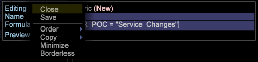

# Configuração de métricas{#metrics-setup}

Esta seção explica como criar métricas no Data Workbench.

## Compreensão de métricas {#section-f0412e851fcb4ac9886dca4003d42cec}

As métricas são informações quantitativas sobre a atividade do cliente, como Exibições, Pedidos, o número de chamadas efetuadas e Receita. As métricas são a base dos relatórios e ajudam você a visualizar e compreender relacionamentos de dados.

O Dimension de Métrica permite agrupar contagens de métrica por um Nível específico. Também permite agrupar contagens de métricas por um nível específico.

## Criar novas métricas {#section-60a413899d1b4707965e06fb5ef7fc4e}

Siga as etapas abaixo para criar uma nova métrica:

1. Clique em **Ferramenta** > **Editor de Métricas**.

1. No editor de métricas, insira o novo nome e fórmula da Métrica. 

1. Salve na pasta Métricas. 

## Criação e edição de métricas derivadas {#section-ebdcd3ec652f485e90e001d694eab6d0}

Use o Editor de métricas para definir uma nova métrica por nome, fórmula e formato, que é salvo na pasta [!DNL User\profile_name\Metrics] para uso posterior.

1. Abra um novo Editor de métricas usando a opção de menu **Admin > Perfil** ou clicando com o botão direito do mouse na coluna Usuário da pasta em que deseja criar a métrica e clicando em **Criar > Nova métrica**. Um Editor de métricas é exibido.

1. No parâmetro *Nome*, digite um nome para a nova métrica.

   >[!NOTE]
   >
   >Observe que espaços ( ) são permitidos, enquanto sublinhados (_) não são. Além disso, não é possível usar os seguintes símbolos: + - * /

   

1. No parâmetro *Fórmula*, digite uma expressão para a nova métrica.

   >[!NOTE]
   Os filtros devem ser definidos entre colchetes [ ] na expressão . Para obter as regras adicionais da sintaxe da expressão da métrica, consulte [Sintaxe para expressões de métrica.](https://experienceleague.adobe.com/docs/data-workbench/using/client/qry-lang-syntx/c-syntx-mtrc-exp.html)

   Esta tabela fornece expressões de amostra para métricas estendidas. 

   >[!NOTE]
   Quando uma expressão apropriada é inserida, a linha de visualização exibe o valor da nova métrica. Se houver um erro na expressão, a linha de visualização exibirá uma mensagem de erro.

1. Clique com o botão direito do mouse e selecione **Save**. Ao salvar a métrica, um arquivo que representa a nova métrica é criado no computador na pasta DWB *Installation diretory \User\profile name\Metrics*.

## Editar métricas derivadas existentes {#section-4b5b7baf885b45cc8b358d1bd774e925}

1. No Gerenciador de perfis ou no Gerenciador de métricas, na coluna nome do perfil, clique com o botão direito do mouse na marca de seleção do arquivo de métrica que você deseja editar e clique em **Tornar local**.
1. Clique com o botão direito do mouse na marca de seleção do arquivo de métrica na coluna Usuário e clique em **Abrir** no workbench.

   >[!NOTE]
   Também é possível abrir um Editor de métricas clicando com o botão direito do mouse em qualquer área relacionada à métrica em uma visualização para exibir o menu da métrica.

1. No **Editor de métricas**, edite e salve a definição da métrica conforme necessário usando as Etapas 2 a 4 em *Criação de novas métricas derivadas*.

   Se quiser que todos os usuários do perfil usem a métrica editada, publique-a no perfil de trabalho usando o Gerenciador de perfis.

Consulte a documentação para obter mais assistência:

[Sintaxe para expressões de métricas](https://experienceleague.adobe.com/docs/data-workbench/using/client/qry-lang-syntx/c-syntx-mtrc-exp.html)

[Criação e edição de métricas derivadas](https://experienceleague.adobe.com/docs/data-workbench/using/client/admin-ui/profile-mgr/c-drvd-mtrcs.html)
