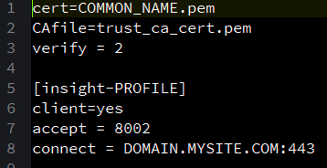

# Configuração da API de consulta{#query-api-setup}

Um guia rápido para configurar uma API de consulta.

Siga as etapas abaixo para configurar a API de consulta:

1. Aquisição de certificado da API de consulta

   Envie um email para a equipe de operações técnicas do Adobe Email - `Dataworkbench@adobe.com`.

   Forneça o nome CN que deseja usar para a API de consulta (forneça um nome genérico como a API de `<Client>` consulta).

   >[!NOTE]
   >
   >As Tech Ops gerarão o certificado e o carregarão em um URL. Informe os consultores da Adobe após receber a notificação da Tech Ops sobre a geração bem-sucedida do ticket para que ele seja enviado a você de volta.

1. Download e extração do stunnel da API. Receba o arquivo api-stunnel do seu consultor.

   Verifique se a Perl está instalada no computador.

   Na pasta extraída (o caminho da pasta onde você copia o arquivo), copie o certificado da API de consulta dentro da pasta *stunnel* .

1. Configurar o Stunnel.conf

   Deve haver um arquivo chamado *stunnel.conf* dentro da pasta *Stunnel* (onde você copiou seu certificado).

   Edite o arquivo no Bloco de notas.

   

   Altere os parâmetros da seguinte forma: 

   Dois parâmetros precisam ser alterados neste arquivo.

   * *Certificado* = O nome no seu certificado. Neste exemplo, é Aadhithiya Ramani QAPI Client.pem.
   * *Connect* = o nome do servidor para a sua DPU principal.

1. Copiando o *Query.pm*.

   O arquivo *Query.pm* estará disponível na pasta da API Insight.

   Copie o arquivo *Query.pm* e cole-o na pasta Biblioteca Perl (normalmente será *C:\Perl64\lib *, mas verifique onde o Perl está instalado na sua máquina).

1. Modifique o arquivo *api-http.pl*

   O arquivo api-http.pl estará disponível na pasta api-stunnel.

   Somente um parâmetro a ser modificado

   *Meu $profile* = O nome do perfil para o qual você está configurando a API de consulta.

1. Instale a API de consulta.

   Abra o prompt de comando no sistema como &quot;Administrador&quot; e navegue até o diretório onde você extraiu o *stunnel* , como mostrado: 

   Execute o seguinte comando *.\stunnel -install*. 

   Depois de executar o comando, uma janela aparecerá declarando que o *stunnel* está instalado.

   >[!NOTE]
   >
   >Depois de executar o comando, uma janela aparecerá declarando que o *stunnel* está instalado.

1. Testando a configuração do stunnel da API de consulta

   A etapa final desse processo será testar a configuração da API de consulta. No prompt de comando usado para instalar o diretório api-stunnel. 

   Execute o script Perl disponível nessa pasta usando o seguinte comando* perl api-http.pl*. 

   Após executar o script, os resultados devem ser semelhantes à captura de tela abaixo (a data e os valores no resultado variam de acordo com a hora e outros parâmetros no perfil no qual você configurou a API de consulta (na etapa 6). 

