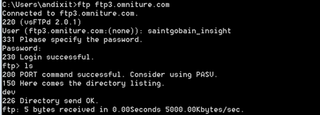

# Validação de servidores FTP internos e externos{#validation-of-internal-and-external-ftp-servers}

Este é um guia rápido que fornece as etapas mínimas necessárias para validar a configuração de FTP interno e externo.

Um FTP interno é usado quando um consultor/arquiteto interno da Adobe precisa se conectar ao site FTP para fazer upload ou download de arquivos, enquanto um FTP externo é principalmente para você, como usuário, fazer upload dos arquivos de dados necessários.

Para obter informações adicionais sobre como configurar servidores FTP, consulte Protocolo [de transferência de](https://docs.adobe.com/content/help/en/analytics/export/ftp-and-sftp/ftp-overview.html)arquivos.

## Etapas de validação - FTP externo {#section-24428111b5c542ce81a765cd63424b97}

1. Abra um prompt de comando. (Windows+R e digite cmd)
1. Type ftp `<ftp server>`
1. Forneça o nome de usuário e a senha. 

1. Altere o diretório local de onde alguns arquivos podem ser movidos. Use este comando:

[!DNL ftp> lcd C:\Users\andixit\Desktop]

diretório local agora [!DNL C:\Users\andixit\Desktop].

1. Copie o arquivo do local para o local remoto. 

1. Desconecte-se do servidor remoto. (Use o comando abaixo)

[!DNL ftp> bye]

[!DNL 221 Goodbye]

>[!NOTE]
>
>Outra maneira de validar o FTP é usar o Filezilla. Forneça o nome do host, o nome do usuário, a senha e a porta. O lado direito do painel é o local remoto e o lado esquerdo é o local. Para validar o FTP, arraste e solte arquivos do local para o local remoto e v.v.

## Etapas de validação - FTP interno {#section-b1f7a789ad6848cf9027f7953d81066e}

As etapas acima podem ser seguidas para validar o ftp interno de qualquer servidor Adobe.
