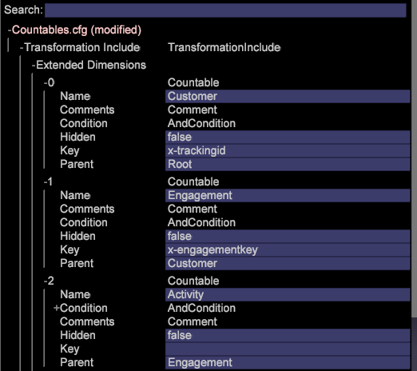

# Alterações de configuração para novo esquema{#configuration-changes-for-new-schema}

{{eol}}

Este documento explica como alterar todas as configurações de Data Workbench padrão após o novo schema estar em vigor.

## Noções básicas sobre o esquema do conjunto de dados {#section-2ffac5170c894781bc943565af7ad479}

A base do esquema do conjunto de dados consiste em um conjunto principal de relacionamentos que formam o backbone do esquema de análise da Web do Data Workbench. No exemplo a seguir, um esquema analítico típico da Web fornece uma ideia das relações entre um visitante, uma visita e uma exibição de página. 

* Um determinado visitante pode ter uma ou mais visitas.
* Qualquer visita é gerada por apenas um visitante.
* Qualquer visita pode incluir uma ou mais exibições de página.
* Qualquer exibição de página pertence a apenas uma visita. `<discoiqbr>`

À medida que a web e o mundo empresarial evoluíram ao longo dos anos, as necessidades de análise de dados e da web também mudaram. Os sites da Web começaram como locais para analisar o conteúdo. Agora, você pode ver o conteúdo; Corresponder interativamente por chats, vídeo ou envios; produtos de compra; e muito mais. Além disso, as empresas agora desejam integrar seus dados da Web a outros canais de dados em seus negócios para obter uma melhor visão de seus negócios como um todo. Por exemplo, uma empresa pode querer integrar os dados da Web, call center, email, social e armazenamento e do cliente. Com essa integração de canais offline e online, os esquemas de conjunto de dados evoluíram ao longo dos anos, onde nenhum dos dois esquemas de conjunto de dados é o mesmo.

`<discoiqbr>`Quando você integra os dados online e offline, o termo &quot;visitante&quot; nem sempre parece apropriado. Como resultado, o termo &quot;cliente&quot; às vezes é usado em vez do visitante.  

O nível &quot;Envolvimento&quot; é usado para ativar uma única visualização de tempo, quando você tem dados de várias fontes de dados. Por exemplo, suponha que você tenha apenas uma única fonte de dados: dados de comércio eletrônico coletados pela atividade do visitante em seu site. Nesse caso, o nível de Visita indica visitas ao site a partir desses visitantes. Observe que as dimensões de tempo - &quot;Dia&quot;, &quot;Semana&quot;, &quot;Mês&quot;, etc. - são capturados normalmente no nível de &quot;Visita&quot;.

Da mesma forma, o nível &quot;Evento&quot; traz todos os eventos (exibição de página, chamada feita para a central de atendimento etc.) ocorridos durante um engajamento. Ele combina todos os eventos online e offline para um cliente durante um engajamento.

## Nova estrutura contável no DWB {#section-b77638ec04e4441cb51c56fd3d4abeb6}

A nova estrutura de esquema substitui Visitante por Cliente, Visita por Envolvimento e Ocorrência por Evento. 

## Alterações de configuração de acordo com o novo esquema do conjunto de dados {#section-27135515be5c471ba2ee879d1ef4771f}

Para alterar o esquema do conjunto de dados de visitante para cliente, é necessário alterar os seguintes arquivos de configuração:

1. Todos os arquivos de configuração na pasta Conjunto de dados, onde dimensões contáveis e estendidas são definidas. 

1. Arquivos de configuração na pasta Dimension, onde &quot;visitante&quot;, &quot;visita&quot; ou &quot;evento&quot; são usados como Nível.

   Exemplo: Arquivo Campaign.cfg. No perfil do Adobe SC, o Campaign é definido no nível da Visita. 

   O exemplo a seguir fornece uma ideia da alteração do esquema principal de Visita para Envolvimento: 

1. Como algumas métricas são derivadas ou criadas a partir de contáveis, os arquivos de configuração na pasta Métricas precisam ser modificados ou criados.

   Por exemplo: criar uma nova métrica [!DNL Customers.metric with formula = sum(one,customer)] ou como Exibições de página.métrica para *definir* no nível da ocorrência. Modifique a métrica e altere o nível para Evento em vez de Ocorrência.

   Adobe SC Métrica de exibições de página definida no nível de Ocorrências: 

   `<discoiqbr>` `<discoiqbr>`A seguir estará a métrica Exibições de página de acordo com o novo esquema: 

1. Altere o *order.txt* na pasta métricas para que reflita as métricas novas ou modificadas relacionadas ao Cliente, Envolvimento e Evento.

   Adobe *SC order.txt* arquivo. 

   *Order.txt* arquivo com novas alterações de esquema: 

1. Todos os arquivos de configuração (.vw) na pasta Visualization devem ser alterados para se referirem a novos níveis : Cliente, envolvimento e evento. Por exemplo: Mapa de processos 2D, Mapa de processos 3D etc.

   O URI.vw padrão do Adobe SC para o Mapa do processo 2D é definido no nível da Ocorrência e no Grupo de visitas como mostrado abaixo: 

   Alterações a serem feitas no URI.vw para novo schema: 
