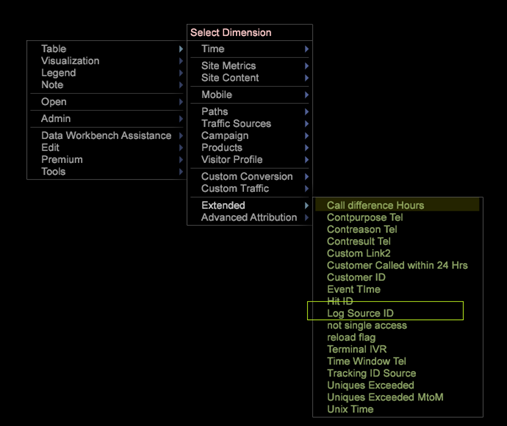

# Configuração de dimensões derivadas{#derived-dimensions-setup}

{{eol}}

Os diferentes tipos de Dimension derivados (lado do cliente) e como configurá-los no Data Workbench.

## Tipos de Dimension derivados {#section-33e6dcc9ab9745de9b830cecb2427ca3}

**Dimension de métricas**

O Dimension de Métrica permite agrupar contagens de métrica por um Nível específico. Também permite agrupar contagens de métricas por um nível específico. Depois que um Dimension de métrica é criado, é possível segmentar dados com base no valor da métrica.

Exemplo 1: Você é uma Companhia de Viagens e quer entender a diferença de atividades comportamentais no site entre seus panfletos frequentes e clientes que reservaram voo menos de 5 vezes - como você faria isso?

Tudo o que você tem é contar os registros como uma métrica, como você segmentará os clientes com base em uma métrica - aqui, reservas - para entender seu comportamento no site?

Exemplo 2: Você é um Banco Financeiro e deseja agrupar seus clientes com base no número de CDs em que eles investiram. Você deseja segmentar seus clientes em 3 camadas. Nível 1 - Clientes com mais de 10 CDs, Nível 2 - Clientes com mais de 5 e &lt;10 CDs e Nível 3 - Clientes com mais de 0 e &lt;5 CDs

As informações que você tem são métricas que oferecem contagens de investimentos em CD - como você criará Segmentos de cliente de teste para sua análise?

*Criando Dimension de métrica - via estação de trabalho*

Marque uma das dimensões da métrica OOB como local e renomeie essa dimensão com um nome personalizado / Faça uma cópia local do RenameDim.example e renomeie-a para o nome da dimensão adequado com a extensão .dim

Abra a dimensão recém-criada na estação de trabalho para fazer alterações. Altere os seguintes parâmetros da dimensão de métrica com base nos requisitos: 

Métrica - Métrica a ser agrupada

Nível - Nível no qual as métricas serão agrupadas

Início do período - Elemento inicial do Dimension de Métrica. Insira o mesmo valor em offset.

Tamanho do grupo - Tamanho do grupo da métrica. Inserir o mesmo valor na escala

Contagem de bucket - Número máximo de elementos a serem exibidos na dimensão

Salve a dimensão recém-criada no servidor se desejar compartilhá-la com outras pessoas.

**Dimension de prefixo**

A principal finalidade da dimensão Prefixo é agrupar elementos da dimensão original e fornecer nomes amigáveis aos elementos agrupados.

Por exemplo, você possui um site de varejo e seu site tem várias seções, como Vestuário feminino, Vestuário masculino, Brinquedos e Jogos, Decoração de casa, etc. e cada uma dessas seções tem várias páginas associadas a ele. Você deseja fazer análise de caminho e obter insights sobre o tráfego que vai de uma seção do site a outra e assim por diante. Se você usar a dimensão URI, será necessário puxar cada página de cada seção do site no Navegador de caminhos ou no Mapa de processos e continuar a análise.

A mesma análise pode ser feita facilmente se houver uma dimensão de Prefixo que tenha páginas de uma seção do site agrupadas como um único elemento.

Criando Dimension de Prefixo:

Abra um mapa de processos 2D no menu Visualização.

Altere os seguintes parâmetros da dimensão de prefixo com base nos requisitos.

Alterar Dimension do mapa - O Dimension que você deseja usar para o mapa de processos 2D (Ex: Tipologia de SMS)

Dimension de nível do mapa de alterações - Nível da dimensão acima mencionada

Alterar Dimension de clipe de mapa - O nível contável no qual você deseja visualizar os dados.

Alterar métrica do mapa - a métrica que você deseja visualizar.

Depois que o mapa de processos 2D for definido, abra a dimensão mencionada no parâmetro Dimension do mapa de alterações.

Selecione os elementos que deseja agrupar. Use CTRL+ALT e arraste e solte os elementos no mapa de processos.

Clique com o botão direito no ponto exibido e renomeie o nome do grupo. Se você selecionou 3 elementos para agrupar, o nome padrão será 3 Selecionado.

Clique com o botão direito do mouse no outline da visualização e salve a dimensão do menu exibido.

**Renomear Dimension**

Dimension de renomeação são criadas a partir de uma dimensão preexistente. A principal finalidade da dimensão de renomeação é fornecer nomes amigáveis aos elementos da dimensão. A dimensão Renomear pronta para uso é a dimensão Página criada fora da dimensão URI. A dimensão URI pode ser confusa para uma pessoa que não sabe os nomes técnicos das páginas e é por isso que a dimensão Página permite renomear elementos da dimensão URI.

CRIANDO DIMENSION DE RENOMEAÇÃO PERSONALIZADA:

Os elementos da dimensão Renomeada contêm um mapeamento de um para um com os elementos da dimensão base original. Você pode verificar isso abrindo o arquivo .dim do Dimension Renomear na estação de trabalho/teclado de notas. Você notará que cada elemento da dimensão original tem apenas um valor (Renomear string) em relação a ele no arquivo.

Se você tiver menos elementos para a finalidade de renomear; você pode criar um arquivo .dim na estação de trabalho e renomear cada elemento individual pelas etapas explicadas abaixo.

Etapas para criar um arquivo .dim para um Dimension de Renomeação - Uso da estação de trabalho

Use essa opção se o número de elementos a serem renomeados for menor.

1. Abra um espaço de trabalho em branco e abra o Gerenciador do Dimension. Clique com o botão direito em > Admin > Perfil > Gerenciador de perfil.
1. Expanda a pasta Dimension na coluna Arquivo.
1. Expanda a Pasta da página na Coluna do arquivo e clique com o botão direito no arquivo Page.dim da coluna Segunda para a Última (Essa coluna geralmente representa o Nome do perfil) e clique na opção &quot;Tornar local&quot;.
1. Clique com o botão direito do mouse na coluna &quot;Usuário&quot; e clique na opção Copiar e Cole o arquivo .dim copiado na pasta desejada no diretório Dimension.
1. Clique em OK na mensagem de erro.
1. Agora, você observará que há dois arquivos Page.dim na pasta Dimension. Um é o arquivo original no diretório Dimension\Page e o segundo é aquele que você acabou de copiar colado na etapa 4.
1. Clique com o botão direito no arquivo Page.dim colado recentemente na coluna Usuário e clique na caixa de entrada azul/cinza que diz Page.dim. A caixa de entrada ficará verde com o cursor piscando, indicando que ela pode ser modificada. Digite o nome da dimensão Renomear que deseja criar.
1. Você notará que o arquivo Page.dim na Coluna Arquivo foi alterado para o novo nome de arquivo que você deu na etapa 7. Clique com o botão direito do mouse no arquivo new.dim na coluna Usuário (Última coluna) e selecione Abrir>Na estação de trabalho.
1. Depois que o arquivo .dim for aberto na estação de trabalho; clique no sinal de mais (+) ao lado da entidade e expanda-o. Observe o valor presente no campo &quot;Pai&quot;, ele reflete a dimensão &quot;URI&quot;. Ele mostra &quot;wdata/model/dim/URI&quot; Clique na caixa de entrada azul/cinza para alterar o URI para o nome da dimensão cujos elementos você deseja renomear.
1. Verifique se a dimensão que você deseja renomear não existe no conjunto de dados. Os nomes de Dimension fazem distinção entre maiúsculas e minúsculas, portanto, mantenha as letras maiúsculas e minúsculas da dimensão original.
1. Observe a mensagem &quot;modificado&quot; que aparece ao lado do nome da dimensão. Isso indica que a dimensão original foi modificada. Manter as alterações efetuadas na etapa 9; Clique com o botão direito do mouse em new.dim (modificado) e clique na opção &quot;Salvar como&quot;.
1. Depois que a dimensão é salva por etapa 10, a dimensão de renomeação recém-criada para as Campanhas agora está disponível para você com o objetivo de renomear. Isso só está disponível localmente.
1. Para que outras pessoas vejam a dimensão criada por você, ela deve ser salva no perfil. Clique com o botão direito no arquivo .dim da nova dimensão na coluna &quot;Usuário&quot; (Última coluna) e clique em &quot;Salvar em > Nome do perfil&quot; na qual deseja salvar a dimensão.
1. Depois de salvar o arquivo no perfil, todos os usuários da estação de trabalho que têm acesso a esse perfil poderão ver a dimensão Renomear para as campanhas.

Prefixar e renomear ferramenta de criação de escurecimento

O Adobe tem uma ferramenta do Excel para gerar Prefix e Renomear Dimension.

Abaixo estão as etapas para gerar as dimensões Prefixo/Renomear usando a ferramenta:

1. Salvar a ferramenta do Excel *Adobe_DWB_Dimension_Generator.xlsm* em uma pasta. Entre em contato com o Atendimento ao cliente do Adobe para baixar a ferramenta.
1. Abra a ferramenta e habilite as macros: 

1. Preencha a folha de dados com os valores a serem usados.

   Por exemplo, estamos criando uma dimensão Prefixo da marca do produto com base no Dimension do produto. Na folha de dados, as seguintes informações são capturadas: 

   Cada produto é atribuído a uma marca na data sheet.

1. Na guia Configuration , preencha as informações relacionadas à dimensão que será criada. Para os dados de amostra acima, são inseridas informações: 

   Nome: Nome da dimensão Prefixo/Renomear

   Tipo: Prefixo/Renomear

   Dim de Origem: Dimension original

   Corresponder coluna: Coluna a corresponder

   Coluna de resultado: Valor a ser usado para nova dimensão.

1. Clique no botão intitulado *Clique aqui*. 

1. O arquivo dim será gerado na mesma pasta em que a ferramenta foi salva. 

   Usando o Gerenciador de perfis, salve o arquivo antigo na pasta Dimension.

**Shift Dimension**

As dimensões de deslocamento permitem observar o elemento Nth de qualquer dimensão em qualquer Dimension contável específico.

Eles também oferecem a capacidade de retroceder no elemento -Nth de qualquer dimensão dentro de um Dimension contável específico

Exemplo 1:

* A nona página em uma sessão - Dimension Próxima página
* A nona página de um visitante - Próxima página para visitante - em todas as sessões
* A nth chamada de um usuário

Por que é importante saber o elemento Nth da dimensão contável?

* Você quer saber a 5ª página visualizada em uma sessão.
* Você deseja fazer a definição de caminho em Campanhas para entender qual era a segunda campanha visualizada após visualizar a campanha da &quot;Conta de Verificação Livre&quot;?
* Deseja entender em qual link o visitante clicou antes de clicar no link &quot;Bate-papo com um agente&quot;? 

O URI seguinte é uma das dimensões do OOB Shift que podem ser usadas como modelo. O exemplo acima é fornecer o elemento 2nd (Offset = 1) da Campanha (Dim = Campanha) no Evento de engajamento (Clipe = Evento de engajamento)

Aqui, offset 1 significa olhar para a direita no Evento

Alguns outros Dimension OOB Shift

*Próxima página:*

A próxima página visualizada em uma sessão depois da página selecionada no momento no Dimension Página

Aqui o deslocamento é 1, Nível é Visualização de página, Dim é Página e Clipe é Sessão

*Página anterior:*

A página anterior era exibida em uma sessão antes da página selecionada no momento no Dimension Página

Aqui o deslocamento é -1, Nível é Visualização de página, Dim é Página e Clipe é Sessão

O que a Campanha anterior será visualizada antes da campanha selecionada atualmente por um visitante?

Aqui o deslocamento é -1, Nível é Resposta da Campanha, Dim é Valor do Atributo de Resposta da Campanha e Clipe é Visitante

*Criando Dimension de Shift - Via Workstation*

* Marcar uma das dimensões de turno OOB como local
* Renomeie essa dimensão com um nome personalizado
* Abra a dimensão recém-criada na estação de trabalho para fazer alterações
* Altere os seguintes parâmetros da dimensão de métrica com base nos requisitos.

   * Dimensão Contável em nível
   * Deslocamento - você deseja olhar para frente de trás
   * Dim -Dimension cujos elementos você deseja analisar
   * Contável de clipes no que você deseja visualizar.

* Salve a dimensão recém-criada no servidor se desejar compartilhá-la com outras pessoas.

**Último N Dimension**

Os Últimos N Dimension funcionam somente no Time Dimension e no a partir do Time do sistema. As dimensões de tempo OOB são Dia, Semana, Hora e Mês. É possível criar, Última dimensão N para cada uma dessas dimensões de tempo base, como Últimos 10 dias, Últimas 72 horas, Últimas 8 semanas, Últimos 6 meses etc. O último N Dimension calcula o Último N com base na &quot;Métrica de tempo de relatório&quot; ou na Hora do sistema. 

Contagem - Número total de elementos a serem exibidos na dimensão

Intervalo de deslocamento - Valor de deslocamento para indicar o ponto inicial (Dia/Semana) para calcular o último N dia/semana.

**None.dim**

None.dim é uma dimensão Alias . É usado para criar alias de dimensões estendidas.

Exemplo:

No arquivo None.dim, a entidade é definida como &quot;wdata/model/dim/Parent/+name&quot; (pode ser alterada), o que significa criar a dimensão de acordo com o nome do arquivo de dimensão. Assim, se criarmos uma cópia do arquivo None.dim na pasta Dimension (por exemplo, copiando e renomeando o arquivo None.dim na pasta Perfil do visitante) e renomeá-lo para &quot;ID de origem de log.dim&quot;, uma nova dimensão derivada com ID de origem de log aparecerá no Menu em Perfil do visitante, como mostrado abaixo:

Antes das alterações: 

Depois de None.dim, altera: 

A entidade pode ser alterada para o nome da dimensão estendida, nesse caso, outra dimensão com outro nome apontando para a mesma dimensão, como mostrado abaixo:

Neste exemplo, o &quot;Source Name.dim&quot; tem o seguinte conteúdo: 

Assim, outro Nome de fonte Dimension apontando para ID de fonte de log será exibido. 

**Ocultar Dimension derivadas**

Para ocultar o Dimension derivado, defina a variável *Mostrar* para &quot;false&quot;. 
