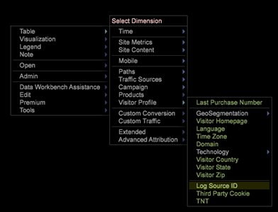
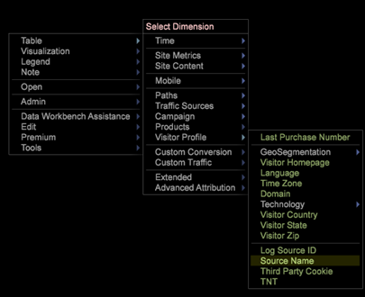

# Configuração de dimensões derivadas{#derived-dimensions-setup}

Os diferentes tipos de Dimensões Derivadas (Lado do Cliente) e como configurá-las na Análise de big data.

## Tipos de dimensões derivadas {#section-33e6dcc9ab9745de9b830cecb2427ca3}

**Dimensões da métrica**

A Dimensão de métrica permite agrupar contagens de métricas por um Nível específico. Também permite agrupar contagens de métricas por um nível específico. Depois que uma Dimensão de métrica for criada, você poderá segmentar os dados com base no valor da métrica.

Exemplo 1: Você é uma Empresa de Viagens e quer entender a diferença de atividades comportamentais no site entre seus passageiros frequentes e os clientes que reservaram um voo menos de 5 vezes - como você faria isso?

Tudo o que você tem é contar os Marcadores como uma métrica, como você segmentará os clientes com base em uma métrica - aqui, reserva - para entender o comportamento deles no site?

Exemplo 2: Você é um Banco Financeiro e deseja agrupar seus clientes com base no número de CDs em que eles investiram. Você deseja segmentar seus clientes em 3 níveis. Camada 1 - Clientes com mais de 10 CDs, nível 2 - Clientes com > 5 e &lt;10 CDs e nível 3 - Clientes com > 0 e &lt;5 CDs

As informações que você tem são métricas que oferecem contagens de investimentos em CD - como você criará Segmentos de clientes conectados para sua análise?

*Criação de dimensão de métrica - via estação de trabalho*

Marcar uma das dimensões da métrica OOB como local e Renomear essa dimensão com um nome personalizado / Criar cópia local do RenameDim.example e renomeá-la para o nome de dimensão correto com extensão .dim

Abra a dimensão recém-criada na estação de trabalho para fazer alterações. Altere os seguintes parâmetros da dimensão de métrica com base nos requisitos: 

Métrica - Métrica a ser agrupada

Nível - Nível no qual as métricas serão agrupadas

Início do período - elemento inicial da Dimensão de métrica. Insira o mesmo valor em offset.

Tamanho do grupo - Tamanho do agrupamento da métrica. Insira o mesmo valor na escala

Contagem de período - Número máximo de elementos a serem exibidos na dimensão

Salve a dimensão recém-criada no servidor se desejar compartilhá-la com outras pessoas.

**Dimensões do prefixo**

A principal finalidade da dimensão Prefixo é agrupar elementos da dimensão original e fornecer nomes amigáveis aos elementos agrupados.

Por exemplo, você possui um site de varejo e seu site tem várias seções do site, como Vestuário de mulher, Vestuário de homem, Brinquedos e jogos, Decoração de casa etc., e cada uma dessas seções tem várias páginas associadas a ele. Você deseja fazer a análise de caminho e obter insights sobre o tráfego que vai de uma seção do site para outra e assim por diante. Se você usar a dimensão URI, será necessário puxar cada página de cada seção do site no Navegador de caminhos ou no Mapa de processos e continuar a análise.

A mesma análise pode ser feita facilmente se houver uma dimensão de Prefixo que tenha páginas de uma seção do site agrupadas como um único elemento.

Criando Dimensão de Prefixo:

Abra um mapa de processo 2D no menu Visualização.

Altere os seguintes parâmetros da dimensão de prefixo com base nos requisitos.

Alterar dimensão do mapa - a dimensão que você deseja usar para o mapa de processo 2D (ex: Tipologia SMS)

Dimensão de nível do mapa de alterações - Nível da dimensão mencionada acima

Alterar dimensão do clipe do mapa - o nível contável no qual você deseja visualizar os dados.

Alterar métrica do mapa - a métrica que você deseja visualizar.

Depois que o mapa de Processo 2D for definido, abra a dimensão mencionada no parâmetro de Dimensão do Mapa de Alteração.

Selecione os elementos que deseja agrupar. Use CTRL+ALT e arraste e solte os elementos no mapa de processos.

Clique com o botão direito do mouse no ponto exibido e renomeie o nome do grupo. Se você tiver selecionado 3 elementos para agrupar, o nome padrão será 3 Selecionados.

Clique com o botão direito do mouse no contorno da visualização e salve a dimensão do menu exibido.

**Renomear dimensões**

Renomear dimensões são criadas de uma dimensão preexistente. A principal finalidade da dimensão de renomeação é fornecer nomes amigáveis aos elementos da dimensão. A dimensão de renomeação out of box é a dimensão Página criada fora da dimensão URI. A dimensão URI pode ser confusa para uma pessoa que não sabe os nomes técnicos das páginas e é por isso que a dimensão Página permite que você renomeie elementos da dimensão URI.

CRIAÇÃO DE DIMENSÕES PERSONALIZADAS DE RENOMEAR:

Os elementos da dimensão Renomeada possuem um mapeamento de um para um com os elementos da dimensão base original. Você pode verificar isso abrindo o arquivo .dim da dimensão Renomear no painel Workstation/Nota. Você observará que cada elemento da dimensão original tem apenas um valor (Renomear sequência de caracteres) em relação a ela no arquivo.

Se você tiver menos elementos para a finalidade de renomear; você pode criar um arquivo .dim na estação de trabalho e renomear cada elemento individual pelas etapas explicadas abaixo.

Etapas para criar um arquivo .dim para renomear uma dimensão - Usando a estação de trabalho

Use essa opção se o número de elementos a serem renomeados for menor.

1. Abra um espaço de trabalho em branco e abra o Gerenciador de dimensões. Clique com o botão direito do mouse em>Admin>Perfil>Gerenciador de perfis.
1. Expanda a pasta Dimensões na coluna Arquivo.
1. Expanda a Pasta da página na Coluna do arquivo e clique com o botão direito do mouse no arquivo Page.dim na coluna Segundo para último (esta coluna geralmente representa o Nome do perfil) e clique na opção &quot;Tornar local&quot;.
1. Clique com o botão direito do mouse na coluna &quot;Usuário&quot; e clique na opção Copiar e Cole o arquivo .dim copiado na pasta desejada no diretório Dimensões.
1. Clique em OK na mensagem de erro.
1. Agora, você observará que existem dois arquivos Page.dim na pasta Dimensões. Um é o arquivo original no diretório Dimensões\Página e o segundo é aquele que você acabou de copiar colado na etapa 4.
1. Clique com o botão direito do mouse no arquivo Page.dim colado recentemente na coluna Usuário e clique na caixa de entrada azul/cinza que diz Page.dim. A caixa de entrada ficará verde com o cursor piscando, indicando que pode ser modificada. Digite o nome da dimensão Renomear que deseja criar.
1. Você observará que o arquivo Page.dim na Coluna Arquivo foi alterado para o novo nome de arquivo fornecido na etapa 7. Clique com o botão direito do mouse no arquivo new.dim na coluna Usuário (Última coluna) e selecione Abrir>No Workstation.
1. Depois que o arquivo .dim for aberto na estação de trabalho; clique no sinal de mais (+) ao lado da entidade e expanda-o. Observe o valor presente no campo &quot;Pai&quot;, que reflete a dimensão &quot;URI&quot;. Mostra &quot;wdata/model/dim/URI&quot; Clique na caixa de entrada azul/cinza para alterar o URI para o nome da dimensão cujos elementos você deseja renomear.
1. Certifique-se de que a dimensão que deseja renomear não exista no conjunto de dados. Os nomes de dimensão fazem distinção entre maiúsculas e minúsculas, portanto, mantém a caixa da dimensão original.
1. Observe a mensagem &quot;modificado&quot; que aparece ao lado do nome da dimensão. Isso indica que a dimensão original foi modificada. Apoiar as alterações introduzidas na etapa 9; Clique com o botão direito do mouse em new.dim (modificado) e clique na opção &quot;Salvar como&quot;.
1. Depois que a dimensão é salva por etapa 10, a dimensão de renomeação recém-criada para as Campanhas agora está disponível para você com o objetivo de renomear. Isso só está disponível localmente para você.
1. Para que outras pessoas vejam a dimensão criada por você, ela deve ser salva no perfil. Clique com o botão direito do mouse no arquivo .dim da nova dimensão na coluna &quot;Usuário&quot; (Última coluna) e clique em &quot;Salvar em>Nome do perfil&quot;, no qual deseja salvar a dimensão.
1. Depois de salvar o arquivo no perfil, todos os usuários da estação de trabalho que tiverem acesso a esse perfil poderão ver a dimensão de renomeação das Campanhas.

Prefixar e renomear a ferramenta do criador escuro

A Adobe tem uma ferramenta do Excel para gerar Prefixo e Renomear Dimensões.

Abaixo estão as etapas para gerar as dimensões Prefixo/Renomear usando a ferramenta:

1. Salve a ferramenta Excel *Adobe_DWB_Dimension_Generator.xlsm* em uma pasta. Entre em contato com o Atendimento ao cliente da Adobe para baixar a ferramenta.
1. Abra a ferramenta e ative as macros: 

1. Preencha a folha de dados com os valores a serem usados.

   Por exemplo, estamos criando uma dimensão de Prefixo de marca de produto com base na Dimensão de produto. Na folha de dados, as seguintes informações são capturadas: 

   Cada produto é atribuído a uma marca na data sheet.

1. Na guia Configuração, preencha as informações relacionadas à dimensão a ser criada. Para obter os dados de amostra acima, são inseridas as seguintes informações: 

   Nome: Nome da dimensão Prefixo/Renomear

   Tipo: Prefixo/Renomear

   Esmaecimento de origem: Dimensão original

   Corresponder coluna: Coluna a ser correspondida

   Coluna de resultado: Valor a ser usado para nova dimensão.

1. Clique no botão *Clique aqui*. 

1. O arquivo dim será gerado na mesma pasta em que a ferramenta foi salva. 

   Usando o Gerenciador de perfis, salve o arquivo escurecido na pasta Dimensão.

**Deslocar dimensões**

As dimensões de deslocamento permitem que você olhe para o elemento Nth de qualquer dimensão em qualquer dimensão em uma Dimensão contável específica.

Eles também permitem que você olhe para o elemento -Nth de qualquer dimensão em qualquer dimensão contável específica

Exemplo 1:

* A nth página em uma sessão - Dimensão da próxima página
* A nona página de um visitante - Próxima página para o visitante - em todas as sessões
* A nth chamada para um usuário

Por que é importante saber o nono elemento da dimensão contável?

* Você quer saber a 5ª página exibida em uma sessão.
* Deseja fazer o caminho nas Campanhas para entender qual foi a segunda campanha visualizada após visualizar a campanha &quot;Conta de verificação gratuita&quot;?
* Deseja entender qual link o visitante clicou antes de clicar no link &quot;Bate-papo com um agente&quot;? 

O URI seguinte é uma das dimensões de OOB Shift que podem ser usadas como modelo. O exemplo acima fornece o elemento 2nd(Offset = 1) da Campanha (Dim = Campanha) no Evento de Envolvimento (Clipe = Evento de Envolvimento)

Aqui, deslocamento 1 significa olhar para a direita no Evento

Outras dimensões de deslocamento OOB

*Próxima página:*

A próxima página visualizada em uma sessão após a Página atualmente selecionada na Dimensão de página

Aqui o deslocamento é 1, Nível é Exibição de página, Dim é Página e Clipe é Sessão

*Página anterior:*

A página anterior era exibida em uma sessão antes da página selecionada no momento na Dimensão de página

Aqui o deslocamento é -1, o Nível é a Exibição de página, o Dim é a Página e o Clipe é Sessão

Qual será a exibição da Campanha anterior antes da seleção atual de Campanha por um visitante?

Aqui o deslocamento é -1, Nível é Resposta da campanha, Dim é Valor do atributo de resposta da campanha e Clipe é Visitante

*Criando Dimensão Shift - Via Estação de Trabalho*

* Marcar uma da dimensão de deslocamento OOB como local
* Renomear essa dimensão com um nome personalizado
* Abrir dimensão recém-criada na estação de trabalho para fazer alterações
* Altere os seguintes parâmetros da dimensão de métrica com base nos requisitos.

   * Dimensão Contável de Nível
   * Deslocamento - você deseja olhar para frente de trás
   * Dimensão de dimensão cujos elementos você deseja analisar
   * Clipe contável em você deseja exibir.

* Salve a dimensão recém-criada no servidor se desejar compartilhá-la com outras pessoas.

**Última dimensão N**

Últimas N dimensões opera somente na Dimensão de tempo e na Hora do sistema. As dimensões de tempo OOB são Dia, Semana, Hora e Mês. Você pode criar a dimensão Últimos N para cada uma dessas dimensões de tempo base, como Últimos 10 dias, Últimos 72 horas, Últimas 8 semanas, Últimos 6 meses etc. A Última Dimensão N calcula a Última Dimensão N com base na &quot;Métrica de Tempo do Relatório&quot; atual ou na Hora do sistema. 

Contagem - O número total de elementos a serem exibidos na dimensão

Deslocamento do intervalo - Valor de deslocamento para indicar o ponto inicial (Dia/Semana) para calcular o último N Dia/Semana.

**None.dim**

None.dim é uma dimensão Alias. É usado para criar alias a partir de dimensões estendidas.

Exemplo:

No arquivo None.dim, a entidade é definida como &quot;wdata/model/dim/Parent/+name&quot; (pode ser alterada), o que significa criar a dimensão de acordo com o nome do arquivo de dimensão. Assim, se criarmos uma cópia do arquivo None.dim na pasta Dimension (por exemplo, copiando e renomeando o arquivo None.dim na pasta Visitor Profile) e renomeá-lo para &quot;Log Source ID.dim&quot;, uma nova dimensão derivada com ID da Fonte de Log aparecerá no Menu sob Perfil do visitante, como mostrado abaixo:

Antes das alterações: 

Após as alterações de None.dim: 

A entidade pode ser alterada para o nome da dimensão estendida, nesse caso, outra dimensão com outro nome apontando para a mesma dimensão, como mostrado abaixo:

Neste exemplo, &quot;Source Name.dim&quot; tem o seguinte conteúdo: 

Dessa forma, outro Nome de origem da dimensão que aponta para a ID de origem do log será exibido. 

**Ocultar dimensões derivadas**

Para ocultar a Dimensão Derivada, defina a propriedade *Mostrar* como &quot;false&quot;. 

