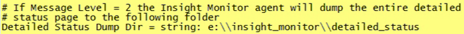
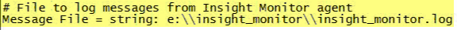

# Instalação do perfil de monitoramento{#installing-the-monitoring-profile}

Instruções para instalar o Perfil de monitoramento da análise de big data.

## Etapas de instalação {#section-d4355dbea8a447f48ab168db6ccff612}

1. Configure uma nova instância do Sensor como se fosse usada para a coleta de dados de páginas da Web com tags. Certifique-se de que o arquivo zigif esteja na raiz do documento do servidor Web do Sensor. O sensor pode ser executado no mesmo host dos perfis do monitor. (Esse não é um problema ao usar um arquivo de texto para esse fim.)

   >[!NOTE]
   >
   >Essa instância do sensor deve ser dedicada ao recebimento de apenas tráfego dos agentes de monitoramento. Além disso, o Sensor pode ser configurado para ser executado em uma porta diferente se você redefinir o objetivo de um servidor da Web para essa coleção.

1. No [!DNL txlogd.conf] arquivo, há a linha padrão:

   ```
   <b>ContentFilterExclude</b> image/,text/css,application/x-javascript,text/javascript
   ```

   Para o aplicativo de Perfil de monitoramento da análise de big data (ou qualquer implementação de página &quot;marcada&quot;), o tipo de imagem deve ser removido para ser coletado por meio de um arquivo GIF. A linha atualizada é:

   ```
   <b>ContentFilterExclude </b>text/css,application/x-javascript,text/javascript
   ```

1. Copie o [!DNL insight_monitor.zip/insight_monitor_agent] para um local temporário.
1. Atualize o [!DNL insight_monitor_agent.cfg] arquivo do seu ambiente. Siga os comentários dentro do arquivo de configuração:

   **O arquivo de configuração Monitoramento:**

   

   Defina onde você está coletando todas as informações e forneça o endereço do URL. Isso precisa ser um sensor dedicado e não deve receber tráfego, exceto para este aplicativo.

   

   Há caminhos assumindo que há um e: disco. Talvez você queira alterar esse caminho para seu ambiente.

   

   Em algum momento ao executar um perfil de Transformação, a análise de big data pode não responder. Esse valor permite enviar um alerta se três vezes seguidas o processo não responder. Esta é uma forma de reduzir os alertas falsos positivos.

   

   É aqui que você define o ambiente e as dimensões do grupo. Isso pode ser diferente de host para host.

   Aqui podemos ver exatamente o que o agente do monitor está fazendo ao exibir registros de erros nesse caminho.

   

   Isso é para usar o db temporário internamente. Ele pode ser alertado ao atingir a capacidade. Isso é diferente do uso do disco físico.

1. Copie a pasta *insight_monitor_agent* para cada host DPU e FSU que executa o servidor de análise de big data. O local padrão como indicado no arquivo de configuração é [!DNL e:\insight_monitor_agent] , mas você pode alterar esse local.

1. Adicione uma tarefa programada do Windows para chamar o agente a cada 10 minutos (esse período é considerado nos cálculos de taxa de processamento). O programa é [!DNL e:insight_monitor/insight_monitor_agent.exe]. O argumento é config-file e:\insight_monitor\insight_monitor.cfg. Comece em e:\insight_monitor. O usuário que está executando a tarefa deve ter permissão para ler/gravar [!DNL e:\insight_monitor] e ler o objeto OLE Win32 [!DNL root\CIMV2] (necessário para verificar o modo de inicialização do serviço de análise de big data e a porcentagem de espaço em discos locais)

1. Confirme se o arquivo VSL está começando a crescer à medida que os registros do monitor se acumulam. Isso levará algum tempo, pois o volume de tráfego será extremamente baixo em uma pequena instalação (a cada 10 minutos, o agente envia apenas uma ocorrência para os dados específicos do host, além de uma ocorrência por perfil de processamento).
1. Descompacte insight_monitor.zip\profiles\Insight Historic to a temporary location.
1. Atualize o nome do host em [!DNL profile.cfg], [!DNL [!DNL dataset\cluster.cfg]] e [!DNL [!DNL dataset\segment export.cfg]].

1. Atualize os arquivos para o diretório de perfis da análise de big data.
1. Atualize o servidor de log e o caminho até [!DNL dataset\log processing.cfg] o local onde os VSLs do sensor estão se acumulando.
1. [Opcionalmente] , faça o mesmo com os perfis [!DNL Insight Profile Status] e [!DNL Insight Server Status]. Além disso, os perfis de status devem ser reprocessados noturna com uma janela de dois dias à direita. Adicionar uma tarefa agendada do Windows: O programa é [!DNL e:\insight_monitor\insight_reprocess.exe]. O argumento é [!DNL --profile-path="PATH TO PROFILES\insight profile status" --start-days-ago=2]. Deixe [!DNL start in] em branco. Adicione outra tarefa agendada para *&quot;status do servidor do insight&quot;*. *insight_reprocess.exe* requer acesso de leitura/gravação ao *log processing.cfg* para atualizar a hora de início.

1. Além disso, os perfis de status devem ser reprocessados noturna com uma janela de dois dias à direita. Adicionar uma tarefa agendada do Windows: O programa é *e:\insight_monitor\insight_reprocess.exe*. O argumento é - [!DNL -profile-path="PATH TO PROFILES\insight profile status" --start-days-ago=2]. Deixe o *início em* branco. Adicione outra tarefa agendada para [!DNL "insight server status"]. [!DNL insight_reprocess.exe] requer acesso de leitura/gravação para [!DNL log processing.cfg] atualizar a hora de início. Confirme se cada perfil está lendo os VSLs do monitor à medida que eles se acumulam. Novamente, isso levará algum tempo — provavelmente horas — devido ao volume extremamente baixo.

## Notas de instalação {#section-17722441ab0046fcbcb46b957d56230a}

* **Configuração do perfil de monitoramento em um ambiente** de teste licenciado. O pacote de ambiente de teste é incluído com a implementação da análise de big data, permitindo que você instale e configure o aplicativo. Se estiver instalando em um servidor FSU ou DPU de produção, será necessário configurar o servidor para ser executado em uma porta separada.
* **Implantação de um novo sensor especificamente para o perfil** de monitoramento. Será necessário instalar uma nova instância do Sensor no servidor que executa o Perfil de monitoramento. Isso é além da instância de produção do Sensor. (Não há custo adicional para instalar o Sensor em um servidor de produção ou não-produção especificamente para o Perfil de monitoramento.)
* **Desative o agente do monitor durante a manutenção** da análise de big data. Para evitar poluir o tempo de atividade e as métricas de desempenho, você pode definir o modo de início de serviço como manual para o serviço InsightServer (Omniture Insight Server). Um comando útil do PowerShell é *set-service -name insightserver -startuptype manual*. Redefina para automático após a manutenção: *set-service -name insightserver -startuptype automático*. Outra opção é desativar temporariamente a tarefa agendada do agente do monitor.
* **Os perfis de Status precisam de uma janela** à direita para descartar os hosts e perfis antigos, bem como os mapeamentos antigos de perfil de host. No entanto, se a quantidade de dados do evento for tão pequena que a análise de big data não o armazenará em buffer, talvez seja necessário estender um pouco o tamanho da janela para que seja processada.
* **O agente coleta o status** detalhado geral e o mais antigo de tempo da análise de big data, que é reportado na hora do host local, assumindo que os carimbos de hora do log de dados do evento estão em UTC (como nos arquivos VSL). Se os carimbos de data e hora dos dados do evento estiverem em um fuso horário não UTC, a hora de início será deslocada no perfil de Status do Perfil de Insight resultante. Se **todos** os carimbos de data e hora dos dados do evento estiverem no mesmo fuso horário, você poderá adicionar esse deslocamento ao perfil do *Insight Status\metrics\as of delay minutes.metric*.

* **Duas novas dimensões foram introduzidas para ajudar o cliente a agrupar seus servidores se eles estiverem em diferentes estados**, como produção, armazenamento temporário, servidores de teste e servidores em outros estados. Por exemplo, se você estiver procurando por &quot;tempo de atividade&quot;, então você verá os servidores somente no modo de produção. Como resultado, a dimensão Grupo é apenas outra forma de agrupar servidores arbitrariamente para suas necessidades. Por exemplo, no arquivo de Configuração de monitoramento você pode definir, qual host seu departamento está atendendo, como Operações, Desenvolvimento ou Marketing.

