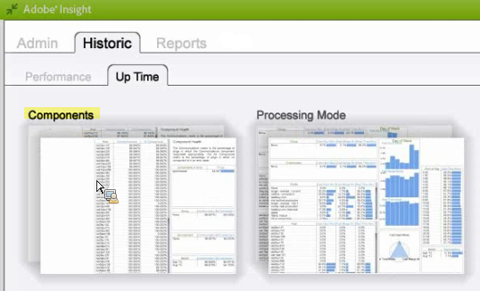

# Área de trabalho do histórico da análise de big data{#data-workbench-historic-workspace}

Use o perfil histórico da análise de big data para ver como a configuração, o hardware e outras alterações afetam o desempenho, a estabilidade e a capacidade do servidor ao longo do tempo.

O perfil Histórico inclui um conjunto de dados de Desempenho [de](../../../home/monitoring-installation/monitoring-profiles/monitoring-historical-using.md#section-184a86f9de054970bf68515bb9dea85d) Perfil baseado em perfil e o conjunto de dados de Desempenho [do](../../../home/monitoring-installation/monitoring-profiles/monitoring-historical-using.md#section-5dad5870384b40e094d50173fcd90a09) Servidor baseado em servidor na guia **[!UICONTROL Performance]** . Esses são os conjuntos de dados mais usados exibidos para uma perspectiva anterior do desempenho do servidor da análise de big data. Além disso, você pode exibir os [Componentes](../../../home/monitoring-installation/monitoring-profiles/monitoring-historical-using.md#section-5be7223abb384784bafe7b37c764ea66) e o Modo [de](../../../home/monitoring-installation/monitoring-profiles/monitoring-historical-using.md#section-5be7223abb384784bafe7b37c764ea66) processamento selecionando a **[!UICONTROL Up Time]** guia.

Além disso, você pode exibir os [Componentes](../../../home/monitoring-installation/monitoring-profiles/monitoring-historical-using.md#section-5be7223abb384784bafe7b37c764ea66) e o Modo [de](../../../home/monitoring-installation/monitoring-profiles/monitoring-historical-using.md#section-5be7223abb384784bafe7b37c764ea66) processamento selecionando a **[!UICONTROL Up Time]** guia.

Para obter informações adicionais de referência sobre as dimensões usadas na análise de big data Perfil histórico, consulte [Dimensões no perfil Histórico do Insight.](../../../home/monitoring-installation/monitoring-appendix/monitoring-historical.md#concept-a42837c9c9274f83ad5bc5a6720f02b0)

## Área de trabalho Desempenho do perfil {#section-184a86f9de054970bf68515bb9dea85d}

Esse conjunto de dados inclui as seguintes métricas relevantes para o monitoramento da análise de big data.

* MegaBytes de entrada rápida por minuto — métricas que exibem entradas de dados pesadas durante o processamento de log inicial.
* Mesclagem rápida de megaBytes por minuto — métricas exibindo transformação.

>[!NOTE]
>
>Para fazer uma avaliação de desempenho real do seu perfil, verifique a taxa em vez do tempo decorrido no calendário. A taxa é medida como os valores alterados entre a pesquisa a cada dez minutos.

## Espaço de trabalho Desempenho do Servidor {#section-5dad5870384b40e094d50173fcd90a09}

Esse conjunto de dados monitora as métricas do servidor além do escopo dos perfis incluídos e inclui as seguintes métricas relevantes do servidor para o monitoramento da análise de big data.

* Estimativa dos resultados da verificação — Tempo estimado de resolução da consulta.
* Milissegundos de latência da pesquisa — Indicador de como o software é ocupado, medindo o tempo necessário para passar por um ciclo completo de manutenção de cada componente.

## Área de trabalho Componentes {#section-5be7223abb384784bafe7b37c764ea66}

Esse conjunto de dados está localizado na guia Tempo de funcionamento.

O conjunto de dados Componentes inclui dois aspectos para a integridade do componente:

* Métrica de comunicação — O processo do servidor da análise de big data respondeu?
* Métrica Todos os componentes — Na parte superior da página Status detalhado está uma lista de componentes que o host está atendendo nos processos do servidor da análise de big data. Se algum componente estiver em um estado de erro, ele será listado na tabela Components in Error (Componentes em erro).

## Espaço de trabalho do Modo de processamento {#section-3e1dedb9474e4b4ba513240943e76817}

Esse espaço de trabalho está localizado na guia Tempo de funcionamento. Esse espaço de trabalho permite observar quanto tempo é gasto em entradas rápidas, mesclagem rápida e modos em tempo real.

Esse conjunto de dados fornece características importantes de carga do servidor, como a identificação da carga de dados para

* Dia da semana (por exemplo, uma Taxa de Entrada Rápida na terça e quarta-feira),
* Hora do dia (que porcentagem do dia está no modo de Entrada rápida?)

