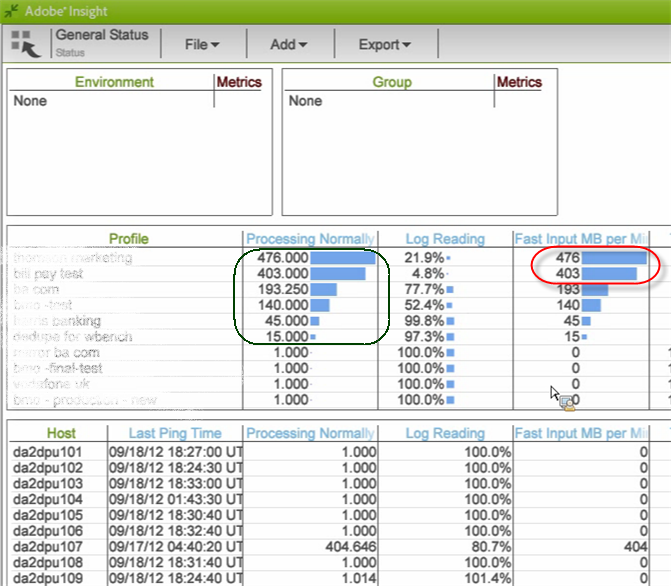

# Área de trabalho Status do Perfil da Análise de big data{#data-workbench-profile-status-workspace}

O perfil Status do perfil da análise de big data fornece informações atuais sobre a integridade do servidor da análise de big data com base no perfil em vez de métricas do servidor ou dados históricos.

## Status do perfil da análise de big data {#section-65d1fa393cfd450cbacef3cba823fcc1}

Este perfil de status fornece as informações atuais do servidor da análise de big data, mas não em tempo real, pois o agente é pesquisado a cada dez minutos e o relatório sempre inclui essa latência de dez minutos. Mais precisamente, os conjuntos de dados gerados por esse perfil fornecem a última observação do servidor do agente, que geralmente tem um período padrão de pesquisa de dez minutos.

Para obter informações adicionais de referência sobre as dimensões usadas no perfil Status do perfil da análise de big data, consulte o perfil [Status do perfil de](../../../home/monitoring-installation/monitoring-profiles/monitoring-profile-using.md#concept-d4cd7da41c8a42bab4aea25418264e64)insight.

Este relatório é mais para operações de monitoramento do que para componentes ou flutuações de tráfego específicas.

Isso nos dá uma ideia de quem está em que modo: Se observarmos uma alta taxa de Entrada Rápida para um determinado perfil, esse perfil estará no modo de Entrada Rápida.

Se a métrica Parada for 1, o servidor será parado. Se o valor for 0, o servidor não será parado.

**Leitura de log para grandes cargas em lote**

