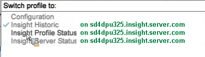

# Espaços de trabalho para monitorar o servidor do Data Workbench{#workspaces-for-monitoring-the-data-workbench-server}

{{eol}}

Para identificar com sucesso a integridade e o desempenho do servidor, você pode usar perfis padrão do Data Workbench para monitorar o servidor a partir do agente instalado usando dados atuais ou empregar perfis de conjuntos de dados históricos para visualizar o impacto das mudanças de desempenho ao longo do tempo.

Os espaços de trabalho do Data Workbench usados com mais frequência incluem:

* [Espaço de trabalho Histórico do Insight](../../../home/monitoring-installation/monitoring-profiles/monitoring-historical-using.md#concept-4a4661f3728540e699b92dac80c44015)
* [Espaço de trabalho Status do perfil do Insight](../../../home/monitoring-installation/monitoring-profiles/monitoring-profile-using.md#concept-b4f472ece1094abc9192d89fdce5e104)
* [Espaço de trabalho Status do servidor Insight](../../../home/monitoring-installation/monitoring-profiles/monitoring-server-using.md#concept-b4f472ece1094abc9192d89fdce5e104)

Para selecionar um perfil, abra o menu suspenso no canto superior esquerdo da interface do cliente do Data Workbench.

